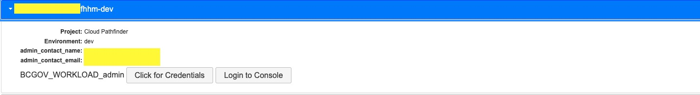
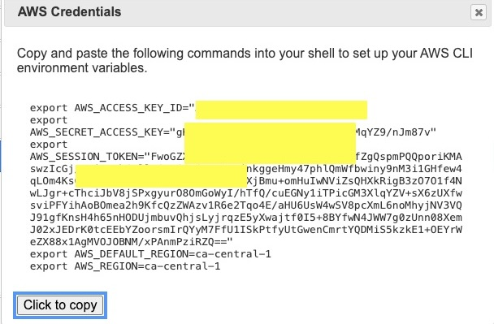
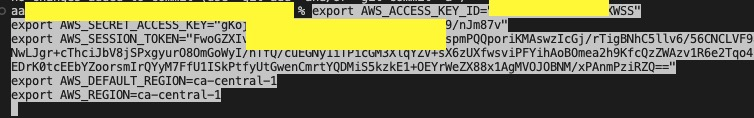

# Requirements for building your application in AWS

Last updated: **{{ git_revision_date_localized }}**

The following sections describe the requirements for building your application on the B.C. government Public cloud, AWS Landing Zone.

## Prerequisites

1. Create a [provisioning request for a project set](../../../welcome/provision-a-project-set.md) for your team on the B.C. government Public cloud

2. Once approved, your project set will be provisioned followed up by an email sent to the Product Owner and Technical Lead once the provisioning is complete

3. Request access for the rest of the team by submitting a [Support Request](https://citz-do.atlassian.net/servicedesk/customer/portal/3) ticket. Refer to the guidelines on what details to include in your request for [account access](../../../welcome/provision-a-project-set.md#accessing-your-project-set)

## Limitations of the AWS Landing Zone

Take the following into consideration when building your application on the AWS Landing zone:

* There is no direct (private) connectivity to the B.C. government network. Any application requiring access to data on this network must use a public endpoint

* Only HTTPS applications are compatible with public endpoints through Amazon API Gateway or Application Load Balancer

* Log groups are safeguarded by AWS Landing Zone guardrails and cannot be deleted. This could lead to issues if they are created by Terraform

* The only supported region is Canada (Central) - ca-central-1

* Most networking is under the management of AWS Landing Zone and is not subject to change. Security groups are the exception to this rule

* IAM Users and their access keys can only be generated  by the [IAM User management service](iam-user-service.md), which is created and managed by the Public cloud team

## Other requirements and best practices

To use GitHub Actions for deploying your application, [OpenID Connect (OIDC) authentication](deploy-an-app-to-the-aws-landing-zone.md#configuring-github-action-oidc-authentication-to-aws) is required.

To deploy your application:

* Use a CI/CD pipeline
* Use infrastructure as code, such as Terraform
* Set up a monitoring solution for your application
* Through the [Product Registry](https://registry.developer.gov.bc.ca/login) configure budgets to receive notifications when your quota is close to being exceeded
* Only grant access to your AWS accounts for those who actually need it

## Local deployment

To facilitate local deployments into AWS, from your machine. The process involves using Terraform as an Infrastructure as Code (IaC) tool, AWS CLI and Visual Studio Code (VSCode) as an Integrated Development Environment (IDE).

* Install Terraform by following the [official Terraform guide](https://developer.hashicorp.com/terraform/tutorials/aws-get-started/install-cli),
* Understand and install  [AWS CLI](https://docs.aws.amazon.com/cli/latest/userguide/getting-started-install.html)
* Set up [Visual Studio Code](https://code.visualstudio.com/docs/setup/setup-overview)

After all the tools have been installed, you can provision S3 bucket in AWS using Terraform:

Save this code in a file with a ".tf" extension, for example, main.tf.

```terraform
# Define provider
provider "aws" {
  region = "ca-central-1"  # Change this to your desired AWS region
}

# Create an S3 bucket
resource "aws_s3_bucket" "example_bucket" {
  bucket = "your-unique-bucket-name"  # Replace with a globally unique bucket name
  acl    = "private"

  tags = {
    Name        = "ExampleBucket"
    Environment = "Development"
  }
}
```

To apply this configuration, follow these steps:

1. Open a terminal in the directory where you saved your Terraform script.

Ensure you have AWS credentials, obtainable by visiting the AWS login page and clicking on the `Click for Credentials` button for the desired authorization role as shown in the image below. 

2. Copy the credential



3. Paste the copied credential



4. Initialize your Terraform configuration:

```
terraform init
```

5. Create an execution plan:

```
terraform plan
```

6. Apply the changes to create the S3 bucket:

```
terraform apply

```

7. Confirm by typing yes when prompted.

This script creates an S3 bucket with the specified configuration. Adjust parameters as needed for your specific use case.

For deploying to AWS using Terraform, [find this  comprehensive tutorial](https://developer.hashicorp.com/terraform/tutorials/aws-get-started/aws-build ).
This combined approach of Terraform AWS CLI and VSCode streamlines the deployment process, promoting ease of use and efficiency in AWS infrastructure management.

## Next steps

* [Deploy an application to the B.C. government AWS Landing Zone](deploy-an-app-to-the-aws-landing-zone.md)

## Related documentation

* [Provision a project set](../../../welcome/provision-a-project-set.md)
* [Account access](../../../welcome/provision-a-project-set.md#accessing-your-project-set)
* [Configuring GitHub Action OIDC Authentication to AWS](../design-build-and-deploy-an-application/deploy-an-app-to-the-aws-landing-zone.md#configuring-github-action-oidc-authentication-to-aws)
* [Deploy an application to the B.C. government AWS Landing Zone](../design-build-and-deploy-an-application/deploy-an-app-to-the-aws-landing-zone.md)
