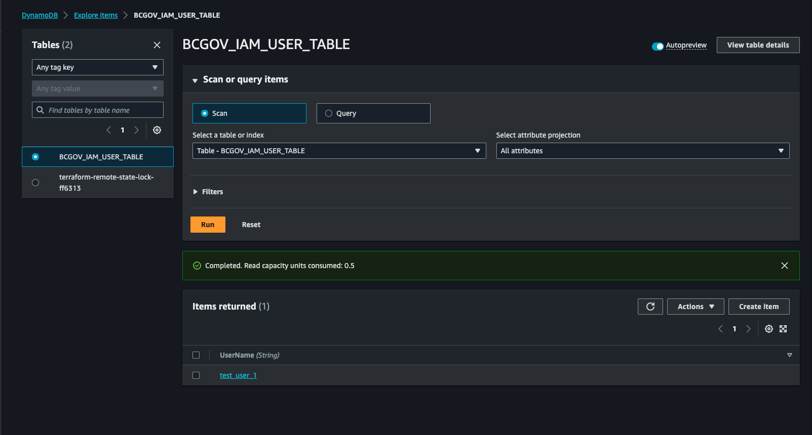
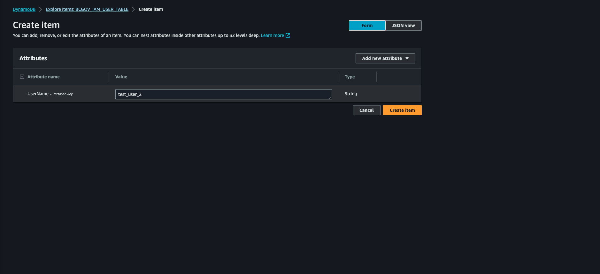
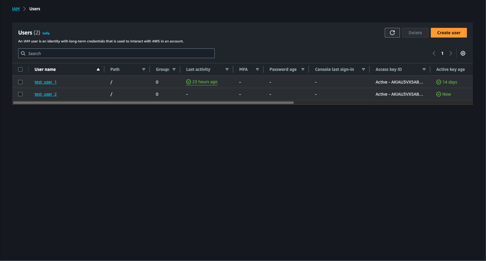
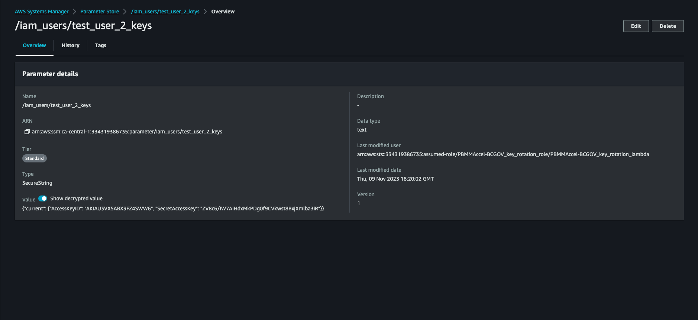

# IAM User management service

Last updated: **{{ git_revision_date_localized }}**

This solution employs AWS services such as DynamoDB, Lambda, and IAM for automated IAM user management and secure access key rotation. The necessary services are deployed into project sets within the AWS Landing Zone Accelerator (LZA) upon creation.

!!! info "IAM User restrictions in LZA"

    IAM Users and their access keys can only be generated by this IAM User management service, which is created and managed by the Public cloud team. You cannot create IAM users directly through the AWS console or APIs.

---

## How to create IAM users

To create an IAM user:

1. Insert a new item into the DynamoDB table `BCGOV_IAM_USER_TABLE`

    

2. Set the `UserName` attribute to the desired IAM username

    

    A Lambda function will trigger to create the IAM user, generate an access key, and store it in the SSM Parameter Store. This function also runs hourly to rotate keys as needed and ensure DynamoDB table entries align with actual IAM account users, removing any discrepancies.

    

### IAM username constraints

When creating an AWS IAM user, the constraints for naming are as follows:

- **Length**: The name must be between 1 and 64 characters long.
- **Characters**: The name can include only the following characters:
  - Uppercase and lowercase letters (A–Z and a–z)
  - Numbers (0–9)
  - Plus (+), equal (=), comma (,), period (.), at (@), underscore (_), and hyphen (-) characters

These constraints ensure that usernames are compatible with AWS naming conventions and can be used across various AWS services without issues. It's important to adhere to these guidelines to avoid errors during user creation and when assigning permissions or attaching policies to the user.

!!! warning "Username planning"

    Choose IAM usernames carefully as they cannot be changed once created. Consider using a naming convention that includes your project identifier and purpose (e.g., `abc123-api-user`, `abc123-ci-cd`).

## How does key-rotation work

The Lambda function manages key rotation by monitoring the age of the keys. When the current key is older than 2 days, it's marked as pending_deletion key and a new current key is created. Once the pending_deletion key reaches 4 days old, it is deleted and replaced with a new current_key.

The lambda function also updates the keys in the parameter store automatically.

!!! tip "Automatic key rotation benefits"

    This automatic key rotation enhances security by ensuring:
    - Keys are regularly refreshed (every 4 days maximum)
    - No manual intervention required for key management
    - Graceful transition period to prevent service disruptions

## How to get the keys

- The lambda function automatically stores the keys created for users in the SSM parameter store, Users can get the keys from the parameter store and setup automation.
- The name with which the parameter is created `/iam_users/<user-name>_keys`.
- The keys are stored in the parameter store in the below json structure

```json
{
  "pending_deletion": {
    "AccessKeyID": "Access_Key_ID_Pending_Deletion",
    "SecretAccessKey": "Secret_Access_Key_Pending_Deletion"
  },
  "current": {
    "AccessKeyID": "Access_Key_ID_Current",
    "SecretAccessKey": "Secret_Access_Key_Current"
  }
}
```



## Setup automation to retrieve and use keys

Users can implement a checker in their automation scripts to verify if they are using a 'pending_deletion' key. If so, the script should automatically rotate to the 'current' key fetched from the Parameter Store.

This way one can stay ahead of the key rotation and always use the current keys.

### Example automation script

Here's an example of how to implement key rotation checking in your applications:

```python
import boto3
import json
import logging

def get_current_iam_keys(username):
    """
    Retrieve current IAM keys from Parameter Store
    """
    ssm = boto3.client('ssm', region_name='ca-central-1')
    
    try:
        parameter_name = f"/iam_users/{username}_keys"
        response = ssm.get_parameter(Name=parameter_name, WithDecryption=True)
        keys = json.loads(response['Parameter']['Value'])
        
        # Always use the 'current' keys
        return keys['current']
    except Exception as e:
        logging.error(f"Failed to retrieve keys for {username}: {e}")
        raise

def setup_aws_client_with_rotation(username, service='s3'):
    """
    Setup AWS client with automatic key rotation
    """
    keys = get_current_iam_keys(username)
    
    client = boto3.client(
        service,
        region_name='ca-central-1',
        aws_access_key_id=keys['AccessKeyID'],
        aws_secret_access_key=keys['SecretAccessKey']
    )
    
    return client
```

## Permission boundaries

Permission boundaries prevent privilege escalation by setting the maximum permissions users can have, even if their IAM policies allow more extensive permissions. For instance, an `AdministratorAccess` policy constrained by a permission boundary that only allows `AmazonS3FullAccess` will limit the user to S3 actions.

The lambda function automatically sets permission boundaries to the users created as a security measure.

!!! note "Security by design"

    Permission boundaries are automatically applied to prevent users from escalating their privileges beyond what's intended, even if they have permissions to modify IAM policies.

## Service-specific API credentials

AWS supports service-specific credentials for some AWS services through the IAM API action `iam:CreateServiceSpecificCredential`. These credentials are different from standard AWS access keys. They work only with the service that creates them.

Supported services include Amazon Bedrock, Bedrock Mantle, CloudWatch Logs, and CloudWatch Metrics. CloudWatch Logs credentials support some external applications that send logs to CloudWatch Logs HTTP ingestion endpoints with bearer-token authentication.

### Two-day maximum

The LZA restricts IAM service-specific credentials to a maximum lifetime of two days. This limit applies to every AWS service that uses `iam:CreateServiceSpecificCredential`.

| Credential request | Result |
| --- | --- |
| One day | Permitted |
| Two days | Permitted |
| More than two days | Denied |
| No expiry specified | Denied |

The control does not affect IAM roles, AWS Security Token Service (STS) temporary credentials, normal AWS access patterns, or unrelated API actions.

### Permissions boundary control

The IAM User Service applies a permissions boundary to each IAM user it creates. The boundary includes this explicit deny statement:

```json
{
    "Sid": "DenyServiceSpecificCredentialsOverTwoDays",
    "Effect": "Deny",
    "Action": "iam:CreateServiceSpecificCredential",
    "Resource": "*",
    "Condition": {
        "NumericGreaterThanIfExists": {
            "iam:ServiceSpecificCredentialAgeDays": "2"
        }
    }
}
```

The `iam:ServiceSpecificCredentialAgeDays` condition key checks the requested lifetime. `NumericGreaterThanIfExists` denies requests over two days. It also denies requests that omit the lifetime.

The boundary limits actions performed by the IAM user. It does not control another principal that creates a credential for that user. For example, an administrator or SSO role could otherwise create a 30-day credential for the user.

### Service Control Policy control

The custom LZA SCP, [`bcgov-lza-scp`](scp.md), provides the account and organization guardrail. It includes an explicit deny for the same action and condition:

```json
{
    "Effect": "Deny",
    "Action": "iam:CreateServiceSpecificCredential",
    "Resource": "*",
    "Condition": {
        "NumericGreaterThanIfExists": {
            "iam:ServiceSpecificCredentialAgeDays": "2"
        }
    }
}
```

The SCP applies to principals subject to the policy. It blocks requests from the AWS console, AWS CLI, AWS SDKs, Terraform, and automation. It also blocks requests from IAM users, IAM roles, and SSO roles. An explicit SCP deny overrides an identity policy allow.

The SCP does not include an exception for `BCGOV-LZA-*` or `AWSAccelerator-*` principals. The condition applies to all service-specific credential services. It does not use `iam:ServiceSpecificCredentialServiceName`. Future services receive the same protection without another policy update.

### Bedrock credentials

This control applies to long-term service-specific credentials created with `iam:CreateServiceSpecificCredential`. It does not block all Bedrock authentication or all Bedrock API keys.

!!! tip "Use short-term Bedrock keys"

    AWS recommends short-term Bedrock API keys instead of long-term keys. Short-term keys last for 12 hours. Applications running in OpenShift can automate key retrieval and rotation once or twice each day.

Applications that use CloudWatch Logs service-specific credentials for external log delivery can continue to create credentials. They must rotate those credentials at least every two days. A complete deny on `iam:CreateServiceSpecificCredential` would break these integrations.

### Validate the control

To test the permissions boundary, authenticate as the IAM user whose boundary you are testing. Verify the identity first:

```bash
aws sts get-caller-identity
```

The returned ARN should look like `arn:aws:iam::<ACCOUNT_ID>:user/<IAM_USER_NAME>`.

Test a credential above the maximum:

```bash
aws iam create-service-specific-credential \
    --user-name <IAM_USER_NAME> \
    --service-name bedrock.amazonaws.com \
    --credential-age-days 30
```

Expected result: `AccessDenied`.

Test the maximum permitted lifetime:

```bash
aws iam create-service-specific-credential \
    --user-name <IAM_USER_NAME> \
    --service-name bedrock.amazonaws.com \
    --credential-age-days 2
```

Expected result: success, when the identity policy allows `iam:CreateServiceSpecificCredential`.

Repeat the test with another supported service to confirm that the control is service-agnostic.

To test the SCP, use an administrative or SSO role that normally has permission to create the credential. A 30-day request should receive an explicit SCP deny. A two-day request should not receive a deny from this SCP. This test demonstrates why the SCP protects against principals that do not use the target user's permissions boundary.

### Deleting an IAM user

Remove the corresponding entry from the DynamoDB table. The Lambda function will trigger and delete the user and their access keys from IAM and the SSM Parameter Store.

!!! warning "Cleanup is automatic"

    When you delete an IAM user entry from DynamoDB, all associated access keys and Parameter Store entries are automatically cleaned up. Ensure you've updated any applications using these credentials before deletion.

## Best practices

### Applying least-privilege permissions

When setting permissions with IAM policies, grant only the permissions needed for a task. Define actions on specific resources under specific conditions, known as least-privilege permissions.

Initially, you might have broad permissions to explore what's needed for your workload. As your use case matures, work to reduce permissions and move towards least privilege.

### Deny access to AWS based on the source IP

In AWS we can create identity-based policy that denies access to AWS actions in the account when the request comes from principals outside the specified IP range.

Example policy that allows s3 actions only to a specific ip range:

```json
{
    "Version": "2012-10-17",
    "Statement": [
        {
            "Effect": "Allow",
            "Action": "s3:*",
            "Resource": "*"
        },
        {
            "Effect": "Deny",
            "Action": "*",
            "Resource": "*",
            "Condition": {
                "NotIpAddress": {
                    "aws:SourceIp": [
                        "192.0.2.0/24"
                    ]
                },
                "Bool": {
                    "aws:ViaAWSService": "false"
                }
            }
        }
    ]
}
```

### Use IAM roles when possible

While IAM users are available through this service, consider using IAM roles with temporary credentials when possible:

- For applications running on EC2, use [instance profiles](https://docs.aws.amazon.com/IAM/latest/UserGuide/id_roles_use_switch-role-ec2_instance-profiles.html)
- For serverless applications, use [execution roles](https://docs.aws.amazon.com/lambda/latest/dg/lambda-intro-execution-role.html)
- For CI/CD pipelines, use [OIDC authentication](../best-practices/iac-and-ci-cd.md)

!!! tip "When to use IAM users vs roles"

    **Use IAM users for**:
    
    - Legacy applications that cannot use roles
    - Third-party integrations requiring static credentials
    - Local development and testing scenarios

    **Use IAM roles for**:
    
    - Applications running on AWS infrastructure
    - Cross-account access scenarios
    - Temporary access requirements
    - Modern CI/CD pipelines

## Getting help

If you need assistance with the IAM User management service:

- **Service issues**: Contact the [Public Cloud Service Desk](https://citz-do.atlassian.net/servicedesk/customer/portal/3)
- **Policy questions**: Consult the [AWS IAM documentation](https://docs.aws.amazon.com/IAM/latest/UserGuide/)
- **General support**: See our [support page](../../../welcome/support.md) for all available options

## Related documentation

- [AWS Landing Zone Accelerator overview](../get-started-with-lza/aws-landing-zone-accelerator-overview.md)
- [User management in AWS LZA](user-management.md)
- [Deploy to the AWS Landing Zone Accelerator](deploy-to-the-aws-landing-zone-accelerator.md)
- [Requirements for building your application](requirements.md) 