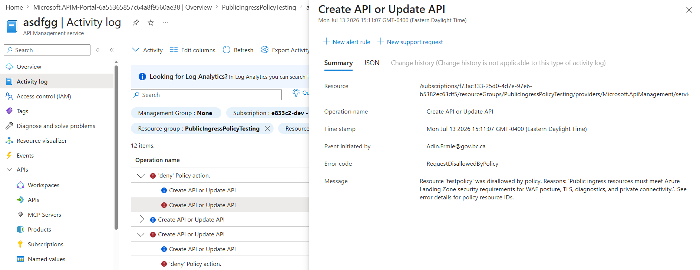

# API Management service

Last updated: **{{ git_revision_date_localized }}**

Version 1 of the Azure [API Management Service](https://learn.microsoft.com/en-us/azure/api-management/api-management-key-concepts) doesn't support [inbound private endpoints](https://learn.microsoft.com/en-us/azure/api-management/virtual-network-concepts#inbound-private-endpoint). To access the service from within a virtual network, you must create a DNS record. Unlike other [private endpoints](../best-practices/be-mindful.md#private-endpoints-and-dns) in the Landing Zones, this process isn't automated.

If you are using v1 of the API Management Service, please [submit a Service Request](https://citz-do.atlassian.net/servicedesk/customer/portal/3) to the Public cloud team to have the DNS record created for you.

!!! success "APIM v2"
    Version 2 of the API Management Service is now available in the Canada Central Azure region. Use the [v2 tiers](https://learn.microsoft.com/en-us/azure/api-management/v2-service-tiers-overview) of APIM to enable network isolation and private endpoints.

## Required protocols

The Landing Zones enforce the `API Management APIs should use only encrypted protocols` policy, requiring all APIs to use encrypted protocols. Supported protocols are **HTTPS** and **WSS**.

If you attempt to create an API in API Management using an unsupported protocol, the UI shows _no error message_ but the API creation fails.

To confirm this is the reason why your API creation is failing, check the Activity Logs, which will show that the `Create API or Update API` action was denied, and the message will indicate that the API does not use a supported protocol.

