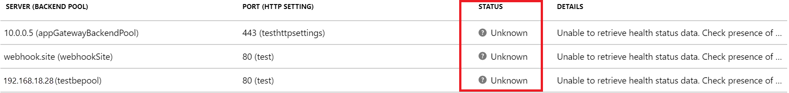

# Application Gateway

Last updated: **{{ git_revision_date_localized }}**

If you are using an [Application Gateway](https://learn.microsoft.com/en-us/azure/application-gateway/overview), be aware that the backend health may show a status of **Unknown**. This is because internet and private traffic are routed through the Azure Firewall in the Virtual WAN Hub.

To resolve this, a custom **User Defined Route (UDR)** must be created to send traffic to the backend pool via an Azure Firewall in the Virtual WAN hub.

Due to Landing Zone security and governance requirements, you cannot create this UDR yourself. Please contact the Public cloud team by submitting a [Service Request](https://citz-do.atlassian.net/servicedesk/customer/portal/3) for assistance with this, and reference the following Microsoft documentation: [Troubleshoot backend health issues in Application Gateway](https://learn.microsoft.com/en-us/azure/application-gateway/application-gateway-backend-health-troubleshooting#other-reasons).
