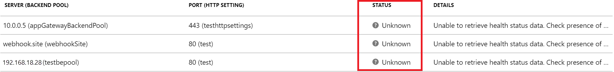
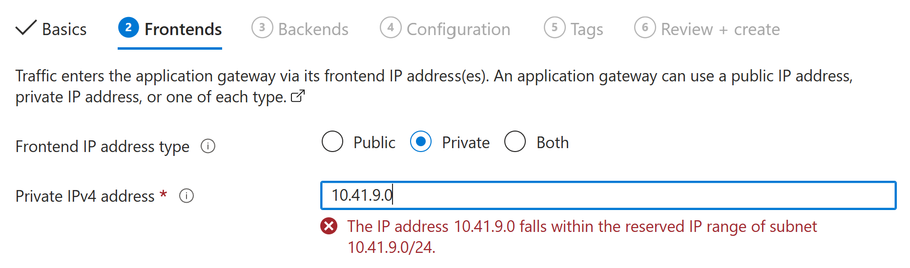

# Application Gateway

Last updated: **{{ git_revision_date_localized }}**

## Public Application Gateway

If you use an [Application Gateway](https://learn.microsoft.com/en-us/azure/application-gateway/overview) with a **public** IP address, backend health may show **Unknown**. Internet and private traffic route through the Azure Firewall in the Virtual WAN hub.

To resolve this issue, create a custom **User Defined Route (UDR)**. This route sends traffic to the backend pool through the Azure Firewall in the Virtual WAN hub.

Landing Zone security and governance requirements prevent self-service UDR creation. Contact the Public Cloud team by submitting a [Service Request](https://citz-do.atlassian.net/servicedesk/customer/portal/3). Include this Microsoft guidance in your request: [Troubleshoot backend health issues in Application Gateway](https://learn.microsoft.com/en-us/azure/application-gateway/application-gateway-backend-health-troubleshooting#other-reasons).

## Private Application Gateway

Microsoft now supports [private Application Gateways](https://learn.microsoft.com/en-us/azure/application-gateway/application-gateway-private-deployment?tabs=portal) in Azure. If you use a private Application Gateway, backend health should show **Healthy** without additional configuration (for example, custom NSG rules or a UDR).

!!! tip "Access from on-premises"
    If your application is for **internal non-public use**, consider a private Application Gateway. This option avoids additional configuration and keeps traffic within the Azure network.

    This setup also supports access to the Application Gateway from on-premises through existing [MCCS connectivity](../../shared-services/mccs/mccs.md) to Azure, without additional configuration.

To use a private Application Gateway, **register** the `EnableApplicationGatewayNetworkIsolation` feature in your Azure subscription. Follow the latest Microsoft documentation to [register the feature](https://learn.microsoft.com/en-us/azure/application-gateway/application-gateway-private-deployment?tabs=portal#register-the-feature).

!!! warning "Private IP address"
    When you create a private Application Gateway, provide a specific private IP address. The creation process checks whether the address is in the target subnet, but it **does not** check whether the address is already in use.

    
