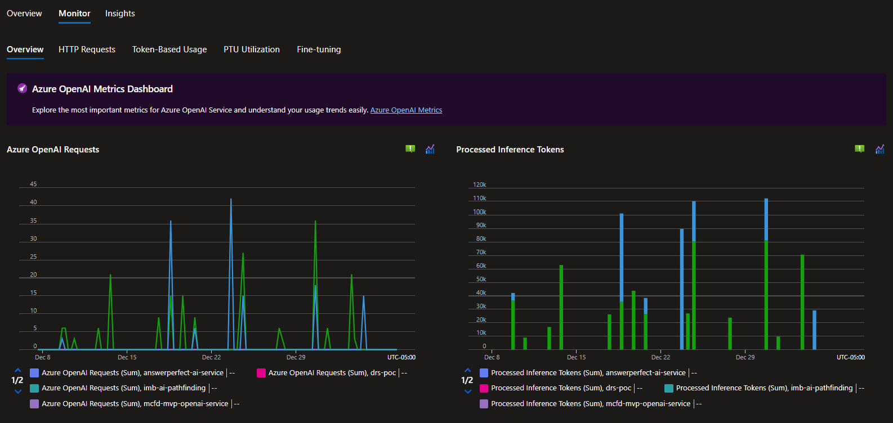

# Azure AI services

Last updated: **{{ git_revision_date_localized }}**

Many of the ministry teams are using Azure AI services to build intelligent applications. Artificial Intelligence and Machine Learning are rapidly changing technologies. The following are some recommendations and guidance based on observations and experiences from the ministry teams.

---

!!! tip "Azure OpenAI best practices"
    Be sure to review the following Microsoft blog post, which highlights key best practices for deploying and managing Azure OpenAI workloads. The blog post covers architectural considerations, security measures, governance strategies, networking configurations, and more.

    It also includes an Azure OpenAI review checklist with **180+ best practice items** covering AI Landing Zones for every critical area: Governance, Operations, Networking, Identity, Cost Management, and Business Continuity & Disaster Recovery (BCDR).

    - [Azure OpenAI best practices: A quick-reference guide to optimize your deployments](https://techcommunity.microsoft.com/blog/startupsatmicrosoftblog/azure-openai-best-practices-a-quick-reference-guide-to-optimize-your-deployments/4403546)

!!! tip "Azure OpenAI PTU Calculator"
    Check out the [Azure OpenAI PTU Calculator](https://www.ptucalc.com/) to help optimize your Azure OpenAI costs by intelligently sizing Provisioned Throughput Units (PTUs) and analyzing your usage patterns.

## Region availability

[Azure AI Foundry (formerly Azure AI Studio)](https://learn.microsoft.com/en-us/azure/ai-studio/what-is-ai-studio) is available in the Canada Azure regions. However, not all [models](https://azure.microsoft.com/en-us/products/ai-model-catalog?msockid=2274ddfe4fb768de0595c8be4e1d6918#tabs-pill-bar-oc92d8_tab0) or services are available there. For example, some [Azure OpenAI](https://learn.microsoft.com/en-us/azure/ai-services/openai/concepts/models?tabs=global-standard%2Cstandard-chat-completions#model-summary-table-and-region-availability) models are not available in Canadian regions. Check the availability of the services and models **before** starting development.

!!! tip "Canada East region"
    Currently, Azure AI models are only available in the **Canada East** region. Our current implementation of Landing Zones **does not** include any networking connectivity to the Canada East region.

The most common Azure AI services used by ministry teams are:

- Azure OpenAI
- AI Search
- Document Intelligence

If another ministry team has implemented a similar solution, use their experience and knowledge to avoid potential issues.

## Deploying models

When using Azure AI services, you may need to deploy a virtual machine within your Azure virtual network. This lets you deploy models in a private-only AI service. Security guardrails protect government data from the internet.

The simplest approach is to deploy [Azure Bastion](https://learn.microsoft.com/en-us/azure/bastion/quickstart-host-portal) within your virtual network. You can then connect to a virtual machine on the same private network as the AI service.

!!! example "Azure Bastion deployment example"
    To support our customers and speed up deployment, we've created an example Terraform module. For more information, see the Tools > [Azure Bastion](../tools/bastion.md) page.

## Azure OpenAI and Private DNS
<!-- Remove or update this section once it is confirmed that the Azure Policy resolves this -->
When working with Azure OpenAI, you may need to create a Private Endpoint to resolve the Azure OpenAI service endpoints.

In several cases, the DNS `A-Record` for the Azure OpenAI service is not created properly in the Private DNS Zone. This can prevent the service from resolving the endpoint.

If you encounter this issue, open a [support ticket](../../welcome/support.md) with the Public cloud support team.

## Azure AI Search Service and outbound connections
If you use Azure AI Search Service and require an **outbound** connection to another Azure resource (such as Storage, SQL, Key Vault, or OpenAI), you need to configure a **shared private link**. This applies when using knowledge bases, indexers, or skillsets. Shared private links are different from private endpoints, which handle inbound connections.

Follow the [Make outbound connections through a shared private link](https://learn.microsoft.com/en-us/azure/search/search-indexer-howto-access-private?tabs=portal-create) Microsoft documentation to configure the shared private link for your Azure AI Search Service.

## Regulated Landing Zone compliance
<!-- Recommend review by Security and compliance team -->
When you deploy Azure Cognitive Services, OpenAI, or Machine Learning, several Microsoft Enterprise Scale guardrail policies apply. These policies control permitted SKUs, authentication through managed identities, storage configuration, and outbound network access.

To prevent deployment issues caused by policy enforcement, ensure that these services are configured with the highest level of security from the outset.

## Monitoring AI

Microsoft provides an Azure Monitor Workbook with a centralized view of your AI services. This workbook shows usage, performance, and health data. Use this workbook to monitor your AI services.

For more information, see [Azure OpenAI Insights: Monitoring AI with Confidence](https://techcommunity.microsoft.com/blog/fasttrackforazureblog/azure-openai-insights-monitoring-ai-with-confidence/4026850).

## Related pages

- [Azure Bastion](../tools/bastion.md)
- [Be mindful of service constraints](../best-practices/be-mindful.md)
- [Support](../../welcome/support.md)
