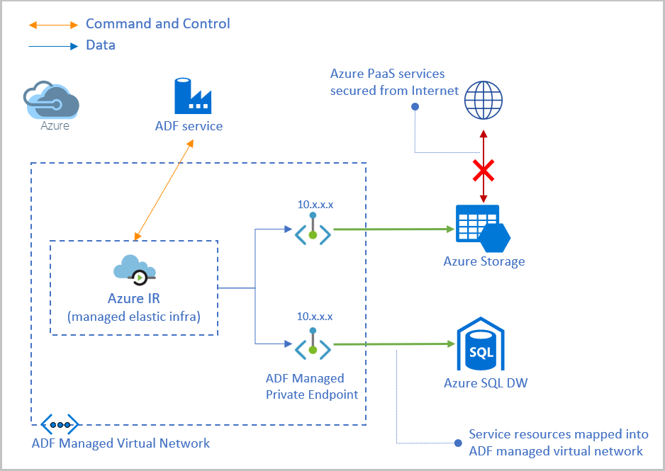
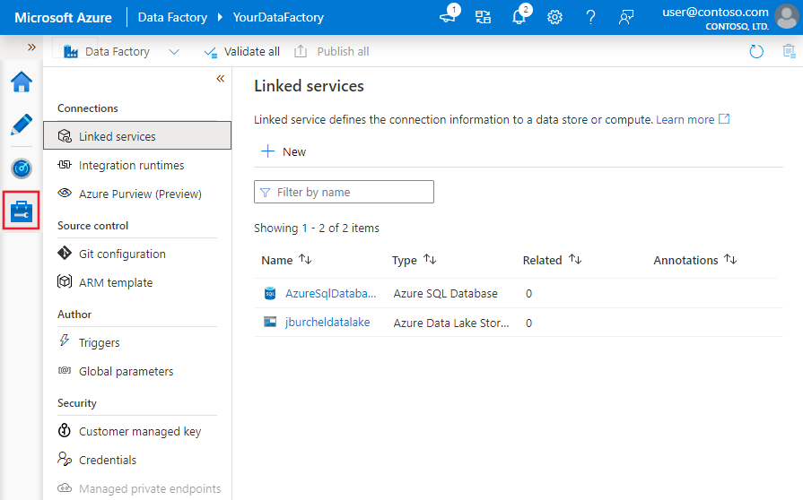

# Azure Data Factory

Last updated: **{{ git_revision_date_localized }}**

Azure Data Factory (ADF) is a cloud-based data integration service that allows you to create data-driven workflows for orchestrating and automating data movement and data transformation.

## Networking and security

In the Azure Landing Zone, Azure Data Factory is configured with guardrails to ensure secure data integration.

### Private endpoints

Access to Azure Data Factory is restricted to **private endpoints only**. This means that the ADF management portal and its associated endpoints are not accessible over the public internet.

When setting up your Data Factory, you must configure private endpoints for the `dataFactory` and `portal` sub-resources.

For more information, see the [Azure Private Link for Azure Data Factory documentation](https://learn.microsoft.com/en-us/azure/data-factory/data-factory-private-link).

### Managed virtual network

It is recommended to use the **Azure Data Factory Managed Virtual Network** and **Managed Private Endpoints** for connecting to data sources that are also protected by private endpoints (like Azure SQL Database or Storage Accounts).

For more information, see the [Azure Data Factory managed virtual network documentation](https://learn.microsoft.com/en-us/azure/data-factory/managed-virtual-network-private-endpoint).

### Linked services in Azure Data Factory

Linked services define the connection information for Azure Data Factory to connect to external data stores and compute environments. When using private endpoints, ensure that your linked services are configured to connect to the private endpoint's DNS name.

For more information on configuring linked services with private endpoints, see the [Linked services in Azure Data Factory and Azure Synapse Analytics documentation](https://learn.microsoft.com/en-us/azure/data-factory/concepts-linked-services?tabs=data-factory).

## Portal connectivity considerations

!!! warning "Azure Data Factory Studio"
    The **Azure Data Factory Studio** (the authoring and monitoring tool) communicates with the ADF service from your browser. When private endpoints are enabled for Data Factory, your browser must be able to resolve and reach the private endpoint's IP address.

    If you are on your local machine outside the VNet, you will likely see connectivity errors when trying to "test connection" or browse data within ADF Studio.

    **To resolve this:**
    Use a **Jump Host** within your VNet (accessed via [Azure Bastion](../tools/bastion.md)) to access the Azure portal and open ADF Studio from there. This ensures your browser is within the private network and can communicate with the ADF private endpoints.

## Best practices

* **Use Managed Identity:** Authenticate to data sources using the Data Factory's Managed Identity whenever possible.
* **Customer-Managed Keys (CMK):** Data Factory supports encryption at rest using CMK for enhanced security.
* **Source Control Integration:** Always integrate your Data Factory with a Git repository (Azure DevOps or GitHub) for version control and CI/CD.
