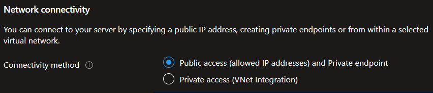

# Azure Database for PostgreSQL Flexible server

Last updated: **{{ git_revision_date_localized }}**

When deploying an [Azure Database for PostgreSQL Flexible server](https://learn.microsoft.com/en-us/azure/postgresql/flexible-server/overview), you have multiple network connectivity options, including [Public access (allowed IP addresses) and Private endpoint](https://learn.microsoft.com/en-us/azure/postgresql/flexible-server/how-to-networking), and [Private access (VNet Integration)](https://learn.microsoft.com/en-us/azure/postgresql/flexible-server/concepts-networking-private#private-access-vnet-integration).

Although the connectivity method says "**public access**", this is the option you want to select, in order to be able to [add private endpoint connections](https://learn.microsoft.com/en-us/azure/postgresql/flexible-server/how-to-networking-servers-deployed-public-access-add-private-endpoint?tabs=portal-add-private-endpoint-connections).
