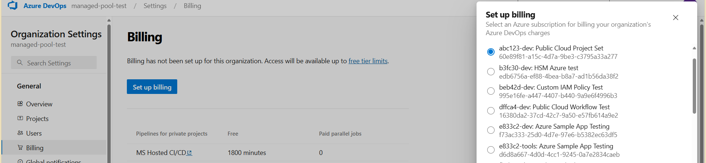

# External Microsoft services - Azure DevOps

Last updated: **{{ git_revision_date_localized }}**

## Overview

There are several Microsoft services that are commonly used in conjunction with Azure services. These may include services like Azure DevOps, Dynamics 365, Power Platform, etc. This document provides some considerations when working with these services within the Azure Landing Zone.

## Azure DevOps

Azure DevOps Services supports configuring billing to be associated with an Azure subscription. This allows you to use the same Azure subscription for both Azure DevOps and Azure resources.

For more information, please refer to the [Azure DevOps - Manage Billing](https://learn.microsoft.com/en-us/azure/devops/organizations/billing/set-up-billing-for-your-organization-vs?view=azure-devops) documentation.

