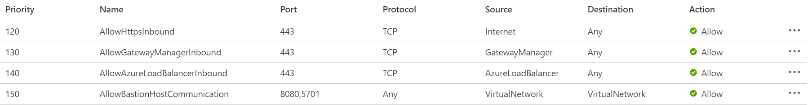
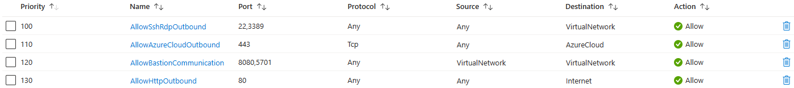
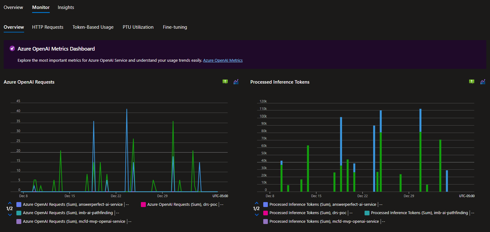

# Azure AI services

Last updated: **{{ git_revision_date_localized }}**

Many of the ministry teams are using Azure AI services to build intelligent applications. Artificial Intelligence and Machine Learning are rapidly changing technologies. The following are some recommendations and guidance based on observations and experiences from the ministry teams.

## Region availability

Although the [Azure AI Foundry (formerly Azure AI Studio)](https://learn.microsoft.com/en-us/azure/ai-studio/what-is-ai-studio) is available in the Canada Azure regions, not all [models](https://azure.microsoft.com/en-us/products/ai-model-catalog?msockid=2274ddfe4fb768de0595c8be4e1d6918#tabs-pill-bar-oc92d8_tab0) or services may be available in the Canada regions (for example, some [Azure OpenAI](https://learn.microsoft.com/en-us/azure/ai-services/openai/concepts/models?tabs=global-standard%2Cstandard-chat-completions#model-summary-table-and-region-availability) models). It is recommended to check the region availability of the services/models before starting development.

The most common Azure AI Services that are used by the ministry teams are:

- Azure OpenAI
- AI Search
- Document Intelligence

If another Ministry team has implemented a similar solution, it is recommended to leverage their experience and learnings to avoid any potential issues.

## Deploying models

When using Azure AI services, you may need to deploy a Virtual Machine within your Azure virtual network, to deploy models in a private-only AI service. This is because of the security guardrails that protect government data from the Internet.

The simplest method to do this, is to deploy an [Azure Bastion](https://learn.microsoft.com/en-us/azure/bastion/quickstart-host-portal) within your virtual network, to connect to a Virtual Machine that is also deployed to the same private network as the AI service.

!!! question "Azure Bastion SKU"
    The minimum Bastion SKU required is **Basic**, as the **Developer** SKU is not currently available in the Canada regions.

Azure Bastion does require a specifically-named Subnet to be created within the VNet. The subnet name must be **AzureBastionSubnet**. The subnet address range that you specify must be **/26 or larger** (for example, /25 or /24). After adding this subnet to your virtual network, you can deploy Azure Bastion.

Additionally, you will need to create the appropriate ingress and egress Network Security Group (NSG) rules to allow traffic to and from the Azure Bastion service. Please refer to the [Working with NSG access and Azure Bastion](https://learn.microsoft.com/en-us/azure/bastion/bastion-nsg#apply) documentation for specific details.

> Note: The rule priority number does not need to match the example below, but the rule configuration should match.

## Azure OpenAI and Private DNS
<!-- Remove or update this section once it is confirmed that the Azure Policy resolves this -->
When working with Azure OpenAI, you may need to create a Private Endpoint to resolve the Azure OpenAI service endpoints.

It has been observed in several cases, where the DNS `A-Record` for the Azure OpenAI service is not being created properly in the Private DNS Zone. This can cause issues with the service not being able to resolve the endpoint.

If you encounter this issue, please open a [support ticket](../../welcome/support.md) with the Public Cloud support team to investigate and resolve the issue.

## Regulated Landing Zone compliance

If you are deploying Azure Cognitive Services, OpenAI, or Machine Learning, there are several Microsoft Enterprise Scale guardrail policies that are enforced that control permitted SKUs, secure authentication through Managed Identities, storage configuration, outbound network access, etc.

To prevent deployment issues caused by policy enforcement, ensure that these services are configured with the highest level of security from the outset.

## Monitoring AI

Microsoft has created an Azure Monitor Workbook that provides a centralized view of the AI services that are being used. This workbook provides insights into the usage, performance, and health of the AI services. It is recommended to use this workbook to monitor your AI services.

For more information, see [Azure OpenAI Insights: Monitoring AI with Confidence](https://techcommunity.microsoft.com/blog/fasttrackforazureblog/azure-openai-insights-monitoring-ai-with-confidence/4026850).
