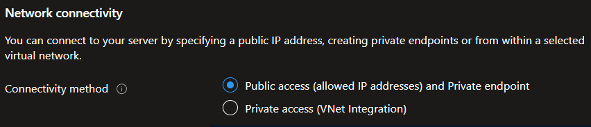

# Azure services

Last updated: **{{ git_revision_date_localized }}**

The following are some things to be aware of when working with specific Azure services within the Azure Landing Zone. This does not list every Azure service, but rather, shares some best practices and limitations for specific services, based on the experience of the Public cloud team and feedback from end-users.

!!! question "Azure AI and ML services"
Looking for information on **Artificial Intelligence (AI)** or **Machine Learning (ML)** services? We have a dedicated page for [Azure AI Services](./azure-ai.md).

## App Service

If you use an [App Service](https://learn.microsoft.com/en-us/azure/app-service/overview), and you plan to [integrate it with an Azure Virtual Network](https://learn.microsoft.com/en-us/azure/app-service/overview-vnet-integration), keep in mind this limitation: **You can't delete a subnet that has previously had an integrated App Service, if the integration has not been removed**.

To follow best practices when using Azure App Services with VNet integration, if you plan to delete the App Service, ensure that you **remove the integration** with the Virtual Network **before** deleting the App Service. This will allow you to delete the associated Subnet without any issues.

!!! failure "Subnet deletion failure"
If you forget to remove the integration, and have deleted the App Service, you will need to [open a support case](../support/enterprise-support.md#how-to-receive-support) with Microsoft Support to have the integration removed before you can delete the Subnet.

## Application Gateway

If you are using an [Application Gateway](https://learn.microsoft.com/en-us/azure/application-gateway/overview), please be aware that the backend health may show a status of **Unknown**. For more information and direction on how to resolve this, see the [Networking within the Azure Landing Zone - Exposing services to the internet](../design-build-deploy/networking.md#exposing-services-to-the-internet) section.

## API Management service

The current version (v1) of the Azure [API Management Service](https://learn.microsoft.com/en-us/azure/api-management/api-management-key-concepts) doesn't work with [inbound Private Endpoints](https://learn.microsoft.com/en-us/azure/api-management/virtual-network-concepts#inbound-private-endpoint). To access the service from within a virtual network, you must create a DNS record. Unlike other [private endpoints](./be-mindful.md#private-endpoints-and-dns) in the Landing Zones, this process isn't automated.

If you are using v1 of the API Management Service, please [submit a Service Request](https://citz-do.atlassian.net/servicedesk/customer/portal/3) to the Public cloud team to have the DNS record created for you.

Version 2 of the API Management Service [isn't currently available](https://learn.microsoft.com/en-us/azure/api-management/api-management-region-availability#supported-regions-for-v2-tiers-and-workspace-gateways) in the Canada Azure regions. When available, use this version, as it'll support Private Endpoints.

## Azure Database for PostgreSQL Flexible server

When deploying an [Azure Database for PostgreSQL Flexible server](https://learn.microsoft.com/en-us/azure/postgresql/flexible-server/overview), you have multiple network connectivity options, including [Public access (allowed IP addresses) and Private endpoint](https://learn.microsoft.com/en-us/azure/postgresql/flexible-server/how-to-networking), and [Private access (VNet Integration)](https://learn.microsoft.com/en-us/azure/postgresql/flexible-server/concepts-networking-private#private-access-vnet-integration).

Although the connectivity method says "**public access**", this is the option you want to select, in order to be able to [add private endpoint connections](https://learn.microsoft.com/en-us/azure/postgresql/flexible-server/how-to-networking-servers-deployed-public-access-add-private-endpoint?tabs=portal-add-private-endpoint-connections).

## Azure Databricks and Unity Catalog

### Overview

[Azure Databricks](https://learn.microsoft.com/en-us/azure/databricks/introduction/) is **available for use** in our environment, while [Unity Catalog](https://learn.microsoft.com/en-us/azure/databricks/data-governance/unity-catalog/) (a governance layer) is currently not enabled. This document outlines the distinction between these components, clarifies where each resides and is managed, and explains the current status of Unity Catalog.

### Key distinctions

| Feature                        | Owned/Managed by         | Lives in Azure? | Lives in Databricks?   |
| ------------------------------ | ------------------------ | --------------- | ---------------------- |
| **Azure Databricks Workspace** | Azure Resource Manager   | ✅ Yes          | ✅ Yes (shared)        |
| **Unity Catalog**              | Databricks Control Plane | ❌ No           | ✅ Yes                 |
| **Metastore**                  | Databricks Account       | ❌ No           | ✅ Yes                 |
| **Azure AD (Entra ID)**        | Microsoft                | ✅ Yes          | Used via federation    |
| **Data Storage (e.g., ADLS)**  | Azure                    | ✅ Yes          | Accessed by Databricks |

### How Unity Catalog works

- **Unity Catalog** is a centralized **data governance layer** for Databricks that enables fine-grained access control across all data assets (tables, views, files).
- It is **not an Azure-native service**. It runs on the **Databricks control plane**, and is provisioned and managed through [https://accounts.azuredatabricks.net](https://accounts.azuredatabricks.net).
- It can enforce **identity-based policies**, using **Microsoft Entra ID** groups via SCIM federation or manual assignment.
- It governs access to data even when the actual storage resides in **Azure Data Lake Storage Gen2** or other Azure-native services.

!!! info "Azure Databricks is available, but Unity Catalog is currently unavailable for use"
While technically supported within Azure Databricks, **we do not currently have an assigned owner or governance process** for Unity Catalog in our environment.

    As such, Unity Catalog **has not been enabled** in any workspace, and users should **not attempt to configure or use it** at this time.

    Workspaces will continue to rely on **legacy workspace-level access controls** and standard Databricks role-based permissions until further notice.

### Practical considerations

- Unity Catalog must be enabled and managed at the **Databricks Account level** — this is separate from Azure Portal or subscription-level controls.
- Currently, there is no designated service owner to manage Unity Catalog, which is why it remains disabled in our environment.
- When enabled, it only works across workspaces that are:
  - In the **same Databricks Account**
  - In the **same Azure region**
- It offers central management of catalogs, schemas, tables, permissions, lineage, and audit logs.

#### Governance implication

If and when Unity Catalog is introduced, a central **data governance function** will be required to:

- Define and manage shared catalogs
- Control access policies at a cross-workspace level
- Maintain consistent audit and data lineage tracking
- Coordinate identity integration with Microsoft Entra ID

## Azure Kubernetes Service (AKS) Networking

When deploying AKS clusters, it is critical to ensure that the **service and pod CIDR ranges do not overlap** with any other networks that cluster pods will need to communicate with. Overlapping address spaces can cause connectivity issues between your AKS workloads and other resources, both within Azure and on-premises.

**Important notes:**

- **Virtual Networks (VNets) are pre-created** by the Public Cloud team. You cannot create new VNets, but you can create subnets within the existing VNet for your AKS resources
- Plan your subnet, pod, and service address ranges carefully to avoid conflicts and to allow for future scaling
- **Reserved address space**: The `10.10.0.0/16` range is reserved for AKS deployments. However, this same range may also be used for extended non-routable peered VNets if teams require additional IP addresses beyond what's provided in the standard routable VNet.
- **Future network expansion**: If you anticipate needing an extended network in the future, it's important to plan your AKS CIDR ranges accordingly to avoid conflicts. Contact the Public Cloud team early in your planning process for guidance on optimal address allocation.

For more information and best practices, see:

- [AKS Networking Concepts](https://learn.microsoft.com/en-us/azure/aks/concepts-network)
- [IP Address Planning for AKS](https://learn.microsoft.com/en-us/azure/aks/concepts-network-ip-address-planning)
- [CNI Overview](https://learn.microsoft.com/en-us/azure/aks/concepts-network-cni-overview)
- [Azure CNI Overlay](https://learn.microsoft.com/en-us/azure/aks/concepts-network-azure-cni-overlay)
- [Azure CNI Pod Subnet](https://learn.microsoft.com/en-us/azure/aks/concepts-network-azure-cni-pod-subnet)

> **Need help or unsure about your AKS networking setup?**
> Reach out to the Public Cloud team for advice via [Jira Service Management (JSM)](https://citz-do.atlassian.net/servicedesk/customer/portal/3) or [Rocket.Chat](https://chat.developer.gov.bc.ca/). See [Support options](../../welcome/support.md) for more details.
