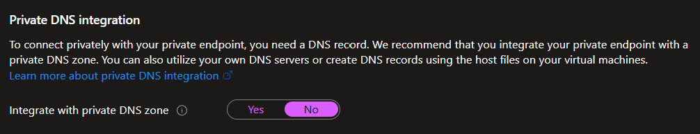

# Be mindful

Last updated: **{{ git_revision_date_localized }}**

The following are some things to be aware of when working within the Azure Landing Zone.

## Virtual Network (VNet) integration

If you are using an [Azure App Service](https://learn.microsoft.com/en-us/azure/app-service/overview), and you plan to [integrate it with an Azure Virtual Network](https://learn.microsoft.com/en-us/azure/app-service/overview-vnet-integration), it is important to be aware of the following limitation: _You can't delete a subnet that has previously had an integrated App Service, if the integration has not been removed_.

As a best practice for using Azure App Services with VNet integration, if you plan to delete the App Service, ensure that you **remove the integration** with the Virtual Network **before** deleting the App Service. This will allow you to delete the associated Subnet without any issues.

## Private Endpoints and DNS

As a security requirement, some Azure PaaS services (ie. Databases, Key Vaults, etc.) have been restricted to private-only connectivity. This means during deployment, you will need to include the creation of a [Private Endpoint](https://learn.microsoft.com/en-us/azure/private-link/private-endpoint-overview) for this service.

As part of creating the Private Endpoint, you will be asked about **Private DNS Integration**. The Azure portal defaults the "**Integrate with private DNS zone**" option to "**Yes**". However, we have the Azure Landing Zones already configured with centralized custom Private DNS Zones, so you should select "**No**" for this option.



Once the Private Endpoint for your resource is deployed, a DNS `A-record` will be automatically created in the custom Private DNS Zone in approximately **10 minutes**, pointing to the private IP address of the resource. This will allow you to access the resource using the custom DNS name within the private network.

However, since the endpoint is private-only, you will not be able to access the resource from outside the VNet. To access and work with these specific resources, you need to use either [Azure Bastion](https://learn.microsoft.com/en-us/azure/bastion/bastion-overview) or an [Azure Virtual Desktop (AVD)](https://learn.microsoft.com/en-us/azure/virtual-desktop/overview) from within the VNet.

In the future, once [Express Route](../upcoming-features/express-route.md) is available, you will also be able to access these resources from the on-premises network or through a VPN.

## Custom DNS Zones

In some scenarios, you may have a need to create a custom DNS Zone. Generally, this is not recommended, as the Azure Landing Zones are already configured with centralized custom Private DNS Zones for the Azure services. However, when working with third-party services (ie. Confluent Cloud), we might not have a Private DNS Zone for the specific service.

If this is your scenario, please submit a [support request](https://citz-do.atlassian.net/servicedesk/customer/portal/3), so that the Public Cloud team can work with you to create and attach the custom DNS Zone to the central Private DNS Resolver.

!!! failure "Private DNS Zone Attachment to VNet"
    Attaching your custom Private DNS Zone to your Virtual Network (VNet) will not work, as all DNS queries are routed through the central Private DNS Resolver.

## Using Terraform to create Subnets

If you are using Terraform to create your infrastructure, in particular the subnets within your assigned Virtual Network, please be aware of the following challenge.

The Azure Landing Zones have an Azure Policy implemented that requires every subnet to have an associated Network Security Group (NSG) for security controls compliance. The challenge with this is that Terraform does not support the creation of subnets with an associated NSG in a _single step_.

Therefore, instead of using the `azurerm_subnet` resource to create subnets, you must use the `azapi_update_resource` resource from the [AzAPI Terraform Provider](https://registry.terraform.io/providers/Azure/azapi/latest/docs). This resource allows you to create subnets with an associated NSG in a single step.

!!! abstract "AzAPI Resource Provider"
    You need to use the `azapi_update_resource` resource, because you are updating an existing Virtual Network (VNet) resource with a new subnet (and associated Network Security Group).

**Example code:**

```terraform
resource "azapi_update_resource" "subnets" {
  type = "Microsoft.Network/virtualNetworks/subnets@2023-04-01"

  name      = "SubnetName"
  parent_id = data.azurerm_virtual_network.vnet.id
  # Note: Discovered the `locks` attribute for AzAPI from the following GitHub Issue: https://github.com/Azure/terraform-provider-azapi/issues/503
  # A list of ARM resource IDs which are used to avoid create/modify/delete azapi resources at the same time.
  locks = [
    data.azurerm_virtual_network.vnet.id
  ]

  body = jsonencode({
    properties = {
      networkSecurityGroup = {
        id = azurerm_network_security_group.id
      }
    }
  })

  response_export_values = ["*"]
}
```

For further details about this limitation, please refer to the following GitHub Issue: [Example of using the Subnet Association resources with Azure Policy](https://github.com/hashicorp/terraform-provider-azurerm/issues/9022).

## AzAPI Terraform provider (using `azapi_update_resource`)

If you are using the [AzAPI Terraform Provider](https://learn.microsoft.com/en-us/azure/developer/terraform/overview), specifically the [azapi_update_resource](https://registry.terraform.io/providers/azure/azapi/latest/docs/resources/update_resource) resource, be aware of the following limitation: _When you delete `azapi_update_resource`, **no operation will be performed**, and these properties will stay **unchanged**. If you want to restore the modified properties to some values, you must apply the restored properties before deleting_.

This means, changes to the `azapi_update_resource` resource may _appear_ to apply changes (ie. remove properties/configurations previous added according to the `terraform plan` output), but this doesn't actually apply those changes in Azure.

## Azure Control-Plane vs Data-Plane access differences

When working with Azure services, it's important to understand the differences between [control-plane](https://learn.microsoft.com/en-us/azure/azure-resource-manager/management/control-plane-and-data-plane#control-plane) and [data-plane](https://learn.microsoft.com/en-us/azure/azure-resource-manager/management/control-plane-and-data-plane#data-plane) access. The control plane is used to manage resources, while the data plane is used to interact with the resources themselves.

Even though someone may have **Owner-level** permissions on a resource, they may not have the necessary permissions to interact with the **data plane**. This is because the data plane permissions are separate from the control plane permissions.

For example, some Azure services and solution patterns may require additional data-level permissions, such as [Storage Blob Data Reader](https://learn.microsoft.com/en-us/azure/role-based-access-control/built-in-roles/storage#storage-blob-data-reader), [Search Index Data Contributor](https://learn.microsoft.com/en-us/azure/role-based-access-control/built-in-roles/ai-machine-learning#search-index-data-contributor), etc.

For a list of built-in roles and their permissions, refer to the [Azure built-in roles](https://learn.microsoft.com/en-us/azure/role-based-access-control/built-in-roles) documentation.

## API Management Service

The current version (v1) of the Azure [API Management Service](https://learn.microsoft.com/en-us/azure/api-management/api-management-key-concepts) does not support [inbound Private Endpoints](https://learn.microsoft.com/en-us/azure/api-management/virtual-network-concepts#inbound-private-endpoint). This means that a DNS record must be created to access the service from within a Virtual Network. This is not automated (like other [private endpoints](#private-endpoints-and-dns) are in the Landing Zones).

If you are using v1 of the API Management Service, please [submit a Service Request](https://citz-do.atlassian.net/servicedesk/customer/portal/3) to the Public Cloud team to have the DNS record created for you.

Version 2 of the API Management Service is [not yet supported](https://learn.microsoft.com/en-us/azure/api-management/api-management-region-availability#supported-regions-for-v2-tiers-and-workspace-gateways) in the Canada Azure regions. Once it is available, it is recommended to use this version, as it will support Private Endpoints.
