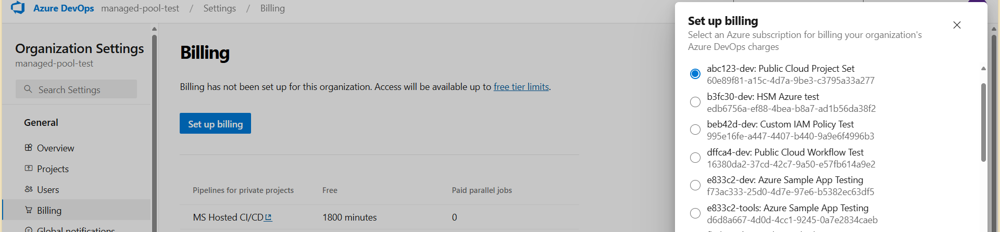
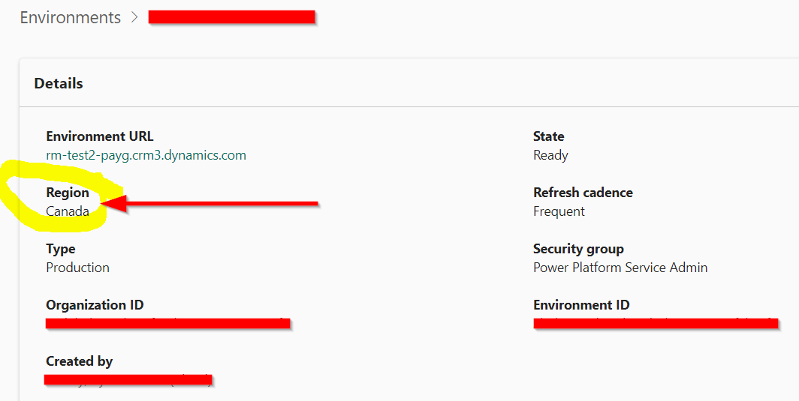

# External Microsoft services

Last updated: **{{ git_revision_date_localized }}**

## Overview

There are several Microsoft services that are commonly used in conjunction with Azure services. These may include services like Azure DevOps, Dynamics 365, Power Platform, etc. This document provides some considerations when working with these services within the Azure Landing Zone.

## Azure DevOps

Azure DevOps Services supports configuring billing to be associated with an Azure subscription. This allows you to use the same Azure subscription for both Azure DevOps and Azure resources.

For more information, please refer to the [Azure DevOps - Manage Billing](https://learn.microsoft.com/en-us/azure/devops/organizations/billing/set-up-billing-for-your-organization-vs?view=azure-devops) documentation.

## Power Platform

Microsoft Power Platform includes [Power Apps](https://learn.microsoft.com/en-us/power-apps/powerapps-overview), [Power Automate](https://learn.microsoft.com/en-us/power-automate/flow-types), [Power BI](https://learn.microsoft.com/en-us/power-bi/fundamentals/power-bi-overview), and Power Virtual Agents (now part of [Microsoft Copilot Studio](https://learn.microsoft.com/en-us/microsoft-copilot-studio/fundamentals-what-is-copilot-studio)). These services can be used to build custom applications, automate workflows, and analyze data.

Power Platform supports configuring billing to be associated with an Azure subscription. This allows you to use the same Azure subscription for both Power Platform and Azure resources.

For more information, please refer to the [Power Platform - Set up pay-as-you-go](https://learn.microsoft.com/en-us/power-platform/admin/pay-as-you-go-set-up?tabs=new) documentation.

!!! info "Information"
    If you plan on using an Azure subscription for Power Platform billing, please **pre-create** the Resource Group where the Power Platform resources will be deployed, and then contact the [Public cloud team](https://citz-do.atlassian.net/servicedesk/customer/portal/3) to apply the necessary resource region exemptions.

    This is required, because the Azure Landing Zones have a region restriction to `Canada Central` and `Canada East`, but the Power Platform's region selection do not align with the Azure regions. In the Power Platform, you can only select `Canada` as a region, which includes all Canadian regions.

    

## Azure Databricks and Unity Catalog

While the [Azure Databricks Workspace](https://learn.microsoft.com/en-us/azure/databricks/introduction/) is an Azure resource managed through the Azure Resource Manager, some of its advanced features, like [Unity Catalog](https://learn.microsoft.com/en-us/azure/databricks/data-governance/unity-catalog/), operate outside the standard Azure management plane.

Unity Catalog provides a centralized data governance layer for Databricks assets but is managed through the **Databricks control plane** via the [Databricks account console](https://accounts.azuredatabricks.net), not through the Azure Portal.

| Feature                           | Owned/Managed by         | Lives in Azure? | Lives in Databricks? |
| --------------------------------- | ------------------------ | --------------- | -------------------- |
| **Azure Databricks Workspace**    | Azure Resource Manager   | ✅ Yes          | ✅ Yes (shared)      |
| **Unity Catalog**                 | Databricks Control Plane | ❌ No           | ✅ Yes               |
| **Metastore (for Unity Catalog)** | Databricks Account       | ❌ No           | ✅ Yes               |

!!! info "Unity Catalog Status"
    As noted in the [Azure Services](./azure-services.md#azure-databricks-and-unity-catalog) documentation, **Unity Catalog is currently not enabled or governed** within the B.C. government's Azure environment. Please refer to that page for more details on the current status and implications.
