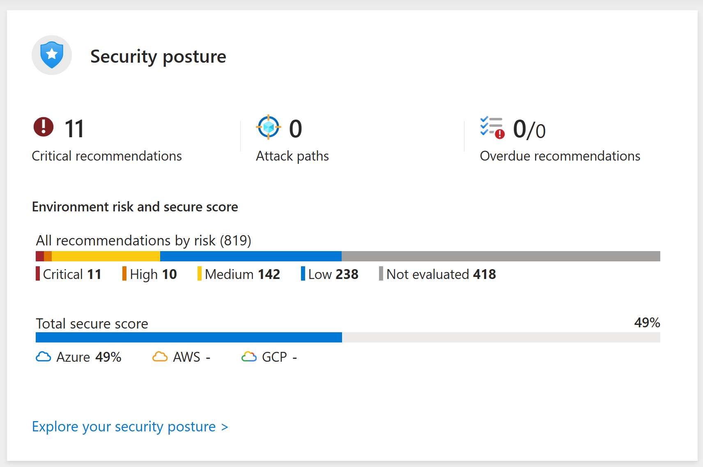
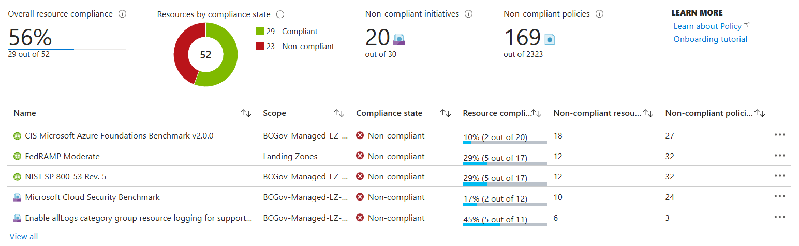
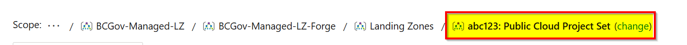

# Governance

Last updated: **{{ git_revision_date_localized }}**

The following describes how to manage and govern your Azure environment. While the Public Cloud team provides the initial guardrails and standards for the environment, **each ministry team is responsible** for managing their own resources and ensuring compliance with the standards.

## Security

Within the Azure portal, navigate to [Microsoft Defender for Cloud](https://portal.azure.com/#view/Microsoft_Azure_Security/SecurityMenuBlade/~/0). This service provides a centralized view of the security posture and regulatory compliance of your Azure environment. It also provides recommendations on how to improve your security.

## Compliance

Within the Azure portal, navigate to [Azure Policy](https://portal.azure.com/#view/Microsoft_Azure_Policy/PolicyMenuBlade/~/Compliance). This service provides a centralized view of the compliance of your Azure environment. It also provides recommendations on how to improve your compliance.

## Cost

Within the Azure portal, navigate to the [Cost Management - Cost Analysis](https://portal.azure.com/#blade/Microsoft_Azure_CostManagement/Menu/costanalysis) view. This service provides a centralized view of the costs of your Azure environments.

!!! example "View Scope"
    Please make sure that you select the appropriate **Scope** to view the costs of your environment.
    

For more detail about managing costs, see the **Understand your billing** > [Azure Cost Management](../understanding-your-bill/azure-billing-and-cost-management.md) section.
