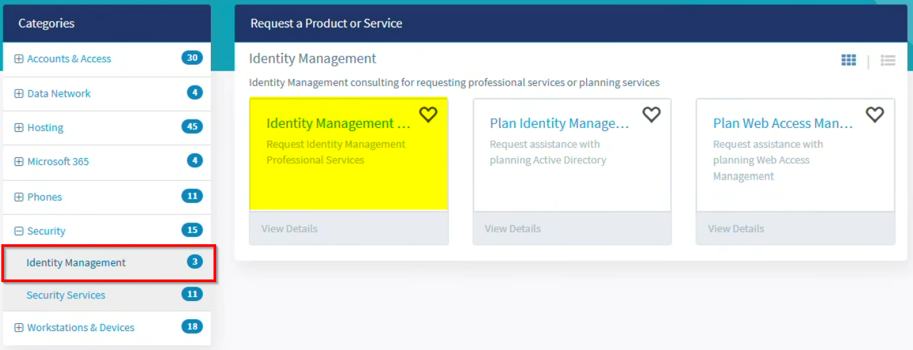

# Requesting a Microsoft Entra app registration

Last updated: **{{ git_revision_date_localized }}**

## When do you need an app registration?

An [app registration](https://learn.microsoft.com/en-us/entra/identity-platform/application-model) in Microsoft Entra ID is required when your application needs to:

- Authenticate users with BC Gov credentials (e.g. single sign-on)
- Access Microsoft Graph API or other Microsoft APIs on behalf of users or as a service
- Act as an OAuth 2.0 / OpenID Connect identity provider for your custom application
- Integrate with Microsoft 365 services that require a registered app
- Establish cross-cloud trust (e.g. GitHub Actions or AWS workloads authenticating to Azure)

If your workload runs on Azure compute and only needs to access other Azure resources, use a [managed identity](https://learn.microsoft.com/en-us/entra/identity/managed-identities-azure-resources/overview) instead — no app registration is required.

## Choose the right authentication method

When requesting an app registration, you must specify an authentication method. Use the highest-priority option that your workload supports:

| Priority | Method | When to use |
|---|---|---|
| 1 | **Managed Identity** | Workload runs on Azure compute (App Service, AKS, Functions, Container Apps, VMs). No credentials to manage. |
| 2 | **Federated Identity Credential** | External platforms (GitHub Actions, AWS, GCP, Kubernetes). Uses OIDC trust — no secrets stored. |
| 3 | **Certificate** | Where federated credentials are not supported. Must be stored in and auto-rotated via Azure Key Vault. Maximum lifetime of 180 days. |
| 4 | **Client Secret** | Exception only. Requires documented justification and a migration plan. Maximum lifetime of 180 days. Must be stored in Key Vault. |

!!! warning "Avoid long-lived credentials"
    Client secrets and certificates must be stored exclusively in Azure Key Vault with automated rotation configured. Hard-coded credentials in source code or pipeline variables are prohibited.

## Naming convention

Your app registration display name must follow this pattern:

```
<org>-<project>-<env>-<platform>-<system>-<purpose>-<auth>
```

| Segment | Description | Examples |
|---|---|---|
| `org` | Ministry or team abbreviation | `citz`, `hlth`, `fin`, `pssg` |
| `project` | Project identifier | `abc123` |
| `env` | Environment | `dev`, `test`, `tools`, `prod` |
| `platform` | Hosting platform | `azure`, `aws`, `github`, `gcp` |
| `system` | Application or system name | `payments`, `analytics`, `infra` |
| `purpose` | Functional role | `api`, `deploy`, `etl`, `sso` |
| `auth` | Authentication type | `mi`, `fed`, `cert`, `secret` |

**Examples:**

- `citz-abc123-prod-azure-payments-api-mi` — Azure-hosted payments API using managed identity
- `citz-abc123-prod-github-infra-deploy-fed` — GitHub Actions deployment pipeline using federated credential
- `citz-abc123-dev-aws-analytics-etl-fed` — AWS cross-cloud ETL workload using federated credential

## What to include in your request

When submitting your request through My Service Centre, be prepared to provide:

- **Workload classification** — Azure workload, external platform, user-facing app, CI/CD pipeline, or legacy integration
- **Display name** — following the naming convention above
- **Authentication method** — with justification if using a client secret
- **API permissions** — specific scopes required, with justification for each
- **Owner group** — an Entra security group with a minimum of 2 members
- **Environment and data classification**
- **Review/expiry date** — maximum 12 months from creation

## How to submit a request

All Entra app registrations in the PROD tenant must be requested through **My Service Centre**. Self-registration is not available.

Submit a request through [My Service Centre](https://myservicecentre.gov.bc.ca) following the steps in the [Requesting Multi-Factor Authentication (MFA) for your organization's applications](https://ociomysc.service-now.com/sp?id=kb_article&sys_id=2061f63d2be2fe50a955f4f5ce91bf5f&spa=1) knowledge base article.



## What doesn't require this process

The following continue to work without a separate app registration request:

- **Managed identities** — automatically managed by Azure for resource-to-resource authentication
- **Enterprise applications** — apps registered externally that use BC Gov credentials
- **Azure service management identities** — such as Managed Service Identity or Windows Azure Service Management API

## Support

If you have questions about app registrations or run into issues:

- **Portal:** [My Service Centre](https://myservicecentre.gov.bc.ca)
- **KB Article:** [Requesting Multi-Factor Authentication (MFA) for your organization's applications](https://ociomysc.service-now.com/sp?id=kb_article&sys_id=2061f63d2be2fe50a955f4f5ce91bf5f&spa=1)
- **Public cloud support:** [please contact the Public cloud team](https://citz-do.atlassian.net/servicedesk/customer/portal/3) for support
