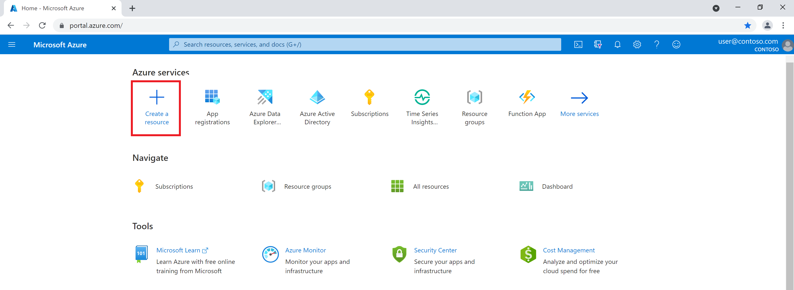
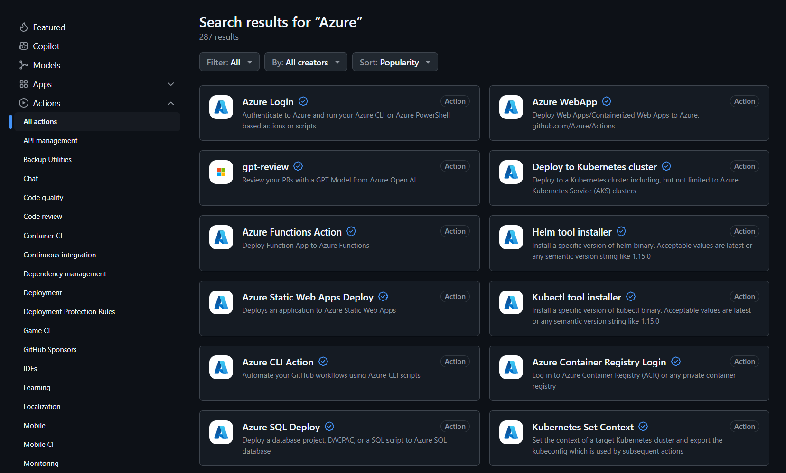

# Deploy to the Azure Landing Zone

Last updated: **September 24, 2024**

There are multiple ways to deploy your application to the Azure Landing Zone. This document outlines a few examples at a high-level, but it is up to each team to determine the best approach for their application.

## Azure Portal (UI)

The Azure Portal is a web-based application that allows you to manage your Azure resources. You can deploy your application to the Azure Landing Zone using the Azure Portal by following these steps:

1. Sign in to the [Azure Portal](https://portal.azure.com/).
2. Click on the **Create a resource** button.
3. Search for the resource you want to create.
4. Click on the **Create** button.
5. Fill in the required information.
6. Click on the **Review + create** button.
7. Click on the **Create** button.



## Azure CLI

The Azure CLI is a command-line tool that allows you to manage your Azure resources. You can deploy your application to the Azure Landing Zone using the Azure CLI by following these steps:

1. Install the [Azure CLI](https://learn.microsoft.com/en-us/cli/azure/install-azure-cli).
2. Sign in to your Azure account by running the `az login` command.
3. Create the resource you want by using the appropriate `az create` command.

```azurecli
az login
az account set --subscription "<your-Azure-subscription-ID>"
```

**Note:** There are other command-line tools like [Azure PowerShell](https://learn.microsoft.com/en-us/powershell/azure/), that you can use to manage your Azure resources. You can choose the tool that you are most comfortable with.

## GitHub Actions / Infrastructure-as-Code (IaC)

GitHub Actions is a feature of GitHub that allows you to automate your workflow. Microsoft developed GitHub Actions for Azure and designed them be used with Azure. You can see all of the GitHub Actions for Azure in the [GitHub Marketplace](https://github.com/marketplace?query=Azure&type=actions).



**Note:** Be sure to review the [CI/CD Best Practices](../best-practices/ci-cd.md) before implementing GitHub Actions.

### Infrastructure-as-Code (IaC)

There are multiple ways to deploy your application to the Azure Landing Zone using Infrastructure-as-Code (IaC). You can use tools like [Terraform](https://www.terraform.io/), [Azure Resource Manager (ARM) templates](https://learn.microsoft.com/en-us/azure/azure-resource-manager/templates/), [Bicep](https://learn.microsoft.com/en-us/azure/azure-resource-manager/bicep/overview?tabs=bicep), [Ansible](https://learn.microsoft.com/en-us/azure/developer/ansible/overview), [Chef](https://learn.microsoft.com/en-us/azure/developer/chef/overview), or [Pulumi](https://devblogs.microsoft.com/devops/infrastructure-as-code-azure-python-wpulumi/) to define your infrastructure as code and deploy it to Azure.

While we don't have a specific example for each tool, we recommend that you choose the tool that you are most comfortable with and that best fits your needs.

**Important:** If you are using Terraform to deploy your application to Azure, please take note of the following: [Using Terraform to Create Subnets](../best-practices/be-mindful.md#using-terraform-to-create-subnets) and [AzAPI Terraform Provider (using azapi_update_resource)](../best-practices/be-mindful.md#azapi-terraform-provider-using-azapi_update_resource).
