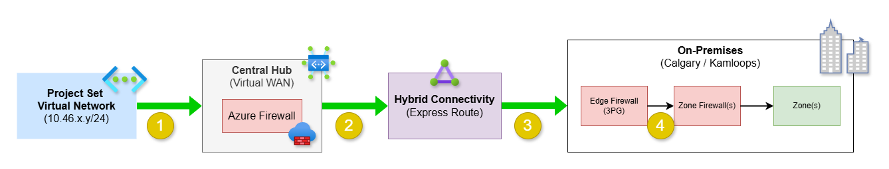
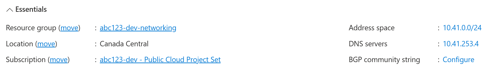
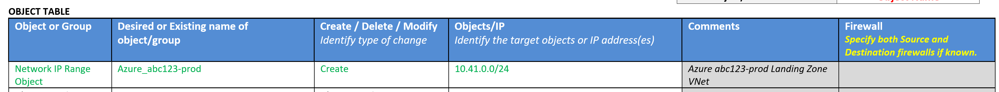
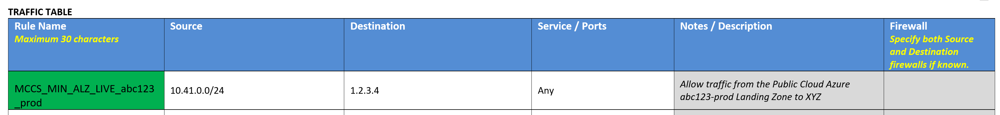

# On-premises connectivity with Azure Express Route

Last updated: **{{ git_revision_date_localized }}**

The following sections describe how hybrid connectivity is implemented in Azure using Express Route, along with the process to establish connectivity between a Project Set's virtual network and an on-premises network.

## Overview

Azure Express Route is a service that provides a private connection between an organization's on-premises infrastructure and Azure data centers. This connection does not go over the public internet, which enhances security, reliability, and performance.

Our configuration of Express Route also include encryption of data in transit (via IPSEC), ensuring that data remains secure while being transmitted between Azure and on-premises networks.

## Azure to on-premises connectivity

To establish connectivity between an Azure virtual network and an on-premises network, the following steps are typically involved.

1. Traffic is routed from the **Azure Virtual Network (VNet)**. This traffic is directed to the centralized **Azure Firewall**, which acts as a security boundary and controls the flow of traffic.
  - To allow traffic to flow from the Azure VNet to the on-premises network, the Azure Firewall must be configured with appropriate rules. Please submit an Azure [Firewall Change Request](https://citz-do.atlassian.net/servicedesk/customer/portal/3/group/18).
2. After passing through the **Azure Firewall**, the traffic is routed to the **Express Route** connection.
  - This requires that the Virtual WAN vHub has the proper **private traffic range** configured. Please ensure that you include the private IP address range of the on-premises network you want to connect to.
3. Express Route then **forwards the traffic** to the on-premises network.
  - The on-premises network must be **configured to accept traffic from the Azure VNet**.
4. On the on-premises side, the traffic is received by the **Edge firewall** (referred to as the "**3PG**"). There are additional firewalls for each respective on-premises **Zone**, which also need to be configured to allow traffic from the Azure VNet.
  - You will need to submit an on-premises **firewall request** (via iStore), requesting a new firewall rule be created to allow traffic from the Azure VNet, through the 3PG firewall, and subsequently through the Zone firewall.
  - You will need to include the **source** (ie. your VNet), and the **destination** (ie. your target on-premises network) in the request.
  - On-premises firewall request form: [Office of the Chief Information Officer: Third Party Gateway Service](https://ssbc-client.gov.bc.ca/services/3rdpartygateway/order.htm)

!!! warning "On-premises initiated traffic"
    If you require an on-premises resource to **initiate traffic to an Azure resource**, you will need a separate firewall rule for that traffic flow.

## Example request form

The following is an example of a request to establish connectivity between an Azure VNet and an on-premises network.

The **Object Table** should **create** a **Network IP Range Object** for the Azure VNet.

The **Traffic Table** should **add a traffic rule** (using the naming pattern of `MCCS_(Ministry Short Name)_ALZ_LIVE_(ProjectSet License Plate)_(ENV)`) to allow traffic from the Azure VNet to the on-premises network. The `Source` should be the Azure VNet address space, and the `Destination` should be the on-premises network address space.

For example: `MCCS_CITZ_ALZ_LIVE_abc123_prod`.

!!! warning "Bi-directional traffic"
    Remember, if you require bi-directional traffic (ie. on-premises to Azure), you will need to include an additional rule in the Traffic Table for that flow.
