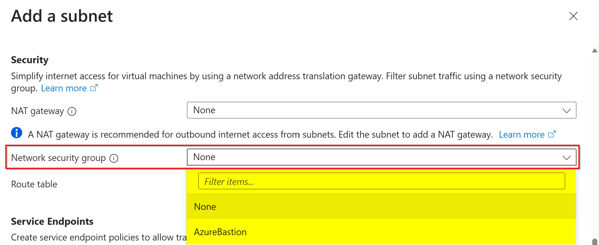

# Next steps

Last updated: **{{ git_revision_date_localized }}**

At this point, you should have a Project Set provisioned in Azure. Now what?

!!! tip "Microsoft Learn Modules"
    Please refer to the [Microsoft Learn modules](#reference-microsoft-learn-modules) list at the end of this page for a curated list of additional training on Azure concepts and services related to these topics.

## Networking

Per the [Azure Landing Zone Overview](../get-started-with-azure/bc-govs-azure-landing-zone-overview.md#networking), each Project Set has its own Virtual Network (VNet) to isolate resources and provide secure connectivity.

Since most projects will deploy common Azure resources that have network security guardrails, such as preventing databases from being exposed to the public internet, you will need to **create a Subnet** within the VNet to host your resource's **Private Endpoints**.

!!! quote "Dedicated subnet for private endpoints"
    According to the Microsoft [Private Endpoint documentation](https://learn.microsoft.com/en-us/azure/private-link/private-link-faq#do-i-require-a-dedicated-subnet-for-private-endpoints--), "_You don't require a dedicated subnet for Private Endpoints. You can choose a Private Endpoint IP from any subnet from the virtual network where your service is deployed._"

    However, it is a common practice to create a dedicated Subnet for Private Endpoints to ensure that they are isolated from other resources and to apply specific Network Security Group (NSG) rules.

!!! tip "Subnet creation via Azure portal"
    Due to other security guardrails, Subnets cannot be created without a Network Security Group (NSG) associated with it. If you are using the [Azure Portal](https://portal.azure.com) however, the UI experience does not allow you to create an NSG **at the same time** as a Subnet. You can only **select an existing** NSG to associate with the Subnet. Therefore, you will need to create the NSG **first**, and then create the Subnet and associate it with the NSG.

    

The number of Subnets you will need to create depends on the architecture of your project, and the Azure services you plan to deploy.

!!! success "NSG best practice"
    It is a best practice to create **one NSG per Subnet** (instead of re-using a single NSG across multiple subnets). This allows you to apply specific security rules to each Subnet, enhancing the security posture of your Azure resources.

## Working with Private Endpoints

Private Endpoints are a secure way to connect to Azure services over a private link, ensuring that traffic between your resources and the Azure service does not traverse the public internet.

When you deploy Azure resources, you should create a **Private Endpoint** for each service. This Private Endpoint will be deployed within the Subnet you created earlier, and it will allow your resources to communicate with the Azure service securely.

However, because Private Endpoints are **not accessible** from the public internet, you will need to interact with these resources **from within** the Virtual Network. This is typically done by deploying a **Virtual Machine (VM)** within the same Virtual Network.

!!! note "Virtual machine subnet"
    You can deploy a Virtual Machine into an existing Subnet, or you can create a new Subnet specifically for the VM.

After deploying a Virtual Machine, you will need to deploy **Azure Bastion** to securely connect to the VM over the internet.

!!! question "Which Azure Bastion SKU to use?"
    The minimum Bastion SKU required is **Developer**. This SKU **does not** require a dedicated Subnet. However, please review the [Azure Bastion SKU](https://learn.microsoft.com/en-us/azure/bastion/configuration-settings#skus) documentation to determine the best SKU for your needs.

    If you determine that you need a feature in a SKU higher than "Developer", you will need to create a **dedicated Subnet** for it. For more information and guidance, please refer to the [Tools - Azure Bastion](../tools/bastion.md) page.

    As a future proof consideration, you may want to create a dedicated Subnet for Azure Bastion, even if you start with the Developer SKU. This will allow you to easily upgrade to a higher SKU in the future without needing to reconfigure your network.

### Accessing Azure resources

Once you have deployed Azure Bastion and a Virtual Machine, you can connect to the VM using Azure Bastion. This allows you to access the Azure portal **through a web browser running on the VM**. This is how you will be able to interact with the Azure resources that have Private Endpoints, as they are only accessible from within the Virtual Network.

## Reference TechDocs pages

- [Networking within the Azure Landing Zone](networking.md)
- [Private Endpoints and DNS](../best-practices/be-mindful.md)
- [Azure Bastion](../tools/bastion.md)

## Reference Microsoft Learn modules

- [Configure network security groups](https://learn.microsoft.com/en-us/training/modules/configure-network-security-groups/)
- [Create subnets](https://learn.microsoft.com/en-us/training/modules/configure-virtual-networks/3-create-subnets?ns-enrollment-type=learningpath&ns-enrollment-id=learn.wwl.configure-secure-workloads-use-azure-virtual-networking)
- [Design and implement private access to Azure Services](https://learn.microsoft.com/en-us/training/modules/design-implement-private-access-to-azure-services/)
- [Connect to virtual machines through the Azure portal by using Azure Bastion](https://learn.microsoft.com/en-us/training/modules/connect-vm-with-azure-bastion/)
