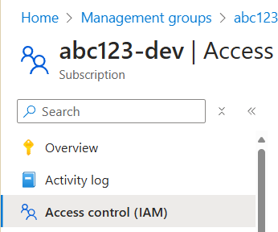
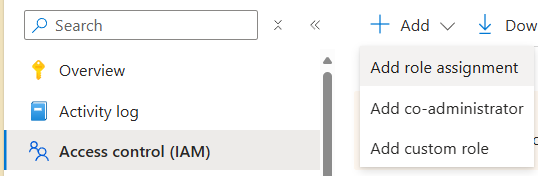
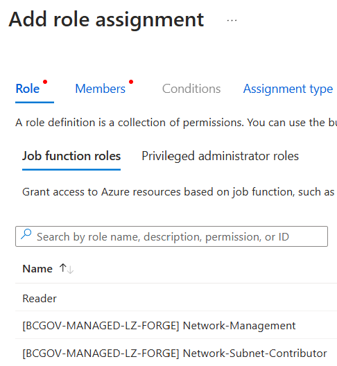
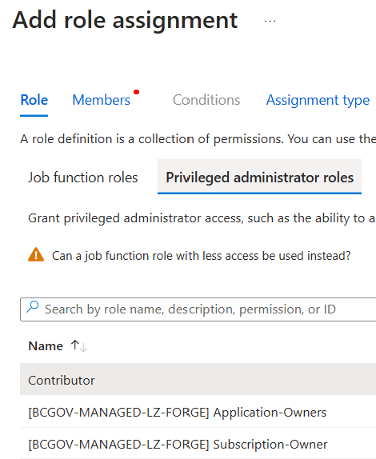

# User management in the Azure Landing Zone

Last updated: **{{ git_revision_date_localized }}**

This guide provides an overview of user management in the Azure Landing Zone, specifically tailored for Product Owners (POs) and Technical Leads (TLs) who have been granted a restricted Owner role on the Project Set Management Group. This role is inherited on the subscriptions within the Project Set.

## What you can do

As a Product Owner or Technical Lead with restricted Owner permissions, you have the ability to:

* Assign users to roles at various levels:

   - Project Set Management Group (prefixed with your Project Set license plate, ie. "abc123")
   - Subscription (prefixed with your Project Set license plate, ie. "abc123")
   - Resource groups
   - Individual resources

* Create [custom Roles](https://learn.microsoft.com/en-us/azure/role-based-access-control/custom-roles)
* Create and manage [Service Principals](https://learn.microsoft.com/en-us/entra/identity-platform/app-objects-and-service-principals?tabs=browser)
* Create and manage [Managed Identities](https://learn.microsoft.com/en-us/entra/identity/managed-identities-azure-resources/overview)
* Create and manage all resources within your subscription

## What you can't do

As a Product Owner or Technical Lead with restricted Owner permissions, you do not have the ability to:

* Assign users to an Owner role

## Best practices for user management

To ensure secure and efficient user management, we recommend the following best practices:

1. **Assign roles at higher levels**: Whenever possible, assign users to roles at the Management Group or Subscription levels. This approach simplifies management and provides consistent access across resources.

2. **Follow the principle of least privilege**: Only give users the roles they need to perform their specific job functions. This minimizes potential security risks.

3. **Regularly review access**: Periodically review user access and remove unnecessary permissions to maintain a secure environment.

## How to manage users in the Azure portal

To manage users and their roles:

1. Log in to the [Azure portal](https://portal.azure.com).

2. Navigate to your Subscription or Management Group (remember, these are prefixed with your Project Set license plate, ie. "abc123").

3. In the left sidebar, click on "**Access control (IAM)**".

   

4. Use the "**Add**" button to assign new roles to users.

   

   

5. To add a user as a **Contributor**, choose **Add Role Assignment** > **Privileged Administrator Roles** > **Contributor**.

   

6. Use the "**Role assignments**" tab to view and manage existing role assignments.

   

7. To create custom roles, use the "**Roles**" tab and click "**Add custom role**".

Remember, user management is a critical aspect of maintaining a secure and well-organized Azure environment. Always double-check your assignments and follow your organization's security policies.

For more detailed instructions on specific tasks or advanced user management techniques, please refer to the [official Azure documentation](https://docs.microsoft.com/en-us/azure/role-based-access-control/).

## Note on Project Set license plates

Your Management Groups and Subscriptions are prefixed with your unique Project Set license plate (ie. "abc123"). This prefix helps identify and organize resources specific to your project. When navigating the Azure portal or assigning roles, always look for resources and groups that start with your Project Set license plate.
