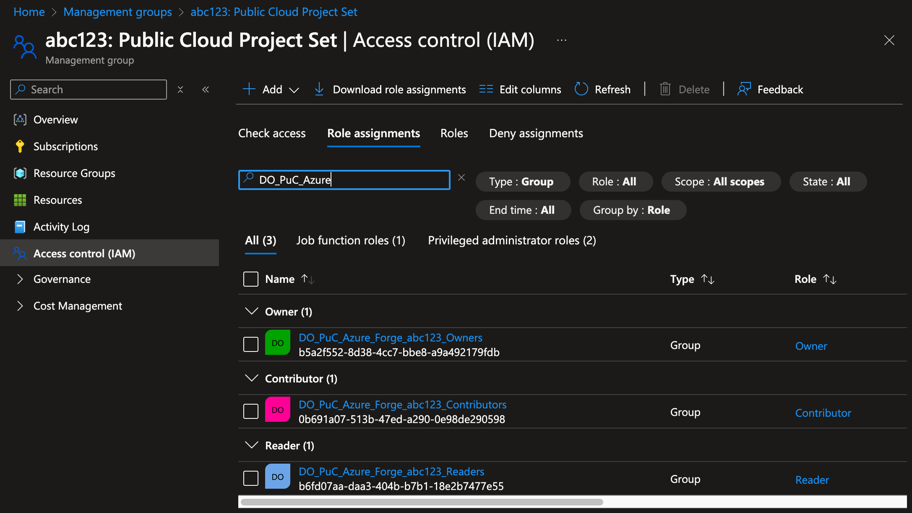

# User management in the Azure Landing Zone

Last updated: **{{ git_revision_date_localized }}**

This guide explains how to manage user access in your Azure Landing Zone. It's designed for Product Owners (POs) and Technical Leads (TLs) who need to administer user permissions within their project set.

## Understanding your project set

Your project set consists of up to four Azure subscriptions grouped under a single management group. Depending on your needs, you may have deployed one or more of these subscriptions:

```
Project Set Management Group (abc123)
├── Development Subscription (abc123-dev)
├── Test Subscription (abc123-test)
├── Production Subscription (abc123-prod)
└── Tools Subscription (abc123-tools)
```

The specific subscriptions that are deployed for your project set are defined in the [Platform Product Registry](https://registry.developer.gov.bc.ca/). This is where your team would have specified which environments: Development, Test, Production, and/or Tools, you need for your project.

All your resources are organized within these subscriptions, and your unique project set license plate, for example: "abc123", prefixes all your management groups and subscriptions.

## Access management overview

### Permission tiers

Your project set uses three standard permission levels:

- **Reader**: View-only access to resources
- **Contributor**: Can create and manage resources but cannot modify access permissions
- **Owner**: Administrative access with full control (with certain security restrictions)

!!! note "Policy Restrictions"
    While these roles provide different levels of access, all actions are still subject to [Azure Policy restrictions](../get-started-with-azure/guardrails.md). Even with Owner or Contributor roles, certain operations may be restricted by policies applied to your Project Set. These policies help ensure compliance with security standards and organizational requirements.

### Security group structure

Access is managed through EntraID security groups that follow this naming pattern:

`DO_PuC_Azure_Live_{LicensePlate}_{Role}`

For example:

- `DO_PuC_Azure_Live_abc123_Owners`
- `DO_PuC_Azure_Live_abc123_Contributors`
- `DO_PuC_Azure_Live_abc123_Readers`

These groups are assigned roles at the Management Group level, which automatically propagates permissions down to all subscriptions within your Project Set. This approach ensures consistent access control across your entire Project Set, regardless of how many subscriptions you have deployed (from one to four).



## What you can and cannot do

### As a Product Owner or Technical Lead with the Owner role, you can:

- Manage membership in your security groups
- Create custom roles for specific needs
- Create and manage service principals
- Assign service principals to a role on resources
- Create and manage managed identities
- Create and manage all resources within your subscriptions (subject to [policy restrictions](../get-started-with-azure/guardrails.md))

### You cannot:

- Assign users or groups directly to an Owner role
- Create direct role assignments (outside of security groups) at any level:
  - Project Set Management Group
  - Subscriptions
  - Resource groups
  - Individual resources
- Bypass [Azure Policy restrictions](../get-started-with-azure/guardrails.md) (policies take precedence over RBAC permissions)

This restriction is by design to maintain security and simplify access auditing for regulatory compliance.

!!! info "Service Principals Exception"
    While you cannot directly assign users or groups to roles, you can still directly assign Service Principals to roles.

## Managing group membership

As a Product Owner, you have two options for managing your security groups:

### Option 1: Using Microsoft Account Management

1. Go to [Microsoft Account Groups](https://myaccount.microsoft.com/groups)
2. Sign in with your Microsoft account
3. You'll see a list of groups you own or are a member of
4. For groups you own, you can:
   - Add or remove members
   - View group details
   - Manage group settings

### Option 2: Using the Azure Portal

1. Log in to the [Azure portal](https://portal.azure.com)
2. Navigate to your Azure Active Directory
3. Go to "Groups" in the left sidebar
4. Find and select your security group (prefixed with your Project Set license plate)
5. Use the "Members" tab to add or remove users

## Best practices for user management

1. **Use the right permission level**: Assign users to the appropriate security group based on their needs:
   - Readers for those who only need to view resources
   - Contributors for those who need to create and manage resources
   - Owners only for those who need administrative access

2. **Follow the principle of least privilege**: Only give users the minimum access they need to perform their job functions.

3. **Regularly review access**: Periodically audit your security groups and remove unnecessary permissions.

4. **Document your access structure**: Maintain documentation of who has access to what and why.

5. **Be aware of policy restrictions**: Understand that [Azure Policies](../get-started-with-azure/guardrails.md) may restrict certain actions regardless of RBAC permissions.

## Service principals

[Service principals](https://learn.microsoft.com/en-us/entra/architecture/service-accounts-principal) are security objects within a Microsoft Entra ID application that define what an application can do in a given tenant. They're set up in the Azure portal during the application registration process and configured to access Azure resources.

!!! info "Managed identities"
    Managed identities are similar to service principals but are automatically managed by Azure. They provide an identity for applications to use when connecting to resources that support Azure AD authentication. Managed identities are created and managed by Azure, so you don't have to worry about credentials or secrets.

    For more information, see [What are managed identities for Azure resources?](https://learn.microsoft.com/en-us/azure/active-directory/managed-identities-azure-resources/overview)

For guidance on creating and managing service principals, refer to the [Register a Microsoft Entra app and create a service principal](https://learn.microsoft.com/en-us/entra/identity-platform/howto-create-service-principal-portal) documentation.

!!! danger "Long lived credentials"
    To avoid security risks, we highly discourage the use of **long-lived credentials**. Instead, use short-lived credentials or managed identities whenever possible. This reduces the risk of credential leakage and ensures that your applications are more secure.

## Azure Control-Plane vs Data-Plane access differences

Understand the differences between [control-plane](https://learn.microsoft.com/en-us/azure/azure-resource-manager/management/control-plane-and-data-plane#control-plane) and [data-plane](https://learn.microsoft.com/en-us/azure/azure-resource-manager/management/control-plane-and-data-plane#data-plane) access. The control plane is used to manage resources, while the data plane is used to interact with the resources themselves.

Even though someone may have **Owner-level** permissions on a resource, they may not have the necessary permissions to interact with the **data plane**. This is because the data plane permissions are separate from the control plane permissions.

For example, some Azure services and solution patterns may require additional data-level permissions, such as [Storage Blob Data Reader](https://learn.microsoft.com/en-us/azure/role-based-access-control/built-in-roles/storage#storage-blob-data-reader), [Search Index Data Contributor](https://learn.microsoft.com/en-us/azure/role-based-access-control/built-in-roles/ai-machine-learning#search-index-data-contributor), etc.

For a list of built-in roles and their permissions, refer to the [Azure built-in roles](https://learn.microsoft.com/en-us/azure/role-based-access-control/built-in-roles) documentation.

## Need help?

If you need assistance with user management or have questions about your access structure, [please contact the Public Cloud team](https://citz-do.atlassian.net/servicedesk/customer/portal/3) for support.
