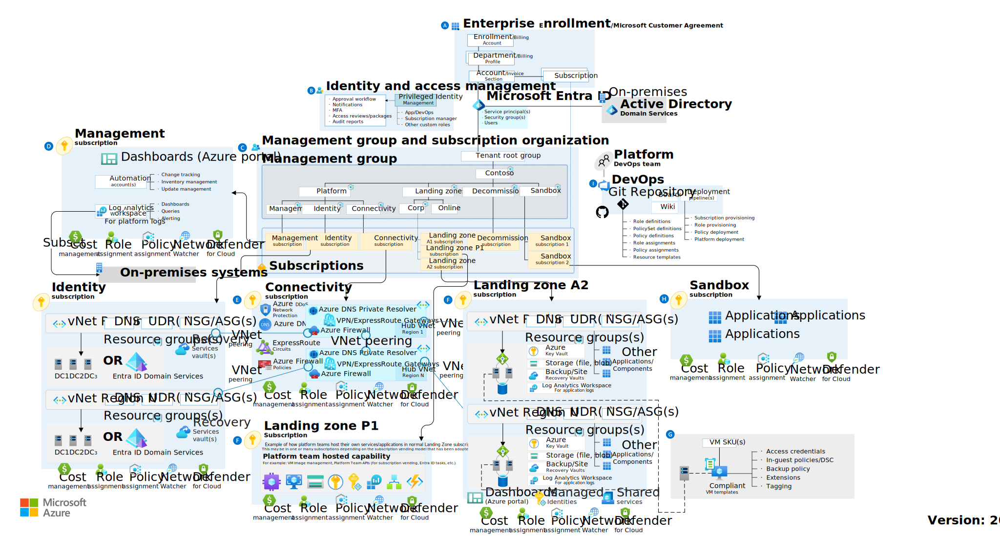
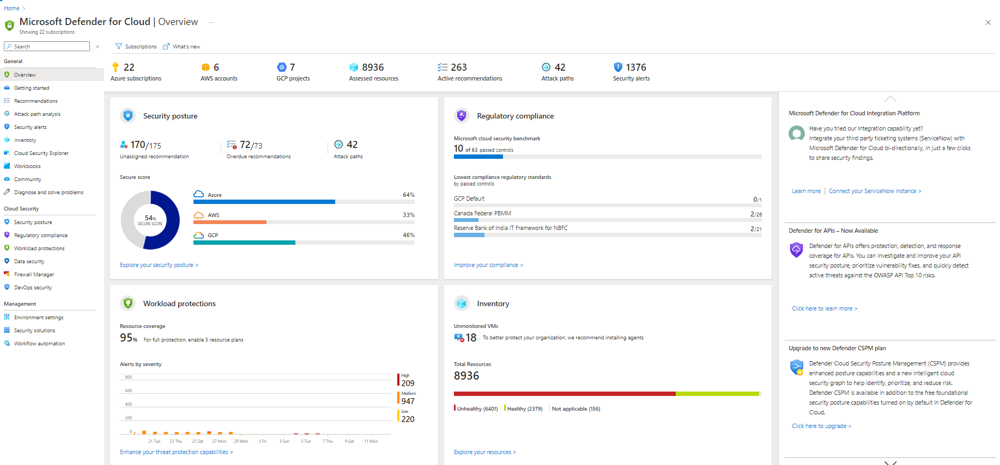
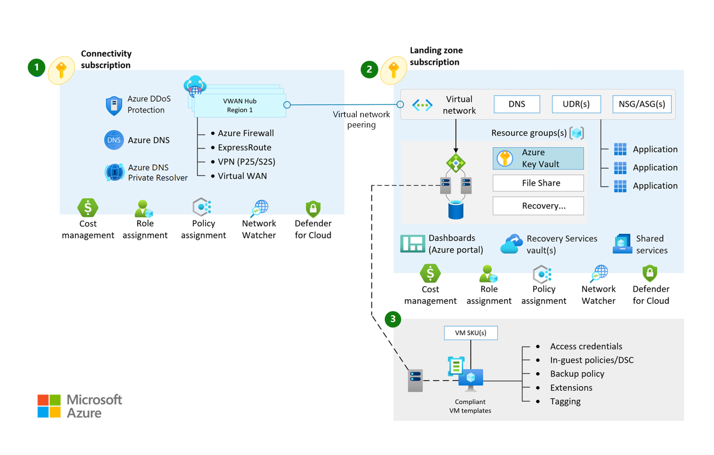
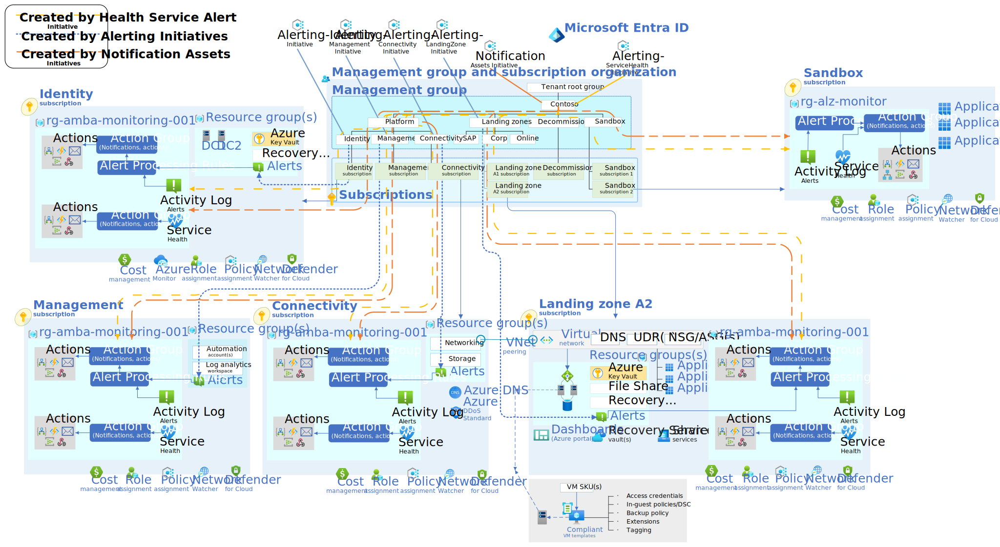
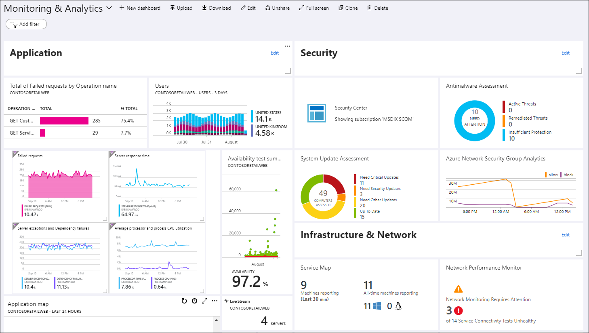

# B.C. Government OCIO Azure Landing Zone overview

Last updated: **{{ git_revision_date_localized }}**

An overview of the B.C. Government OCIO's Landing Zone in Azure, how to get access, its benefits, components, and features.

---

## Benefits of building apps in the Azure Public Cloud

For B.C. Government ministry teams developing applications in the Azure Public Cloud, the OCIO Landing Zone provides a secure, compliant, and efficient pathway. This facilitates the creation of innovative and responsive applications that effectively serve the public.

The [Microsoft Cloud Adoption Framework (CAF)](https://learn.microsoft.com/en-us/azure/cloud-adoption-framework/overview), and [Well-Architected Framework (WAF)](https://learn.microsoft.com/en-us/azure/well-architected/what-is-well-architected-framework) ensures that you can develop and deploy applications in a secure, compliant, and controlled Azure environment, enabling you to focus on delivering innovative and effective digital services.

The following diagram illustrates the Cloud Adoption Framework (CAF) and the various components that support the Landing Zones. For more information, please refer to the official Microsoft documentation on [What is an Azure Landing Zone?](https://learn.microsoft.com/en-us/azure/cloud-adoption-framework/ready/landing-zone/)

## Components and features

In this section, we'll provide a high level overview of the components and features of the OCIO's Landing Zone in Azure.

### Security guardrails

The built-in Azure Policy [Regulatory Compliance](https://learn.microsoft.com/en-us/azure/governance/policy/samples/built-in-initiatives#regulatory-compliance) initiatives provides a security framework for B.C. Government ministry teams developing applications in the Azure Public Cloud. This framework includes both preventative and detective controls to ensure a secure and compliant cloud environment.

[Microsoft Defender for Cloud (MDfC)](https://learn.microsoft.com/en-us/azure/defender-for-cloud/defender-for-cloud-introduction) (formerly known as Security Center) offers a centralized dashboard for assessing the security posture of your resources in Azure. Defender for Cloud frameworks such as the [Microsoft Cloud Security Benchmark](https://learn.microsoft.com/en-us/security/benchmark/azure/overview), [CIS Microsoft Azure Foundations Benchmark](https://learn.microsoft.com/en-us/azure/governance/policy/samples/cis-azure-2-0-0), [Cloud Security Posture Management (CSPM)](https://learn.microsoft.com/en-us/azure/defender-for-cloud/concept-cloud-security-posture-management), [NIST SP 800-53](https://learn.microsoft.com/en-us/azure/governance/policy/samples/nist-sp-800-53-r5), and [Canada Federal PBMM](https://learn.microsoft.com/en-us/azure/governance/policy/samples/canada-federal-pbmm) have been enabled for comprehensive checks against Azure resources.

For more information see [Azure Guardrails](guardrails.md)

### Networking

The Cloud Adoption Framework (CAF) implements a hub-and-spoke network topology. The hub is the central point of connectivity to the on-premises network, and the spoke is the virtual network that connects to the hub. The hub-and-spoke model allows for the centralization of services and management, while providing isolation and segmentation for workloads.

The B.C. government has implemented the hub-and-spoke module using the modern [Virtual WAN (vWAN)](https://learn.microsoft.com/en-us/azure/virtual-wan/virtual-wan-about) architecture. Within this architecture, each Project Set is provisioned with a spoke Virtual Network (VNet) that connects to the Virtual Hub (vHub).

For additional information, please refer to the [Networking within the Azure Landing Zone](../design-build-deploy/networking.md) documentation.

### Monitoring and logging

The Cloud Adoption Framework (CAF) implements the components necessary for centralized monitoring and logging, include: [Azure Monitor](https://learn.microsoft.com/en-us/azure/azure-monitor/overview), [Azure Activity Logs](https://learn.microsoft.com/en-us/azure/azure-monitor/essentials/activity-log-insights), [Azure Metrics](https://learn.microsoft.com/en-us/azure/azure-monitor/essentials/data-platform-metrics), and a centralized [Log Analytics Workspace](https://learn.microsoft.com/en-us/azure/azure-monitor/logs/log-analytics-workspace-overview).

Baseline metric, activity log, and log query alerts are available for landing zone platform components and other selected landing zone components. They're based on Microsoft recommended practices for proactive monitoring, such as setting up alerts, thresholds, and notifications for timely problem detection and response.

While Microsoft provides various "insights or solutions" for popular services (ie. [Storage Insights](https://learn.microsoft.com/en-us/azure/storage/common/storage-insights-overview), [VM Insights](https://learn.microsoft.com/en-us/azure/azure-monitor/vm/vminsights-overview), [Container Insights](https://learn.microsoft.com/en-us/azure/azure-monitor/containers/container-insights-overview)), these do not cover every Azure service.

We have leveraged the [Azure Monitor Baseline Alerts (AMBA)](https://azure.github.io/azure-monitor-baseline-alerts/welcome/) to provide a starting point "What should be monitored in Azure?" for the Landing Zones. This includes a set of alerts that are based on Microsoft recommended practices for proactive monitoring, such as setting up [alerts](https://learn.microsoft.com/en-us/azure/azure-monitor/alerts/alerts-overview), [thresholds](https://learn.microsoft.com/en-us/azure/azure-monitor/alerts/alerts-dynamic-thresholds), and notifications for timely problem detection and response. Included in this, is a generic [Action Group](https://learn.microsoft.com/en-us/azure/azure-monitor/alerts/action-groups) and [Alert Processing Rule](https://learn.microsoft.com/en-us/azure/azure-monitor/alerts/alerts-processing-rules?tabs=portal) that can be used to send notifications to a variety of endpoints (email, SMS, etc.).

While these baselines have been implemented (primarily for regulatory compliance), each team is responsible for configuring the Alerts, and Action Group settings based on their specific requirements. You can also create custom [Azure Dashboards](https://learn.microsoft.com/en-us/azure/azure-portal/azure-portal-dashboards) to visualize and monitor your resources.

For additional information and guidance, please refer to the Microsoft [Advanced Alerting Strategies for Azure Monitoring](https://techcommunity.microsoft.com/blog/startupsatmicrosoftblog/advanced-alerting-strategies-for-azure-monitoring/4268698) article.

## Next steps

- [Deploy to the Azure Landing Zone](../design-build-deploy/deploy-to-the-azure-landing-zone.md)

## Related pages

- [Public cloud services](https://digital.gov.bc.ca/delivery/cloud/public)
- [Public cloud hosting 101](https://digital.gov.bc.ca/delivery/cloud/public/intro/)
- [Deploy to the Azure Landing Zone](../design-build-deploy/deploy-to-the-azure-landing-zone.md)
- [IAM User Management](../design-build-deploy/user-management.md)
