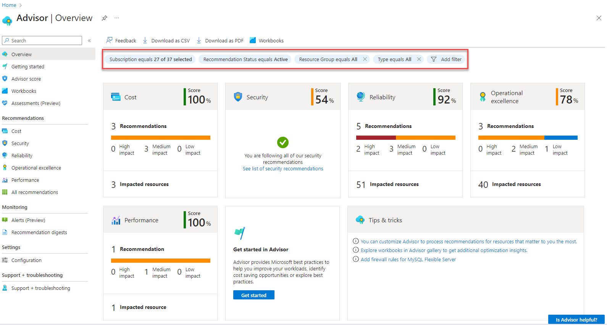

# Resilience and recovery

Last updated: **{{ git_revision_date_localized }}**

The Public Cloud team provides the landing zone, baseline controls, and platform guardrails. Your ministry team owns the resilience and recovery plan for each deployed solution.

---

## Shared responsibility for resilience and recovery

Resilience in Azure follows a shared responsibility model.

- The Public Cloud team manages shared landing zone services and baseline guardrails.
- Your team designs, deploys, and operates workload-level resilience controls.
- Your team accepts and manages the service risk for your application.

## Your responsibilities for backups and disaster recovery

Your team defines and runs the backup and disaster recovery approach for each solution.

- Define recovery time objective (RTO) and recovery point objective (RPO) targets.
- Choose backup and replication settings that support your RTO and RPO.
- Configure retention, encryption, and restore permissions for backup data.
- Test restore procedures on a regular schedule and record results.
- Create and maintain a disaster recovery runbook for failover and failback.
- Monitor backup jobs, replication health, and restore readiness.

## Your responsibilities for deployment code and process

Your team owns the code and process used to deploy and recover the solution.

- Include deployment code in your disaster recovery scope.
- Include application code, Infrastructure-as-Code (IaC), and CI/CD pipeline code in that scope.
- Back up source repositories and keep restore access current.
- Keep a tested process to rebuild environments from code and configuration.
- Store recovery steps for deployment tooling, secrets, and service connections.
- Validate that recovery steps work during regular disaster recovery exercises.

## Use Azure Advisor to improve resilience and availability

Azure Advisor reviews your subscription and provides tailored recommendations. Use the Reliability section to find actions that improve uptime and resiliency.

Examples include:

- Improve availability zone usage for supported services.
- Add redundancy options to reduce single points of failure.
- Configure backup coverage for supported workloads.
- Improve business continuity and disaster recovery posture.

Open [Azure Advisor](https://portal.azure.com/#view/Microsoft_Azure_Expert/AdvisorMenuBlade/~/Overview) in the Azure portal and review the **Reliability** recommendations for your scope.

For product details, see [What is Azure Advisor?](https://learn.microsoft.com/en-us/azure/advisor/advisor-overview), [Reliability recommendations in Azure Advisor](https://learn.microsoft.com/en-us/azure/advisor/advisor-reference-reliability-recommendations), and [Azure Advisor resiliency reviews](https://learn.microsoft.com/en-us/azure/advisor/advisor-resiliency-reviews).

## Related pages

- [Policy compliance](policy-compliance.md)
- [Security](security.md)
- [Update and patch management](update-patch-management.md)
- [Deploy to the Azure Landing Zone](../design-build-deploy/deploy-to-the-azure-landing-zone.md)
