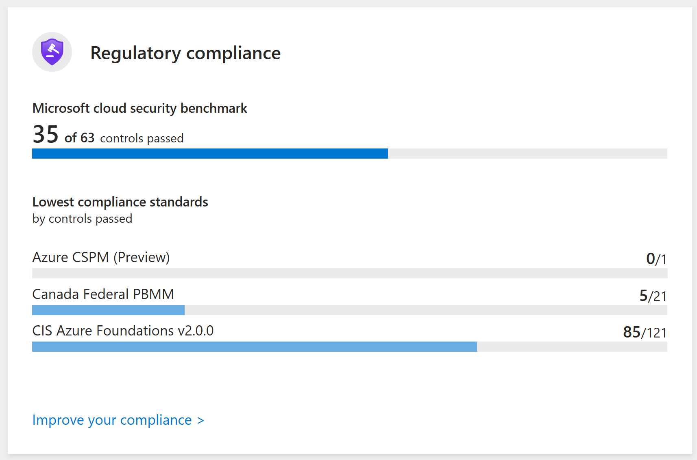

# Security

Last updated: **{{ git_revision_date_localized }}**

While the Public cloud team and the Security Operations team provides the initial guardrails and standards for the environment, **each ministry team is responsible** for managing their own resources and ensuring compliance with the standards.

---

## Defender for Cloud

Microsoft Defender for Cloud is a Cloud Native Application Protection Platform (CNAPP), which is a unified solution that combines multiple cloud security tools to protect applications across their entire lifecycle. The solution provides a comprehensive view of your security posture across your cloud and on-premises resources.

Within the Azure portal, navigate to [Microsoft Defender for Cloud](https://portal.azure.com/#view/Microsoft_Azure_Security/SecurityMenuBlade/~/0). This service provides a centralized view of the security posture and regulatory compliance of your Azure environment. It also provides recommendations on how to improve your security.

