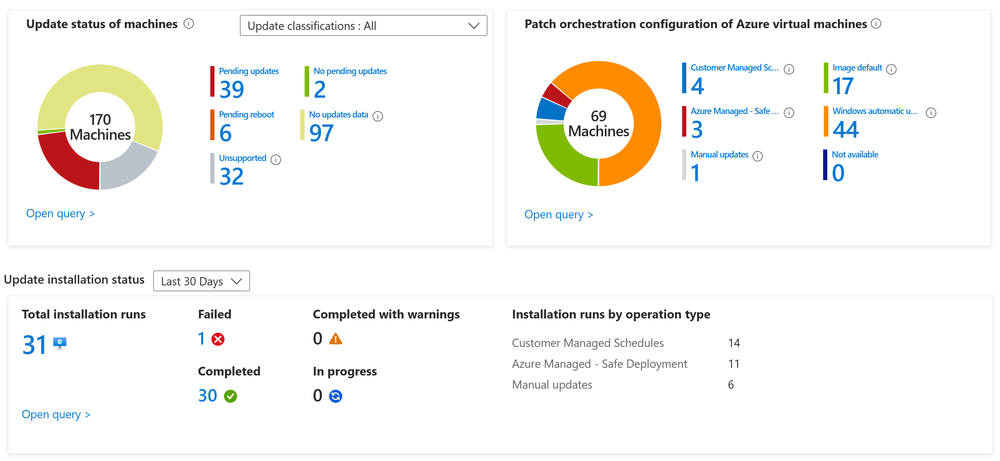
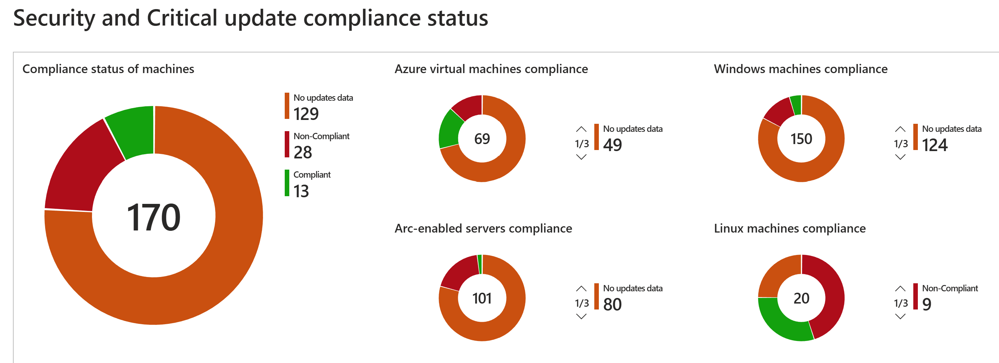

# Update / Patch Management in Azure

Last updated: **{{ git_revision_date_localized }}**

While the Public cloud team and the Security Operations team provides the initial guardrails and standards for the environment, **each ministry team is responsible** for managing their own resources and ensuring compliance with the standards.

---

## Azure Update Manager

If your solution includes Azure Virtual Machines (VMs) or other IaaS components, you are responsible for managing updates and patches for those resources. Proper patch management is crucial for maintaining security, performance, and compliance.

Azure provides Azure Update Manager to help manage and govern updates for all your machines that run a server operating system. With Update Manager, you can monitor Windows and Linux update compliance across your machines in Azure, on-premises, or in other cloud environments (connected by Azure Arc) from a single pane of management. You can also use Update Manager to make real-time updates or schedule updates within a defined maintenance window.

For more information see the Microsoft documentation on [How Update Manager works](https://learn.microsoft.com/en-us/azure/update-manager/workflow-update-manager?tabs=azure-vms%2Cupdate-win)

It also includes an **Update Compliance Report** to help you track the compliance status of your machines with security and critical updates.

