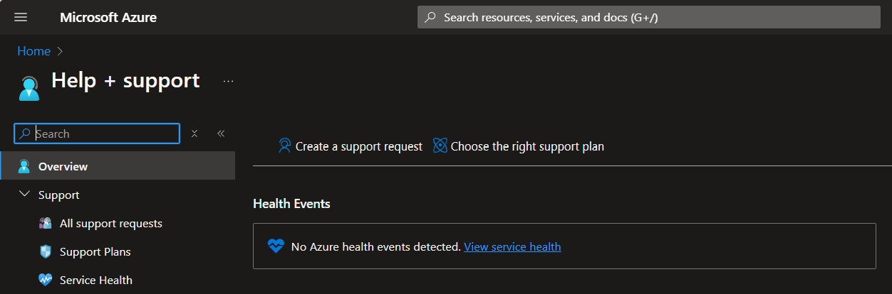

# Azure Enterprise Support

Last updated: **October 8, 2024**

Once your Project Set has been provisioned, each Azure Subscription will be enrolled in the Azure Unified Support plan.

> Note: There is a delay of approximately **2 weeks** for the Azure Unified Support plan to be activated.

In the Azure portal, you can search for Help + support to access the Azure Support Center and open a support ticket.

There are additional ways to access support, as described on the [Create an Azure support request](https://learn.microsoft.com/en-us/azure/azure-portal/supportability/how-to-create-azure-support-request) page.
