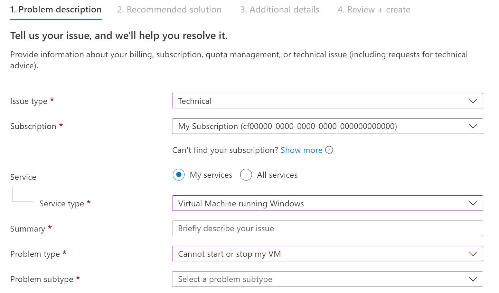
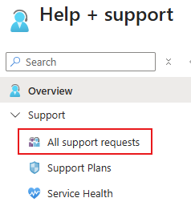

# Microsoft Azure Enterprise Support

Last updated: **{{ git_revision_date_localized }}**

Once your Project Set has been provisioned, each Azure Subscription will be enrolled in the Azure Unified support plan.

!!! note "Support plan activation"
    There is a delay of approximately **2 weeks** for the Azure Unified support plan to be activated on new subscriptions.

!!! info "Third-party vendor landing zones"
    If you use a third-party vendor's landing zone in Azure, you cannot use the B.C. government's Unified Enterprise support plan.

    Ministry teams working in the OCIO-managed Landing Zone in Azure can currently access the Unified Enterprise support services for free. 

You can view the full list of services available to the ministries under the [Unified Enterprise support plan](https://www.microsoft.com/en-IN/microsoft-unified/plan-details){:data-proofer-ignore}.

## How to receive support

1. Log into [Azure Portal](https://portal.azure.com) with your IDIR.
    - Only users with access to applications in the OCIO-managed Landing Zone can use the Unified Enterprise support plan. 
    - New users may take up to **7 business days** to gain access.
    - If you need to open a support case before access is enabled, please [create a Support Request](https://citz-do.atlassian.net/servicedesk/customer/portal/3).

2. Follow the step-by-step instructions on [how to create an Azure support request](https://learn.microsoft.com/en-us/azure/azure-portal/supportability/how-to-create-azure-support-request).

    

3. To view the details and status of support requests, see the [how to manage an Azure support request](https://learn.microsoft.com/en-us/azure/azure-portal/supportability/how-to-manage-azure-support-request) Microsoft documentation.

    
