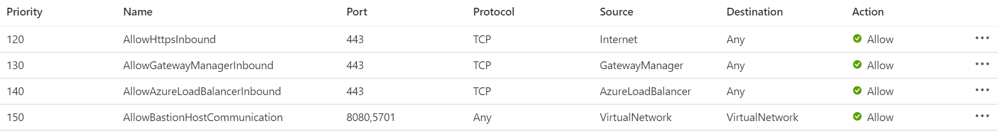
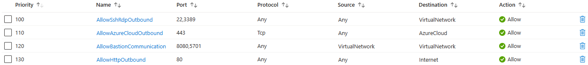

# Azure Bastion

Last updated: **{{ git_revision_date_localized }}**

Azure Bastion is a fully managed PaaS service that you provision to securely connect to virtual machines via private IP address. It provides secure and seamless RDP/SSH connectivity to your virtual machines directly over TLS from the Azure portal.

!!! warning "Bastion session cached credentials"
When you use a Virtual Machine in a VNet to access the Azure portal, the browser may cache your credentials. If your team shares the VM, it is **strongly recommended** to use a **private browser session** (incognito mode) or make sure you **log out** of the Azure portal after each session. Otherwise, other users could access your cached credentials.

!!! question "Which Azure Bastion SKU to use?"
    The minimum Bastion SKU required is **Developer**, where the `AzureBastionSubnet` subnet is not required. However, some features are limited or not available with this SKU. Please review the Microsoft [Bastion SKU](https://learn.microsoft.com/en-us/azure/bastion/configuration-settings#skus) documentation to determine the best SKU for your needs.

If you are using a SKU other than **Developer**, Azure Bastion requires a Virtual Network, and a specifically named subnet called `AzureBastionSubnet`. The subnet address range that you specify must be **/26 or larger** (for example, /25 or /24).

!!! warning "Bastion subnet size"
    Please review the Microsoft documentation about the requirements for the [Azure Bastion subnet](https://learn.microsoft.com/en-us/azure/bastion/configuration-settings#subnet), in particular the subnet size.

Additionally, you will need to create the appropriate ingress and egress Network Security Group (NSG) rules to allow traffic to and from the Azure Bastion service. Please refer to the [Working with NSG access and Azure Bastion](https://learn.microsoft.com/en-us/azure/bastion/bastion-nsg#apply) documentation for specific details.

> Note: The rule priority number does not need to match the example below, but the rule configuration should match.

!!! example "Azure Bastion deployment example"
    Microsoft provides multiple [deployment guides](https://learn.microsoft.com/en-us/azure/bastion/tutorial-create-host-portal) for Azure Bastion.

    To support our customers, and expedite the deployment of all the required resources, we have created a Terraform module that deploys the required Subnet, the Network Security Group (with all the required rules), and the Bastion host (with a "**Basic**" SKU).
    
    You can find this module in the [Azure Landing Zone Samples](https://github.com/bcgov/azure-lz-samples) repository, under `/tools/bastion/`. Please ensure to review the [README](https://github.com/bcgov/azure-lz-samples/blob/main/tools/bastion/README.md) file in the module for instructions on how to use it.

!!! tip "Cost savings options"
    As a suggestion to save costs, if you only need to access Virtual Machines (via Bastion) within a specific time frame (ie. between 8:00 AM to 5:00 PM), you can create a scheduled pipeline to delete the Bastion deployment at the end of the day and recreate it in the morning. This way, you only pay for the service when you need it.

    The following article is an example of this, although it uses Azure Bicep and Deployment Stacks. But the concepts can be applied to Terraform as well: [Save Cost with Azure Bicep Deployment Stacks](https://hungryboysl.wordpress.com/2025/02/02/save-cost-with-azure-bicep-deployment-stackswt-mc_idaz-mvp-5005246/).

    If you are using the [Bastion sample code](https://github.com/bcgov/azure-lz-samples/blob/main/tools/bastion/README.md) provided, please be aware that the sample code also includes _creating_ the **AzureBastionSubnet**. Therefore, you may need to adjust the sample code to not delete the subnet when the Bastion is deleted, or ensure you provide an available address space when it recreates the subnet along with the Bastion deployment.

## Troubleshooting connectivity issues

### Just-In-Time (JIT) VM Access interference

In the Azure portal, when you navigate to a Virtual Machine's **Connect** blade, you may see an option for **Just-In-Time (JIT) VM access**.

!!! danger "Do not use JIT VM Access"
    **Do not click "Configure JIT + Request access".** 

    JIT VM access is designed for VMs with public IP addresses, which are blocked by guardrails in our environment. Clicking this button will create automated Network Security Group (NSG) rules that explicitly **Deny** RDP (3389) or SSH (22) traffic from all sources after a short period, which will interfere with your ability to connect via Azure Bastion.

If you or a teammate accidentally enabled JIT and can no longer connect via Bastion:

1.  Navigate to the **Networking** settings of your Virtual Machine.
2.  Look for inbound rules named starting with `MicrosoftDefenderForCloud-JITRule`.
3.  **Delete** these JIT-related rules.
4.  Ensure you are using the **Connect -> Bastion** option from the sidebar, and NOT the "Native RDP" or "SSH" options that might prompt for JIT.

If you see a "Connection Error" stating the target machine is unreachable due to NSG rules, check for these JIT rules first.

!!! tip "Jump Host for Portal Management"
    Azure Bastion is not only for server administration. It is a key tool for accessing portal-based management features that are otherwise blocked by private endpoints. 

    If you are using **Azure SQL Query Editor** or **Azure Data Factory Studio**, these tools require your browser to be within the private network. By using Bastion to connect to a Windows or Linux VM (Jump Host), you can use the browser *inside* that VM to manage your private-only resources through the Azure portal.
