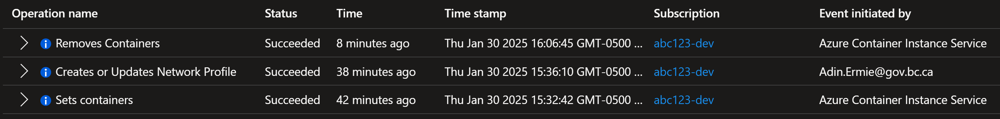

# Azure Cloud Shell

Last updated: **{{ git_revision_date_localized }}**

Azure Cloud Shell is an interactive, authenticated, browser-accessible terminal for managing Azure resources. It provides the flexibility of choosing the shell experience that best suits the way you work, either Bash or PowerShell.

By default, Azure Cloud Shell sessions run in a container in a Microsoft network that's separate from your resources. Commands that run inside the container can't access resources in a private virtual network.

To provide access to your private resources, you can [deploy Cloud Shell into an Azure virtual network](https://learn.microsoft.com/en-us/azure/cloud-shell/vnet/overview) that you control. This technique is called _virtual network isolation_.

!!! tip "Microsoft QuickStart Template for Deploying Cloud Shell in a Virtual Network"
    Although Microsoft provides a [QuickStart template](https://learn.microsoft.com/en-us/azure/cloud-shell/vnet/deployment) for deploying Cloud Shell in a virtual network, this template includes deploying resources that are not permitted in the Azure Landing Zones (namely Private DNS Zones).

    To support our customers who would like to deploy Cloud Shell in a virtual network, we have created a Terraform module that deploys the same resources as Microsoft's QuickStart template (including the same configuration), but without deploying the Private DNS Zones. 
    
    You can find this module in the [Azure Landing Zone Samples](https://github.com/bcgov/azure-lz-samples) repository, under `/tools/cloud_shell_vnet/`. Please ensure to review the [README](https://github.com/bcgov/azure-lz-samples/blob/main/tools/cloud_shell_vnet/README.md) file in the module for instructions on how to use it.

## Deleting Cloud Shell resources

If you have deployed Cloud Shell in a virtual network, and you decide to later no longer use this configuration, please be aware of the following challenges:

When Cloud Shell is deployed, a container instance (that is created behind the scenes in a Microsoft subscription), is still using the **Network Profile** resource. According to Microsoft Support, after you disconnect from the Cloud Shell session, this container will automatically be deleted. However, there is **no set period of time** for this to happen. It could be 30 minutes, an hour, or **several hours**!

To confirm the container instance has been deleted, check the **Network Profile** resource's activity logs for the "**Removes Containers**" Operation (shown below). This event is initiated by the `Azure Container Instance Service`. After this event has been logged, the `"containerNetworkInterfaces": []` property will be empty, and you can then delete the Network Profile resource.

!!! tip "Azure Alert for Monitoring Container Instance Deletion"
    You could create an **Azure Alert** to monitor for this event to notify you when the container instance has been deleted.
