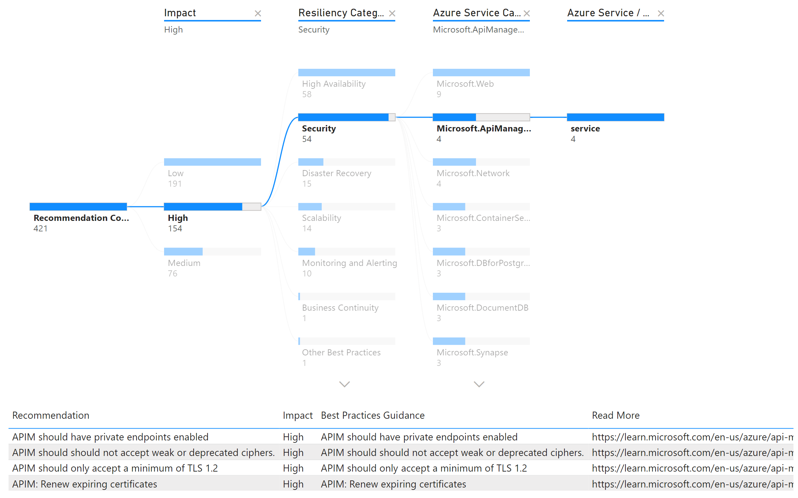
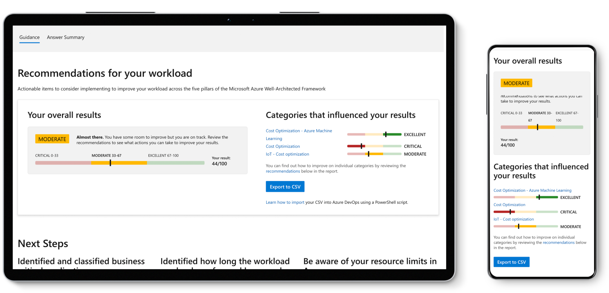
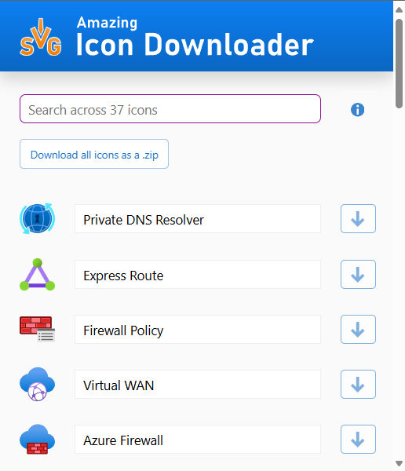

# Tools

Last updated: **{{ git_revision_date_localized }}**

This page is designed for those who manage and maintain Azure environments. The purpose of this is to provide a curated list of tools that can help you efficiently manage your Azure resources, ensure compliance with best practices, and optimize your cloud infrastructure. Whether you are looking to automate tasks, monitor performance, or enhance security, the tools listed here will assist you in achieving your goals.

!!! info "Azure tools"
    It is important to note that these tools **do not** replace, but complement, the built-in Azure tools, providing additional functionality and insights to enhance your Azure management experience.

## Helpful tools

While there are many tools available to help you manage your Azure environment, the following are some that we have found to be particularly useful.

!!! abstract "Tools list"
    If you have a favorite tool that you think should be included in this list, please let us know by [creating a Support Request](https://citz-do.atlassian.net/servicedesk/customer/portal/3) with the details.

### Azure OpenAI PTU Calculator

The Azure OpenAI PTU Calculator is a free, open-source tool that helps you manage your Azure OpenAI costs. It lets you size Provisioned Throughput Units (PTUs), compare PAYGO and PTU pricing and analyze your usage patterns. The tool supports all major Azure OpenAI models and gives you real-time pricing, cost estimates and practical recommendations.

Check out the [Azure OpenAI PTU Calculator](https://www.ptucalc.com/) and its accompanying [User Guide](https://github.com/ricmmartins/azureptucalc/blob/main/docs/USER_GUIDE.md).

### Azure Quick Review (AZQR)

A command-line interface (CLI) tool specifically designed to analyze Azure resources and identify whether they comply with Azure’s best practices and recommendations. Its primary purpose is to provide users with a detailed overview of their Azure resources, enabling them to easily identify any non-compliant configurations or potential areas for improvement. Check out the [Azure Quick Review (AZQR)](https://azure.github.io/azqr/).

You can also create a pipeline to automate the execution of AZQR on a schedule. Check out the following for an example:

- [GitHub Actions workflow for AZQR](https://github.com/Azure/azqr/blob/main/examples/cicd/github-actions.yml)
- [Azure DevOps pipeline for AZQR](https://github.com/Azure/azqr/blob/main/examples/cicd/azdo-pipeline.yml)

### Microsoft Assessments

Self-guided questionnaires designed to help you identify areas to improve your architecture, workloads and implementation, with actionable recommendations. Check out the [Microsoft Assessments](https://learn.microsoft.com/en-us/assessments/browse/?page=1&pagesize=30).

### Amazing Icon Downloader

A browser extension that allows you to download icons from the Azure portal. Helpful when drawing architecture diagrams. Check out the extension:

- Chrome: [Amazing Icon Downloader](https://chrome.google.com/webstore/detail/amazing-icon-downloader/kllljifcjfleikiipbkdcgllbllahaob)
- Edge: [Amazing Icon Downloader](https://microsoftedge.microsoft.com/addons/detail/amazing-icon-downloader/goanjjfecbakkdmbchgoooajnbiafong)

### Terraform Scanning Tools

Tools that scan Terraform code to identify security vulnerabilities, compliance issues, and other potential problems. Check out the following:

- [Checkov](https://www.checkov.io/)
- [TFLint](https://github.com/terraform-linters/tflint)
- [Trivy](https://www.aquasec.com/products/trivy/)
- [InfraCost](https://www.infracost.io/)
