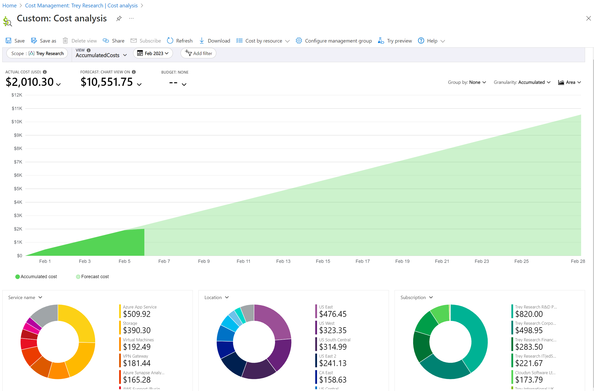
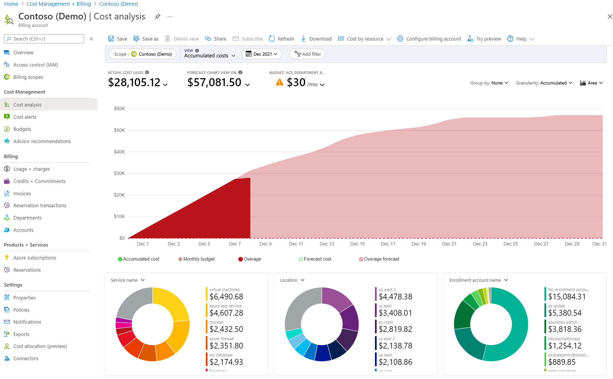
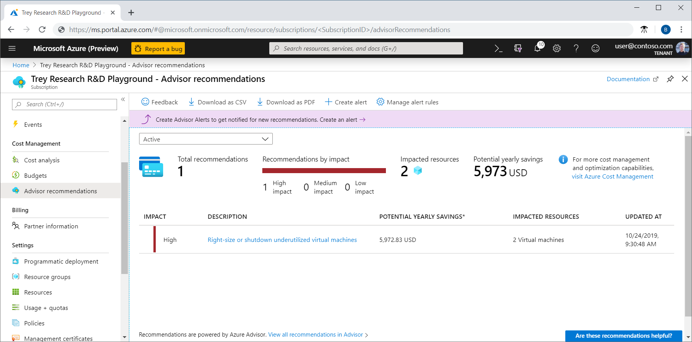
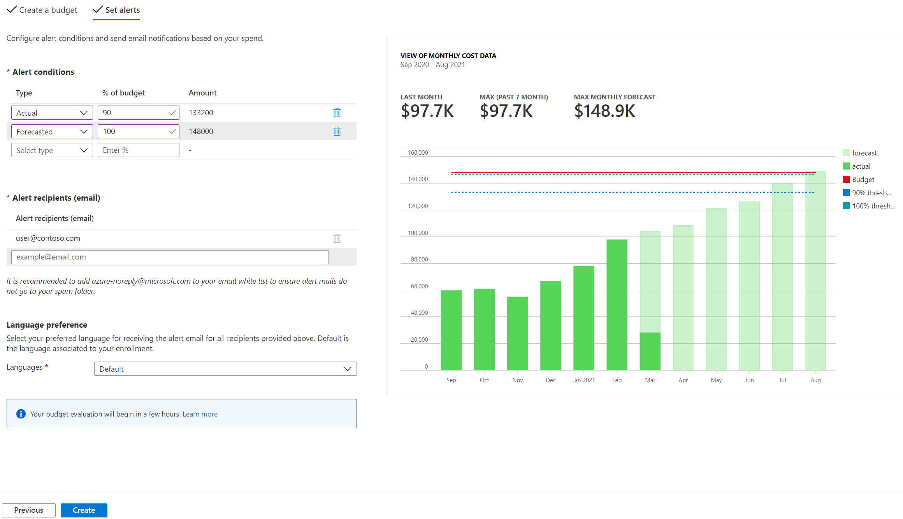

# Azure billing and cost management

Last updated: **December 2, 2024**

## Cost Reporting and Cost Recovery

As part of applying the [principles of FinOps](https://www.finops.org/framework/principles/), and to help streamline our cost tracking processes, we've implemented an automated tagging policy that will now apply standardized tags to all resources within your subscriptions. This is designed to improve our cost recovery process while requiring no action on your part.

### Tags Being Applied

You'll notice the following tags appearing on your resources:

* `account_coding`
* `billing_group`
* `ministry_name`

These tags are inherited from the Subscription-level tags (which are created using the information you provide when [provisioning a new Project Set](../../welcome/provision-a-project-set.md)).

## Manage your Azure spending

Learn more about managing your Azure spending and resources with [Azure Cost Management](https://learn.microsoft.com/en-us/azure/cost-management-billing/costs/overview-cost-management).

Azure Cost Management is a set of tools that help you manage and optimize your Azure costs. You can use Azure Cost Management to:

- Monitor your costs and usage
- Analyze cost drivers
- Optimize your spending
- Set budgets and alerts

## Monitor your costs and usage

Azure Cost Management provides a dashboard that shows your costs and usage over time. You can see how much you're spending and where you're spending it. You can also see how your spending compares to your budget.

## Analyze cost drivers

Azure Cost Management helps you understand what's driving your costs. You can see which services are costing you the most money and which resources are using the most resources, using [cost reporting and analytics](https://learn.microsoft.com/en-us/azure/cost-management-billing/costs/reporting-get-started).

## Optimize your spending

Azure Cost Management provides recommendations for [optimizing your spending](https://learn.microsoft.com/en-us/azure/cost-management-billing/costs/tutorial-acm-opt-recommendations). You can see where you can save money by changing your resource configurations or by using reserved instances.

## Set budgets and alerts

Azure Cost Management lets you set [budgets](https://learn.microsoft.com/en-us/azure/cost-management-billing/costs/tutorial-acm-create-budgets?tabs=psbudget) and [alerts](https://learn.microsoft.com/en-us/azure/cost-management-billing/costs/tutorial-acm-create-budgets?tabs=psbudget#configure-forecasted-budget-alerts) to help you stay on top of your spending. You can set a budget for your spending and get alerts when you're close to exceeding it.

## Next steps

* [Provision a Project Set](../../welcome/provision-a-project-set.md)
* [User Management in Azure](../design-build-deploy/user-management.md)
* [Deploy to the Azure Landing Zone](../design-build-deploy/deploy-to-the-azure-landing-zone.md)

## Resources

* [Azure Cost Management overview](https://learn.microsoft.com/en-us/azure/cost-management-billing/costs/overview-cost-management)
* [Understand and work with scopes](https://learn.microsoft.com/en-us/azure/cost-management-billing/costs/understand-work-scopes)
* [How to optimize your cloud investment with Cost Management](https://learn.microsoft.com/en-us/azure/cost-management-billing/costs/cost-mgt-best-practices)
* [How to budget your Azure cloud spend with Microsoft Cost Management](https://techcommunity.microsoft.com/blog/finopsblog/how-to-budget-your-azure-cloud-spend-with-microsoft-cost-management/4153963)
* [Identify your savings potential in Azure](https://techcommunity.microsoft.com/blog/finopsblog/identify-your-savings-potential-in-azure/4131194)
* [Unlock savings potential with Azure Advisor's Cost Optimization workbook](https://techcommunity.microsoft.com/blog/finopsblog/unlock-savings-potential-with-azure-advisors-cost-optimization-workbook/4135863)
* [Switch off Virtual Machines on a schedule using an Azure Tag](https://techcommunity.microsoft.com/blog/coreinfrastructureandsecurityblog/switch-off-virtual-machines-on-a-schedule-using-an-azure-tag/4207182)
