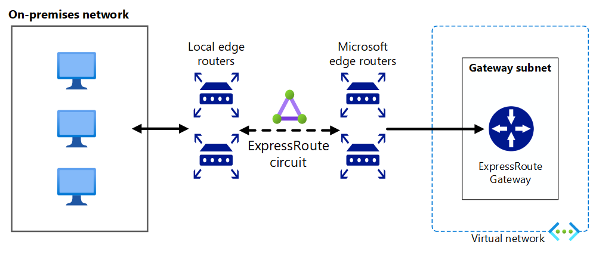

# Express Route Connectivity to On-Premises

Last updated: **November 20, 2024**

## Overview

To support on-premises resources and workloads accessing resources in Azure, and Azure resources accessing on-premises resources, hybrid cloud connectivity (known as [Express Route](https://learn.microsoft.com/en-us/azure/expressroute/expressroute-introduction)) will be deployed. This will provide a dedicated, private connection between on-premises and Azure resources.

Additionally, to adhere to data-in-transit security requirements, the Express Route connection will be encrypted using IPsec.

### Current status

Architecture and design for the Express Route connectivity to on-premises resources is in progress. We are working with the Hosting Team on the timing and execution of the implementation phase, which is tentatively scheduled for the first quarter of 2025.
