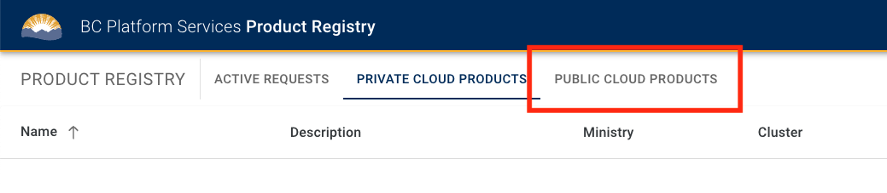
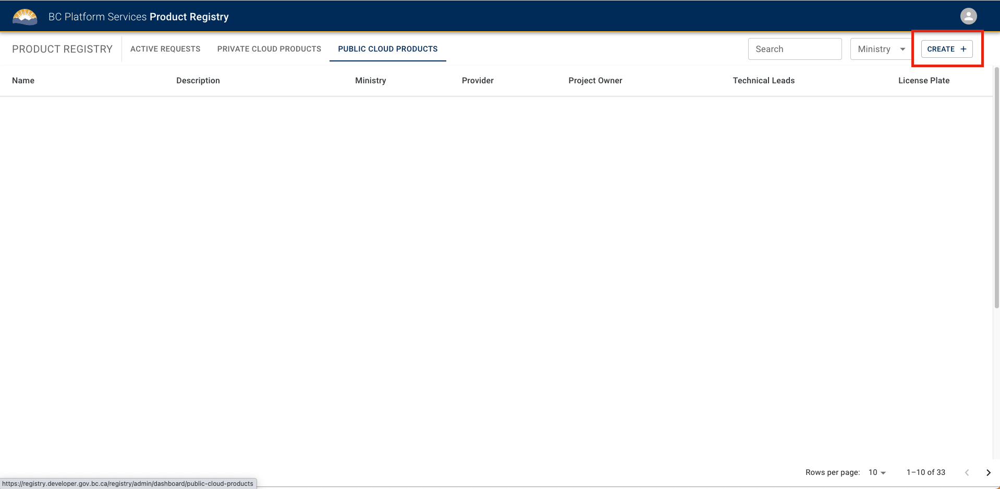
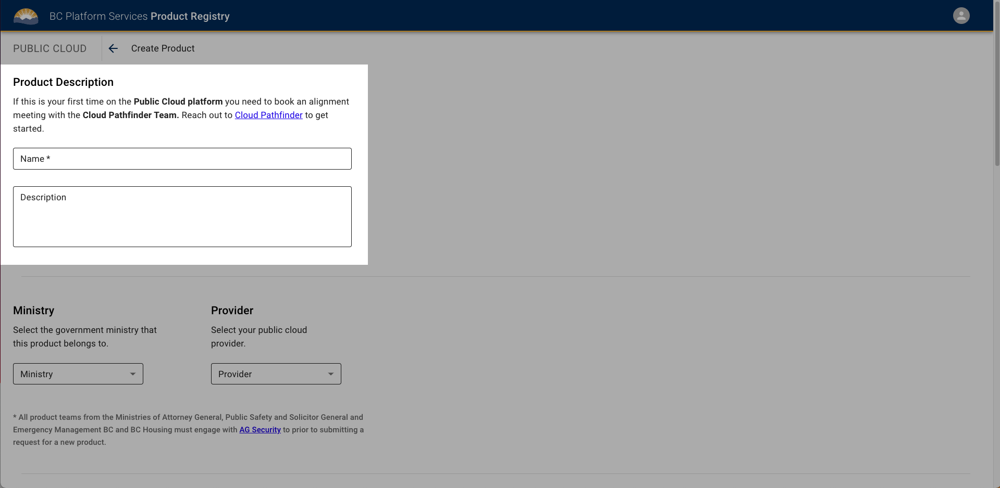
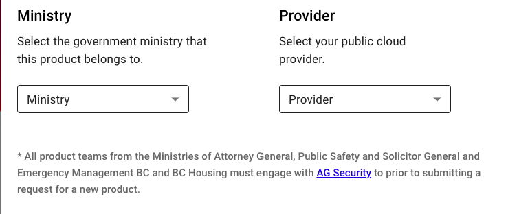
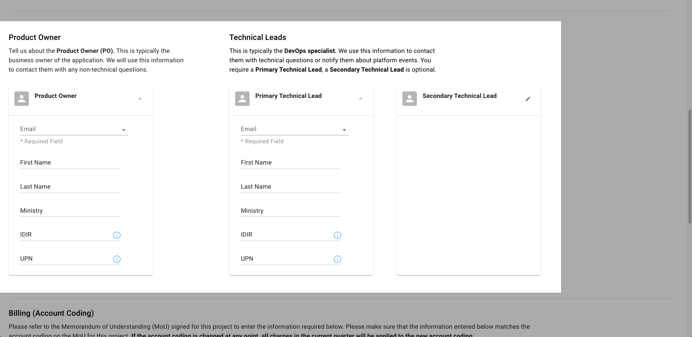
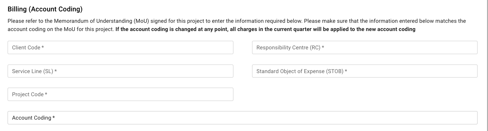
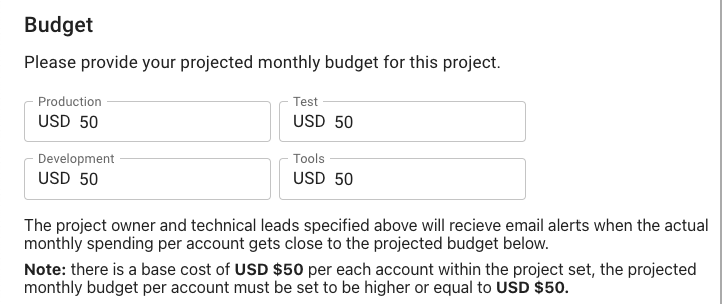

# Provision a new AWS or Azure project set

Last updated: **September 24, 2024**

On the Public Cloud platform, different teams organize their work on isolated [project sets](../design-build-and-deploy-an-application/deploy-an-app-to-the-aws-landing-zone.md#aws-accounts-in-your-project-set). Before working on the platform, the [Product Owner](../get-started/bc-govs-aws-landing-zone-overview.md#key-features-of-the-product-registry-service) of the respective team must submit a project set provisioning request for your team on the B.C. Government Public Cloud.

---

## Prerequisites

New requests must be reviewed and approved. The same rule applies for teams that already have projects on the platform and require additional project sets.

To do that you must meet the prerequisites for provisioning a project set outlined in our [onboarding documentation](https://digital.gov.bc.ca/cloud/services/public/onboard/).

## Process to request a project set

1. Login to the [BC Gov Product Registry](https://registry.developer.gov.bc.ca/login)

  Take into consideration that you will need:

- A descriptive product name (no acronyms)
- Contact details and IDIR accounts for the Product Owner and up to 2 Technical Leads
- For B.C. Gov's Landing Zone in AWS an estimate for the product's projected monthly spend on cloud services [Refer to the AWS Cost Calculator](https://calculator.aws/#/) and an AWS Account Code (Refer to Memorandum of Understanding (MoU)).
- For B.C. Gov's Landing Zone in Azure an estimate for the product's projected monthly spend on cloud services [Refer to the Azure Pricing Calculator](https://azure.microsoft.com/en-ca/pricing/calculator/) and an Azure Subscription ID (Refer to Memorandum of Understanding (MoU)).
  For **new product teams** requesting space in a public cloud landing zone complete the following 2 steps before submitting the provisioning request:

- Sign a Memorandum of Understanding (MoU) with OCIO. Request an MoU template from <cloud.pathfinder@gov.bc.ca>
- Book an onboarding session with the Cloud Pathfinder Team at <cloud.pathfinder@gov.bc.ca>

2. Navigate to the top menu called **Public Cloud Products**

  

3. On the top right side of the screen click on the button **Create +** to create a project set

  

4. Enter the **name** and **description** of your project

- Project names should be descriptive, avoid the use acronyms.

  

5. Enter your **ministry** and desired **service provider**

  

6. Enter the [Product Owner](../get-started/bc-govs-aws-landing-zone-overview.md#key-features-of-the-product-registry-service) and [Technical Lead(s)](get-started/bc-govs-aws-landing-zone-overview.md#key-features-of-the-product-registry-service) **details** per each required field.

    <!-- TODO: move some of this to a separate "RBAC", or "Login Application" document and link to it here -->

- The Product Owner and Technical Lead(s) will be granted access to the 4 AWS accounts in the [Project Set](../design-build-and-deploy-an-application/deploy-an-app-to-the-aws-landing-zone.md#aws-accounts-in-your-project-set) via the Admin role
- The Admin role is attached to the AWS managed policy [AdministratorAccess](https://docs.aws.amazon.com/aws-managed-policy/latest/reference/AdministratorAccess.html) which provides unrestricted access into AWS accounts. However, because we are operating under the ASEA's [guardrails](../get-started/bc-govs-aws-landing-zone-overview.md#security-guardrails) the Admin role is restricted within those bounds in all accounts in the ASEA. As long as the user with an Admin role is not breaching the guardrails, they will be unrestricted within the account.

  

6. Enter your **billing number**

  This number should be reflected on the team's signed MoU, and is related to the expense authority funding the project.

  

7. Enter your **estimated budgets** for the **four AWS accounts**

- Budgets are a tool for the team to receive email billing alerts so it's important that they are accurate, however they can be updated later.
- You will receive a budget alert when your monthly spend has reached 50%, 80%, and 100% of your estimated monthly budget. This tool is intended to allow ministry teams to quickly react and control cost surges within the accounts.
- For help estimating your budget please see the [costs and billing](https://digital.gov.bc.ca/cloud/services/public/intro/#costs) section of our introductory documentation.

  

## Accessing your project set

### AWS

Once the AWS accounts have been provisioned, the [Product Owner](../get-started/bc-govs-aws-landing-zone-overview.md#key-features-of-the-product-registry-service) and [Technical Lead(s)](../get-started/bc-govs-aws-landing-zone-overview.md#key-features-of-the-product-registry-service) will be able to see them all in the [Login Application](https://login.nimbus.cloud.gov.bc.ca/) and they will have Admin access into the accounts.

Other team members can be added to the project set by the Product Owner or Technical Lead(s) via the [AWS User Management](../aws/user-management.md) feature in the Product Registry.

### Azure

Once the Azure subscriptions have been provisioned, the [Product Owner](../get-started/bc-govs-azure-landing-zone-overview.md#key-features-of-the-product-registry-service) and [Technical Lead(s)](../get-started/bc-govs-azure-landing-zone-overview.md#key-features-of-the-product-registry-service) will be able to see them all in the [Azure Portal](https://portal.azure.com/) and they will have Admin access into the subscriptions.

Other team members can be added to the project set by the Product Owner or Technical Lead(s) directly in the [Azure Portal](https://portal.azure.com/). For more information on how to do this, see [Azure User Management](../azure/user-management.md).

---

## Related pages

- [Platform Project Registry](https://registry.developer.gov.bc.ca/login)
- [OnBoarding Guide for BC Gov AWS ASEA](https://digital.gov.bc.ca/cloud/services/public/onboard/)
- [B.C. Government AWS Landing Zone overview](../aws/get-started/bc-govs-aws-landing-zone-overview.md)
- [B.C. Government Azure Landing Zone overview](../azure/get-started/bc-govs-azure-landing-zone-overview.md)
