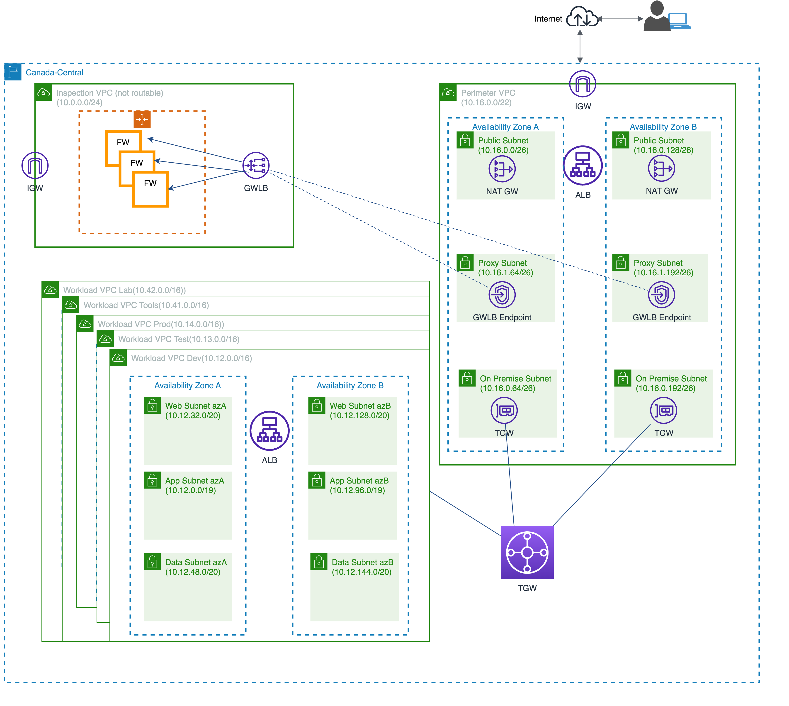
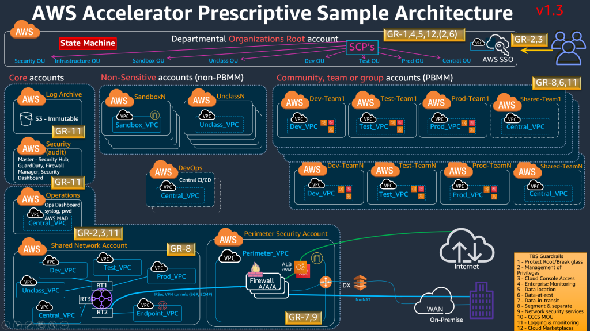

# Networking
Last updated: **December 20, 2023**

## Introduction
This document breaks down the centralized networking of the AWS Secure Environment Accelerator (ASEA), and best practices for networking on the platform. It aims to make the ASEA's networking easy to grasp, helping anyone working on the platform (and within the guardrails of the BC Gov ASEA) understand how our networking is set up. Good networking is like the backbone of cloud technology. It connects everything, keeps things safe, and helps things run smoothly. Understanding it is crucial for making the most of cloud tools.

## Network architecture

The ASEA network revolves around a Transit Gateway, efficiently directing traffic flow between the internet and AWS services across different AWS Accounts on the platform. The networking structure is divided into two separate accounts:

- The **Perimeter Account** is home to our Checkpoint Firewalls, responsible for monitoring and controlling the flow of traffic in and out of the platform
- The **Shared Network Account** serves as a central hub, hosting the Transit Gateway and coordinating various networking resources. It accommodates all Virtual Private Clouds (VPCs), excluding the Perimeter VPC in the Perimeter account, along with most other networking resources.

These resources are accessible through AWS Resource Access Manager (RAM), which allocates them to the respective accounts based on their organizational unit (OU). To control traffic between resources deployed in the VPCs, Security Groups are implemented.

This streamlined approach eliminates the need for duplicating resources across multiple accounts reducing the operational burden associated with managing resources in each individual account.

The distinction between the Shared Networking and Perimeter accounts is driven by the need for "separation of duties" in networking and security. In essence, ASEA's networking architecture guarantees centralized, well-organized, and secure communication. This is achieved through Transit Gateway routing, distinct security measures for the Perimeter VPC, and efficient resource management in the Shared Network account, as depicted in the B.C. Government ASEA's networking diagram below:

Another useful diagram provided by AWS shows how all workload VPCs exist in the Shared Networking account and utilized in every workload account based on the OU that they reside in.

For further reading beyond this document please visit the [AESA network architecture docs](https://aws-samples.github.io/aws-secure-environment-accelerator/latest/architectures/sensitive/network/). We use the [GWLB architecture](https://aws-samples.github.io/aws-secure-environment-accelerator/latest/architectures/sensitive/diagrams/#14-additional-perimeter-patterns) with third-party firewalls.

## Gateway load balancers and CheckPoint firewalls

In the Perimeter account, we employ a [Gateway Load Balancer (GWLB)](https://aws.amazon.com/elasticloadbalancing/gateway-load-balancer/) to evenly distribute traffic load among our firewall instances. These instances, operating in a highly available pair, utilize Checkpoint Firewalls obtained from the AWS Marketplace. The Checkpoint Firewall Manager, coupled with Checkpoint's Smart Console, is instrumental in configuring traffic rules.

Our firewall setup strictly permits only HTTP/HTTPS traffic, with all other forms of traffic being blocked. This includes SSH egress traffic, which might affect accessing git repositories and other services relying on SSH. For git repository access, we recommend using HTTPS instead of SSH. 

If your application necessitates non-HTTP/HTTPS traffic, please don't hesitate to reach out to the team by contacting them by email at Cloud.Pathfinder@gov.bc.ca 

## Transit gateway

The Transit Gateway plays a central role as a key component in managing connectivity between different environments. It serves crucial functions within the ASEA architecture:

- **Centralized routing hub** The Transit Gateway acts as a centralized hub for routing traffic. It facilitates communication between various environments, such as on-premises networks, the internet, and different VPCs within the platform. It utilizes route tables, and TGW policies to determine specific, allowed traffic within the platform

- **Routing permitted flows** It routes permitted flows, directing traffic between different zones based on defined policies. All VPCs are connected to the TGW and all traffic in and out of them must go through it. Note that there is a specific route via the Perimeter VPC that connects workload accounts to any connected on-premises networks without going to the internet

**Traffic control and policy enforcement** It enables the control and enforcement of traffic policies across the network. This is essential for maintaining security and ensuring that data flows adhere to predefined rules. These policies enforce security and isolation by specifying which environments or VPCs can communicate with each other. Communication between VPCs in not allowed in the ASEA, only communication from a VPC to the internet (or on-prem) or vice versa is allowed by the transit gateway. For example, Dev traffic destined for the Prod VPC will be blocked by the "blackhole" route in the TGW route table

## Workload VPCs

Workload VPCs are strategically structured for Development (Dev), Testing (Test), Production (Prod), and Tools (Tools) environments, each assigned a /16 CIDR block. These VPCs all exist in the Shared Network account and leverage AWS Resource Access Manager (RAM) for efficient resource sharing, streamlining operations and enabling centralized management across organizational units.

- **Structure and Purpose of Workload-Specific VPCs:**
  - Workload-specific VPCs are logically segmented based on different environments (Dev, Test, Prod, and Tools).
  - Each environment is isolated to cater to specific stages in the software development lifecycle. The Tools account is specific to resources utilized across the other three environments within a project set (e.g. an ECR).

- **Sharing mechanism via AWS RAM and its benefits**
  - **AWS Resource Access Manager (RAM):**
    - RAM is used to share AWS resources across different accounts from the Shared Networking account.
    - Workload VPCs in different organizational units (OUs) share common resources via RAM.
    - Resources shared include AWS Transit Gateways, Subnets, AWS License Manager configurations, and Amazon Route 53 Resolver rules.

  - **Benefits:**
    - Reduces operational overhead by eliminating the need to duplicate resources in multiple accounts.
    - Simplifies resource management, making it easier to share and control access to centralized components like Transit Gateways.

- **Configuration Details (CIDR Blocks):**
  - **CIDR Blocks:**
    - Each Workload VPC has a /16 CIDR block. Because all accounts in a specific OU share the same VPC that means that all teams in the ASEA share the same IP pools in the specific environments. For example if we have 20 [project sets](deploy-an-app-to-the-aws-landing-zone.md#aws-accounts-in-your-project-set) in the ASEA that's 20 Dev accounts all existing in the same Dev VPC and sharing the same /16 CIDR block.

  - **In the BC Gov ASEA:**
    - Dev VPC: /16
    - Test VPC: /16
    - Prod VPC: /16
    - Tools VPC: /16

  - **Purpose of CIDR Blocks:**
    - CIDR blocks define the IP address range for each VPC, ensuring unique and non-overlapping address spaces.
    - Enables proper addressing and routing.

In summary, Workload VPCs are organized by environments (Dev, Test, Prod, Tools), share resources through AWS RAM for centralized management via Shared Networking account, and each VPC is configured with a /16 CIDR block to define its IP address range. This structure and configuration support the secure and scalable hosting of applications across different stages of development and testing in the ASEA.

### Subnets
All subnets within Workload VPCs, including Web, App, and Data, are private. This subnet configuration ensures a secure and organized environment, with each subnet tailored for distinct purposes within the ASEA infrastructure.
- **Differentiation between Public and Private Subnets:**
  - All subnets in a Workload VPC are designated as private. There is no distinction between public and private subnets within the Workload VPCs.

- **Types of Subnets Created:**
  - Subnets in each Workload VPC are categorized into Web, App, and Data.

- **Use Cases for Each Type of Subnet:**
  - **Web Subnet:**
    - Hosts front-end or client-facing infrastructure such as internal ALBs.

  - **App Subnet:**
    - Hosts application-tier code, such as EC2 instances and containers.

  - **Data Subnet:**
    - Hosts data-tier code, including RDS instances and ElastiCache instances.

- **Configuration of Subnets in Each Workload VPC:**
  - **CIDR Blocks:**
    - Web Subnet: /20
    - App Subnet: /19
    - Data Subnet: /20

  - **Shared Subnets Between Workloads:**
    - Subnets are shared among all workloads within the same VPC.
    - All workload accounts in the same VPC/subnet share the same IP address pool.

### Security groups and NACLs
Security Groups and Network Access Control Lists (NACLs) play distinct roles in ensuring the security of Workload VPCs, with Security Groups acting as instance-level firewalls and NACLs providing an additional layer of defense at the subnet level

- **Difference Between Security Groups and NACLs:**
  - **Security Groups:**
    - Instance-level stateful firewalls controlling inbound and outbound traffic.
    - Rule-based and allow-list focused, supporting ingress/egress based on protocols and sources/destinations.

  - **NACLs:**
    - Stateless constructs operating at the subnet level.
    - Provide an additional layer of security, defining rules for inbound and outbound traffic at the subnet level.

- **Role of NACLs in Subnet Security:**
  - NACLs in ASEA act as a defense-in-depth measure at the subnet level.
  - They are used sparingly, particularly in Data subnets, to enforce segmentation, allowing only necessary inbound traffic from App subnets within the same VPC.

<!-- TODO: add specific information about actual Security Groups and NACLs deployed in workload accounts in the ASEA -->
<!-- - **ASEA Created and Managed Security Groups and NACLs in Each Workload VPC:**
  - **Security Groups:**
    - Configured as instance-level firewalls, recommended as the primary data-plane isolation mechanism.
    - Emphasize stateful rules, focusing on allow-listing required ingress traffic.

  - **NACLs:**
    - Used sparingly as a defense-in-depth measure, particularly in Data subnets, to enforce segmentation.
    - ASEA encourages review and tailoring based on specific security requirements. -->

- **Best Practices for Configuring Security Groups in Workload VPCs:**
  - Security Groups are recommended as the primary data-plane isolation mechanism.
  - Sample security groups provided as a balance between security, ease of operations, and frictionless development, with the expectation that customers will refine them based on their specific security needs.
  - Only open the necessary ports, IP ranges/addresses and grant the minimum required permissions to each security group to minimize exposure to vulnerabilities.

### Exposing services to the internet

Generally, in the ASEA we recommend one of two methods of exposing services to the internet:
- API Gateway
- Application Load Balancer (ALB)

Making strategic choices between AWS API Gateway and ALBs is essential for optimizing cloud architecture. API Gateway is the preferred option for internet exposure, catering to modern applications using RESTful APIs and serverless computing. ALBs are should only be used for supporting legacy applications, and require integration support from the Public Cloud team.

**Create an API in API Gateway:**
For general instructions on how to cerate an API gateway and safely expose it to the internet please see this [AWS documentation on HTTP APIs](https://docs.aws.amazon.com/apigateway/latest/developerguide/http-api.html). For ASEA specific examples deployed using Terraform via GitHub Actions please see our [serverless, or container based sample applications](./deploy-an-app-to-the-aws-landing-zone.md#sample-applications). Creating resources via Terraform/ automation is always preferred.

**Benefits of Using API Gateway and VPC Link:**
- **Security and Isolation:** API Gateway and VPC Link provide a secure and isolated connection between your internet-facing API and backend services within a VPC. AWS WAF can also be used alongside your API gateway. 
    
- **Scalability:** API Gateway scales automatically to handle varying levels of traffic, ensuring the availability of your internet-facing services.
    
- **Managed Service:** API Gateway is a fully managed service, reducing operational overhead and allowing you to focus on building and improving your APIs.

**When to use ALBs:**
While API Gateway is recommended for modern applications, there is still a use case for ALBs with legacy applications where it may be difficult or impossible to use an API Gateway. If your application is unable to accommodate an API Gateway, then please reach out to the [Cloud Pathfinder Team](https://digital.gov.bc.ca/cloud/services/public/get-support/#contact) for integration support.

## Serverless resources

Serverless resources within the AWS Secure Environment Accelerator (ASEA) possess the flexibility to operate within or outside a VPC. When deployed within a VPC, these resources are assigned an Elastic Network Interface (ENI), utilizing an IP address from the corresponding subnet's IP pool. Access to VPC resources, including critical databases such as RDS, is exclusive to serverless resources configured **within** the VPC, ensuring a controlled and secure networking environment.

## Appendices
- [AESA network architecture docs](https://aws-samples.github.io/aws-secure-environment-accelerator/latest/architectures/sensitive/network/)
- [GWLB architecture](https://aws-samples.github.io/aws-secure-environment-accelerator/latest/architectures/sensitive/images/perimeter-NFW-GWLB.png)

