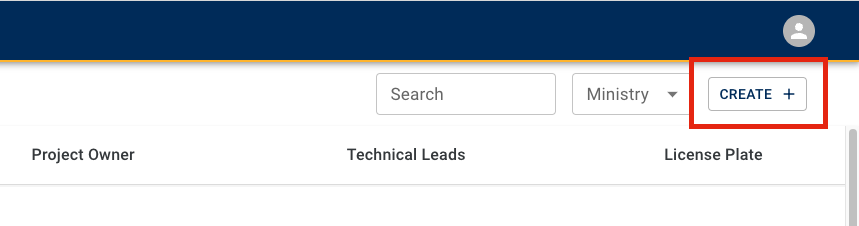

# Provision a new AWS project set

On the Public Cloud platform, different teams organize their work in isolated [project sets](deploy-an-app-to-the-aws-landing-zone.md#aws-accounts-in-your-project-set). Before working on the platform, the [Product Owner](bc-govs-aws-landing-zone-overview.md#key-features-of-the-product-registry-service) of the respective team must submit a project set provisioning request for your team on the BC Gov Public Cloud.

## Prerequisites

Each new request must be reviewed and approved, including requests for additional projects from teams that already have one or more projects on the platform. To do that you must meet the prerequisites for provisioning a project set outlined in our [onboarding documentation](https://digital.gov.bc.ca/cloud/services/public/onboard/).

## Project set provisioning request process

1. Login to the [BC Gov Product Registry](https://registry.developer.gov.bc.ca/login). Please note the section below the login button for more guidance on creating a provisioning request.

2. Navigate to "Public Cloud"

    

3. Click on "create a project set"

    

4. Enter the name and description of your project

    

    - Project names should be descriptive, so expand acronyms where possible.

5. Enter your ministry, and desired service provider

    

6. Enter the "[Product Owner](bc-govs-aws-landing-zone-overview.md#key-features-of-the-product-registry-service)" and "[Technical Lead(s)](bc-govs-aws-landing-zone-overview.md#key-features-of-the-product-registry-service)".

    

    <!-- TODO: move some of this to a separate "RBAC", or "Login Application" document and link to it here -->
    - Both the [Product Owner](bc-govs-aws-landing-zone-overview.md#key-features-of-the-product-registry-service) and [Technical Lead(s)](bc-govs-aws-landing-zone-overview.md#key-features-of-the-product-registry-service) will be granted access to the 4 AWS accounts in the [Project Set](deploy-an-app-to-the-aws-landing-zone.md#aws-accounts-in-your-project-set) via the Administrator Role. The Administrator Role is attached to the AWS managed policy ["AdministratorAccess"](https://docs.aws.amazon.com/aws-managed-policy/latest/reference/AdministratorAccess.html) which provides unrestricted access into AWS accounts. However, because we are operating under the SEA's [Guardrails](bc-govs-aws-landing-zone-overview.md#security-guardrails) the Administrator role is restricted within those bounds in all accounts in the AWS SEA. So as long as a user with an Administrator Role is not breaching the [Guardrails](bc-govs-aws-landing-zone-overview.md#security-guardrails) of the SEA, they will be unrestricted within the account.

6. Enter your billing number

    

    This number should be reflected on the team's MOU, and is related to the expense authority funding the project.

7. Enter your estimated budgets for the four AWS accounts

    

    - Budgets are a tool for the team to receive email billing alerts so it's important that they are accurate, however they can be updated later. You will receive a budget alert when your monthly spend has reached 50%, 80%, and 100% of your estimated monthly budget. This tool is intended to allow ministry teams to quickly react and control cost surges within the accounts. 
    - For help estimating your budget please see the [Costs and billing](https://digital.gov.bc.ca/cloud/services/public/intro/#costs) section of our introductory documentation.

## Account access
<!-- TODO: move some of this to a separate "RBAC", or "Login Application" document and link to it here -->
- Once the AWS accounts have been provisioned, the [Product Owner](bc-govs-aws-landing-zone-overview.md#key-features-of-the-product-registry-service) and [Technical Lead(s)](bc-govs-aws-landing-zone-overview.md#key-features-of-the-product-registry-service) will be able to see them all in the [Login Application](https://login.nimbus.cloud.gov.bc.ca/). As mentioned above they will have admin access into the accounts.
- For other team members access, please have the [Product Owner](bc-govs-aws-landing-zone-overview.md#key-features-of-the-product-registry-service) email "cloud.pathfinder@gov.bc.ca" with the following information:
  - Team members full name
  - Role that the user should be granted (Admin, Developer, Viewer, Billing Viewer, Security Auditor)
    - Note that the Developer role has the same AWS owned policy ["AdministratorAccess"](https://docs.aws.amazon.com/aws-managed-policy/latest/reference/AdministratorAccess.html) as the Administrator Role, however they won't be granted access to the Production AWS Account.
  - License plate of the project set, e.g. "a1b2c3"

<!-- NOTE: unsure about this section, please advise if we should keep it as a pattern, or not -->
## Further reading
- [B.C. Government AWS Landing Zone overview](bc-govs-aws-landing-zone-overview.md)
- [Deploy an application to the  B.C. Government AWS Landing Zone](deploy-an-app-to-the-aws-landing-zone.md)

## Related pages
- [Platform Project Registry](https://registry.developer.gov.bc.ca/login)
- [OnBoarding Guide for BC Gov AWS SEA](https://digital.gov.bc.ca/cloud/services/public/onboard/)

