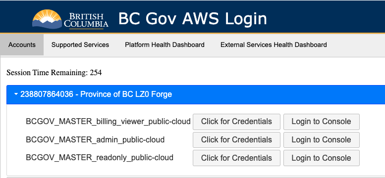

# Requirements for building your application in AWS

Last updated: **January 9, 2024**

The following sections describe the requirements for building your application on the B.C. Government Public Cloud, AWS Landing Zone.

## Prerequisites

1. Create a [provisioning request for a project set](provision-a-project-set.md) for your team on the B.C. Government Public Cloud

2. Once approved, your project set will be provisioned followed up by an email sent to the Product Owner and Technical Lead once the provisioning is complete

3. Request access for the reset of the team by submitting a request to <cloud.pathfinder@gov.bc.ca>. Refer to the guidelines on what details to include in your request for [account access](provision-a-project-set.md#account-access)

## Limitations of the AWS Landing Zone

Take the following into consideration when building your application on the AWS Landing zone: 

* There is no direct (private) connectivity to the B.C. government network. Any application requiring access to data on this network must use a public endpoint

* Only HTTPS applications are compatible with public endpoints through Amazon API Gateway or Application Load Balancer

* Log groups are safeguarded by AWS Landing Zone guardrails and cannot be deleted. This could lead to issues if they are created by Terraform

* The only supported region is Canada (Central) - ca-central-1

* Most networking is under the management of AWS Landing Zone and is not subject to change. Security groups are the exception to this rule

* IAM Users and their access keys can only be generated  by the [IAM User management service](iam-user-service.md), which is created and managed by the Public Cloud team

## Other requirements and best practices

To use GitHub Actions for deploying your application, [OpenID Connect (OIDC) authentication](deploy-an-app-to-the-aws-landing-zone.md#configuring-github-action-oidc-authentication-to-aws) is required. 

To deploy your application: 

* Use a CI/CD pipeline
* Use infrastructure as code, such as Terraform
* Set up a monitoring solution for your application
* Through the [Product Registry](https://registry.developer.gov.bc.ca/login) configure budgets to receive notifications when your quota is close to being exceeded 
* Only grant access to your AWS accounts for those who actually need it

## Local deployment
To run local deployments using an Infrastructure as Code (IaC) tool like Terraform on your machine, you'll need the following install on your machine; Terraform and AWS CLI. 

* How to install [terraform](https://developer.hashicorp.com/terraform/tutorials/aws-get-started/install-cli) 
* How to install  [AWS CLI](https://docs.aws.amazon.com/cli/latest/userguide/getting-started-install.html) 

* Obtain an AWS credential by visiting our AWS login page following the steps below and as shown in the image below:

<!-- Please for accessibility purposes describe each step to take such as AWS login page URL and steps to arrive to click on the button credential 

1. Login to [AWS login page](URL) 
2. Go to ......
3. Click..... 

  -->

 

## Next steps

- [Deploy an application to the B.C. Government AWS Landing Zone](deploy-an-app-to-the-aws-landing-zone.md)

## Related pages

- [Provision a project set](provision-a-project-set.md)
- [Account access](provision-a-project-set.md#account-access)
- [Configuring GitHub Action OIDC Authentication to AWS](deploy-an-app-to-the-aws-landing-zone.md#configuring-github-action-oidc-authentication-to-aws)
- [Deploy an application to the B.C. Government AWS Landing Zone](deploy-an-app-to-the-aws-landing-zone.md)
