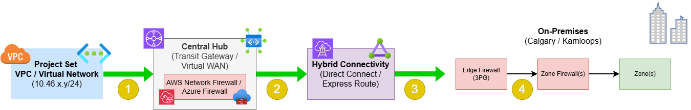
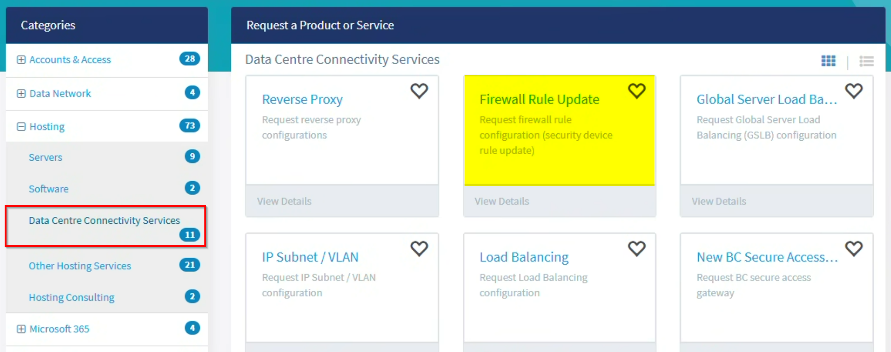
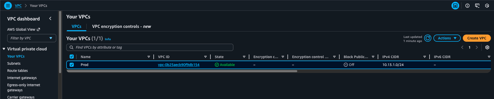
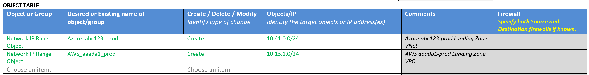
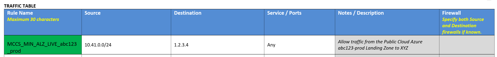
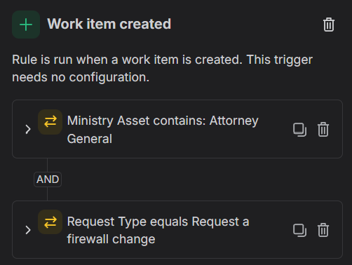
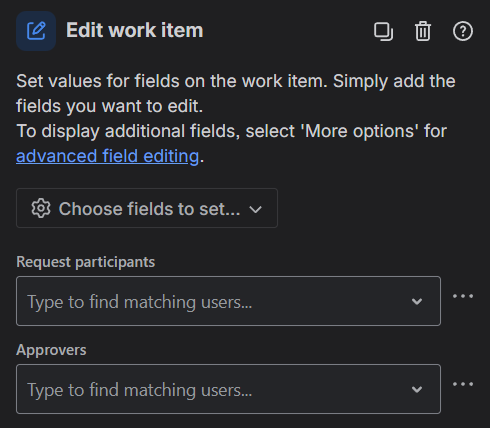

# Multi-Cloud Connect Service (MCCS)

Last updated: **{{ git_revision_date_localized }}**

The following sections explain how to set up hybrid connectivity in AWS/Azure and connect a Project Set’s virtual network to an on-premises network.

!!! info "Early Adopters"
    AWS DirectConnect and Azure ExpressRoute are currently available only for early adopters.
    Please contact the Public Cloud Team at [public.cloud@gov.bc.ca](mailto:public.cloud@gov.bc.ca) for more information about eligibility and access or create a ticket via the [Service Desk portal](https://citz-do.atlassian.net/servicedesk/customer/portal/3).

## Overview

AWS DirectConnect and Azure ExpressRoute provides a private connection between an organization’s on-premises infrastructure and AWS/Azure data centres. Because this connection does not travel over the public internet, it offers stronger security, reliability and performance.

In our setup, DirectConnect and ExpressRoute also encrypts data in transit with IPsec. This ensures data stays secure while moving between AWS/Azure and on-premises networks.

## On-premises connectivity workflow

The following describes the general network connectivity from AWS/Azure to on-premises networks.

Use this general path to connect an AWS virtual private cloud (VPC) or Azure virtual network (VNet) to your on-premises network.

1. Traffic leaves  the cloud **VPC/VNet** and goes to the centralized **cloud firewall**, which acts as a security boundary and controls the flow of traffic
2. After passing through the **cloud firewall**, the traffic goes to the **hybrid** connection (i.e. DirectConnect or ExpressRoute)
3. DirectConnect or ExpressRoute **forwards the traffic** to the on-premises network
4. Traffic reaches the on-premises **edge firewall** (called the "**3PG**"). Each on-premises **Zone** also has _its own_ firewall, which must also allow traffic from the cloud VPC/VNet

## Request workflow

To establish connectivity from AWS/Azure to on-premises networks, follow the steps below.

!!! info "Parallel requests"
    Submit both firewall requests at the same time. You don’t need to wait for one to complete.

1. Submit a **cloud** [firewall change request](https://citz-do.atlassian.net/servicedesk/customer/portal/3/group/18) to have the cloud firewall configured with the correct rules to allow traffic from the AWS VPC / Azure VNet to reach the on-premises edge firewall

   - Need a specific approval process for cloud firewall changes? See the [custom approval process](#custom-approval-process) section below for more information

2. Submit an **on-premises** [firewall request](https://ssbc-client.gov.bc.ca/services/3rdpartygateway/order.htm) (via My Service Center) to create a firewall rule that allows traffic from the AWS VPC / Azure VNet, through the 3PG firewall and subsequently through the required Zone firewalls

   - Navigate to MySC > Hosting > Data Center Connectivity Services > [Firewall Rule Update](https://ociomysc.service-now.com/sp?id=sc_cat_item&sys_id=47f1938a93bd3a5022a1ff50ed03d625&sysparm_category=87c0b527fb563210b0a6f36c5eefdce6)

    

   - Include the **source** (for example your VPC/VNet) and the **destination** (for example your target on-premises network or endpoint) in the request
   - Refer to the [example request form](#example-request-form) section below for additional guidance on how to fill out the request form

!!! question "Two requests for three firewalls?"
    There are at least **3 firewalls** along the connectivity path between AWS/Azure and on-premises resources:
    - the **cloud firewall**,
    - the **3PG firewall**, and
    - the **zone-specific firewalls**

    In our experience, you can include all on-premises firewall rules in the same request form. You don’t need to submit separate requests for the 3PG firewall and each zone firewall. You **only** need **two requests** in total: one for the cloud firewall and one for the on-premises firewall(s).

    When you submit an on-premises firewall request, the firewall team identifies which firewalls need updates based on the source and destination information you provide (though to prevent confusion or delays, you can include "**3PG**" in the **Firewall** column).

!!! warning "On-premises initiated traffic"
    If an on-premises resource needs to **initiate traffic to a cloud resource**, request a separate firewall rule for that traffic flow (ie. source = on-premises resource, destination = cloud virtual network).

!!! tip "Shared responsibility"
    Traffic from AWS/Azure to on-premises networks is secured and **encrypted** using IPsec over DirectConnect or ExpressRoute.

    Once the traffic reaches your **on-premises network**, you are responsible for keeping the data secure. This includes managing connectivity and data transfers within the on-premises network between resources and zones.

    We set up the **connection** between AWS/Azure and your on-premises network through the cloud firewall. However, **you are responsible** for submitting the required firewall requests for the **on-premises firewalls** to allow traffic from AWS/Azure to reach your target on-premises resources.

    Think of it as us driving you to the door; you still need the right key to get in.

    An example request form for reference is provided below.

## Example request form

This is an example of the on-premises firewall request form, and shows how to request connectivity between a cloud network and an on-premises network.

In the **Object Table** create a **Network IP Range Object** for the AWS VPC or Azure VNet, and enter the appropriate CIDR address space.

**Example AWS VPC:**

**Example Azure VNet:**

**Example Object Table entry:**

In the **Traffic Table** add a **traffic rule** using the naming pattern of **MCCS_(Ministry Short Name)_(LZA/ALZ)_LIVE\_(ProjectSet License Plate)\_(ENV)** to allow traffic from the AWS VPC or Azure VNet to the on-premises network.

Set the **Source** to the **Network IP Range Object** previously added in the **Object Table** (which should correspond to the AWS VPC or Azure VNet address space), and the **Destination** to the on-premises endpoint or network address space.

- **Example rule name (AWS):** `MCCS_CITZ_LZA_LIVE_aaada1_prod`
- **Example rule name (Azure):** `MCCS_CITZ_ALZ_LIVE_abc123_prod`

**Example Traffic Table rule entry:**

!!! warning "Bi-directional traffic"
    The above rule examples include a rule for the **cloud network to on-premises** connectivity, and another rule (using the same name) for the reverse flow (**on-premises to cloud**) connectivity.

    If an on-premises system needs to **initiate traffic** to a cloud resource, another rule in the Traffic Table is required for that.

## Custom approval process

If your ministry requires a specific approval process for **_cloud_** firewall changes (ie. review/approval by a security team), we can accommodate that as part of our [cloud firewall change request process](https://citz-do.atlassian.net/servicedesk/customer/portal/3/group/18).

For example, we can configure our ticketing system to automatically add a shared email address as an **approver** to the request when a "**Request a firewall change**" ticket is created from your ministry.

Please have your **Ministry Information Security Officer (MISO)** [create a Support Request](https://citz-do.atlassian.net/servicedesk/customer/portal/3) to discuss your ministry's specific requirements.

## Connectivity testing

When you submit the on-premises firewall request, you will receive an email that states when the firewall changes have been implemented.

<!-- TODO: Update this email template with the latest example received from MySC -->
**Example email:**
> Subject: ESIT Firewall Change Request(s): RITM0123456 - iStore 1234567 - MINISTRY - FirewallSecurity_Attach - SUBMITTED FORM TITLE
>
> Change record CHG0012345 has been submitted on your behalf for implementation on DATE TIME. To ensure your requested change will be implemented on the scheduled Date/Time, please review the change record and ensure all required approvals have been obtained.
>
> This change record has been tentatively scheduled for the Date/Time mentioned above but may have to be rescheduled or rejected due to change management requirements.

!!! danger "Testing responsibility"
    After the firewall rules have been implemented, it is **your responsibility** to test the connectivity to ensure everything is working as expected.

    If there are any issues identified, initiate troubleshooting by contacting the network team that you received the firewall change confirmation email from, providing the **source**/**destination** addresses as well as the **approximate time** of the test.

## On-premises firewall rules

If you are planning to connect to an on-premises endpoint from AWS/Azure, and your application uses a standard set of ports/protocols, you may be able to leverage one of the _existing_ on-premises firewall rules.

For specific details on the existing on-premises firewall rules that are in-place, please refer to the [on-premises firewall rules documentation](https://digital.gov.bc.ca/technology/cloud/public/internal-resources/internal-government-and-external-public-connections/#firewalls).

## OpenShift connectivity

If you use one of the on-premises OpenShift clusters and want to connect to it from AWS/Azure, submit an [on-premises firewall request form](https://ssbc-client.gov.bc.ca/services/3rdpartygateway/order.htm). For the **Source** or **Destination fields**, enter the appropriate firewall "Objects" for the OpenShift cluster endpoints you’re connecting to.

!!! note "OpenShift firewall objects"
    For specific details on the appropriate OpenShift firewall objects to use, please refer to the [OpenShift documentation](https://digital.gov.bc.ca/technology/cloud/private/internal-resources/topology/).
