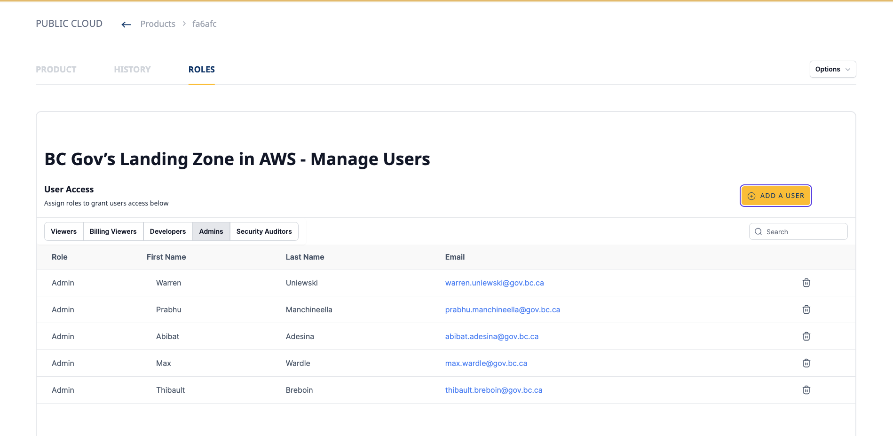
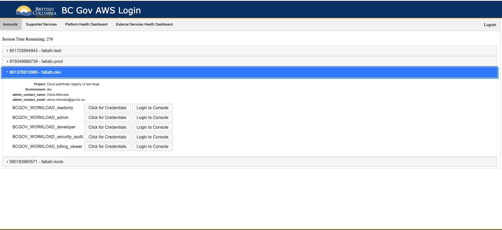

# BC Gov's Product Registry - User management documentation
Last updated: **March 12, 2024**

Welcome to the BC Developer Registry documentation. This guide provides detailed information about the new user interface changes and the enhanced user management feature available at [BC Gov's Product Registry](https://registry.developer.gov.bc.ca/). With the latest update, users can now manage AWS permissions directly from the website, enhancing the overall user experience and streamlining project management.

## New User Interface

The BC Developer Registry has undergone significant UI improvements to provide a more intuitive and user-friendly experience. You can now easily navigate through the website, access different sections, and manage your projects and users more efficiently.

## User Management Feature

One of the key updates is the introduction of a comprehensive user management feature. This feature allows product owners and technical leads to manage AWS permissions for users associated with their product. Users can be assigned to one or more of the following roles:

1. **Viewers**
2. **Billing Viewers**
3. **Developers**
4. **Admins**
5. **Security Auditors**


### Prerequisites

- Users must have a valid IDIR to be added to these roles.
- Only product owners or technical leads can view and manage users in the website.

### Role-Based Access

Assigning users to these roles grants them specific permissions to AWS accounts associated with those roles. Here's a breakdown of the roles and their corresponding AWS policies:

#### Admins

- **Policy**: `arn:aws:iam::aws:policy/AdministratorAccess`
- Admins have full access to all four AWS accounts within the product: dev, test, prod, and tools.

#### Developers

- **Policy**: `arn:aws:iam::aws:policy/AdministratorAccess`
- Developers have admin access to dev, test, and tools accounts. To gain admin access to the prod account, they must have the Admin role.

#### Viewers

- **Policy**: `arn:aws:iam::aws:policy/ReadOnlyAccess`
- Viewers have read-only access to the AWS accounts.

#### Security Auditors

- **Policy**: `arn:aws:iam::aws:policy/SecurityAudit`
- Security Auditors have access to security configuration and logs to perform audit tasks.

#### Billing Viewers

- **Custom Policy**: Provides access to AWS Budgets and Cost Explorer.
  
```json
{
    "Statement": [
        {
            "Action": "ce:*",
            "Effect": "Allow",
            "Resource": "*",
            "Sid": "AllowCostExplorer"
        },
        {
            "Action": "budgets:*",
            "Effect": "Allow",
            "Resource": "*",
            "Sid": "AllowBudgets"
        }
    ],
    "Version": "2012-10-17"
}
```

## Accessing the Public Cloud Landing Zone
- Once a user is added to a role, they can access the product (AWS accounts) from the [Public Cloud Landing Zone.](https://login.nimbus.cloud.gov.bc.ca/) If users have multiple roles, they can choose any of those roles when logging in to the account.


## AWS Managed Policies Overview
- AWS managed policies are predefined policies that provide permissions for many common use cases. These policies are maintained by AWS and provide a set of permissions that align with common job functions in the AWS environment. By using AWS managed policies, you can ensure that the permissions are set up correctly and updated by AWS as necessary.
    - AdministratorAccess: Provides full access to AWS services and resources.
    - ReadOnlyAccess: Provides read-only access to AWS services and resources.
    - SecurityAudit: Provides permissions to view configuration data for security auditing.

# Conclusion
- The new user management feature in the BC Developer Registry enhances the ability of product owners and technical leads to manage AWS permissions efficiently. By understanding the roles and their associated policies, you can ensure that users have the appropriate access to your AWS resources.
- For more information on AWS managed policies and best practices, visit the [AWS Identity and Access Management documentation.](https://docs.aws.amazon.com/IAM/latest/UserGuide/access_policies_job-functions.html)

