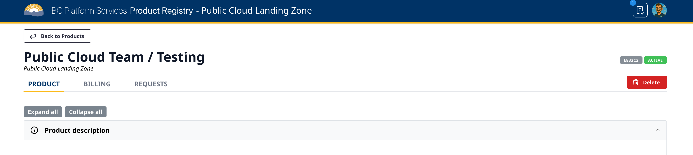

# Close a Project Set

Last updated: **{{ git_revision_date_localized }}**

When a project is no longer needed, teams can close their Project Set through the [Product Registry](https://registry.developer.gov.bc.ca/login). This process is the same for all cloud providers (AWS and Azure).

---

## What happens when you close a Project Set?

Closing a Project Set will:

- **Permanently delete** all cloud resources and data in all environments (dev, test, prod, tools)
- **Stop all billing** for the project set
- **Remove access** for all team members
- **Cancel any ongoing** automated processes or scheduled tasks

> ⚠️ **Warning**: This action is **irreversible**. Once a Project Set is closed, all data and resources are permanently deleted and cannot be recovered.

## Before closing your Project Set

Before proceeding with closing your Project Set, ensure you have:

1. **Backed up any important data** that you need to retain
2. **Notified all team members** about the closure
3. **Completed any final billing cycles** or cost analysis
4. **Documented any lessons learned** or knowledge that should be preserved
5. **Confirmed with stakeholders** that the project is truly no longer needed

## How to close a Project Set

1. **Login to the Product Registry**
   
   Navigate to the [Product Registry](https://registry.developer.gov.bc.ca/login) and sign in with your IDIR credentials.

2. **Find your Project Set**
   
   Locate the Project Set you want to close in the registry. You can search by name or browse through your active projects.

3. **Access the Project Set details**
   
   Click on the Project Set name to open its details page.

4. **Click the Delete button**
   
   In the upper right corner of the Project Set details page, you'll see a **red Delete button** with a trash can icon. Click this button to initiate the closure process.

   

5. **Confirm the deletion**
   
   You'll be prompted to confirm that you want to permanently delete the Project Set. This is your final opportunity to cancel the action.

6. **Wait for completion**
   
   The closure process may take some time to complete, as all resources across all environments need to be properly decommissioned.

## After closing your Project Set

- **Billing will stop** immediately for new charges once the project accounts/subscriptions have been closed by the Public Cloud team.
- **Final billing statements** will be generated for any remaining charges
- **All team members** will lose access to the cloud environments
- **You'll receive confirmation** once the closure is complete

---

## Related pages

- [Provision a Project Set](provision-a-project-set.md)
- [B.C. Gov's Platform Product Registry](https://registry.developer.gov.bc.ca/login)
- [AWS Landing Zone Overview](../aws/LZA/get-started-with-lza/aws-landing-zone-accelerator-overview.md)
- [Azure Landing Zone Overview](../azure/get-started-with-azure/bc-govs-azure-landing-zone-overview.md)
