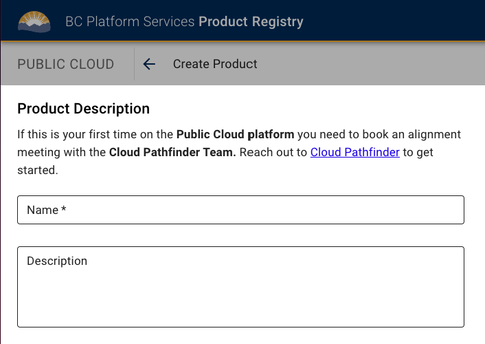
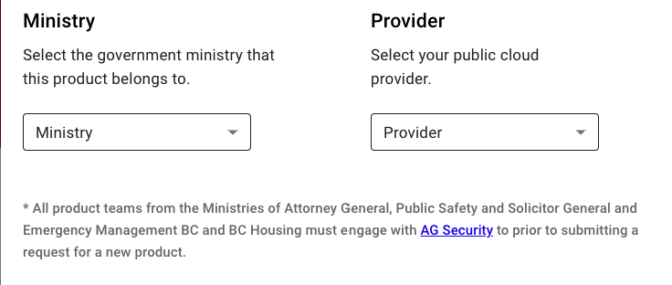
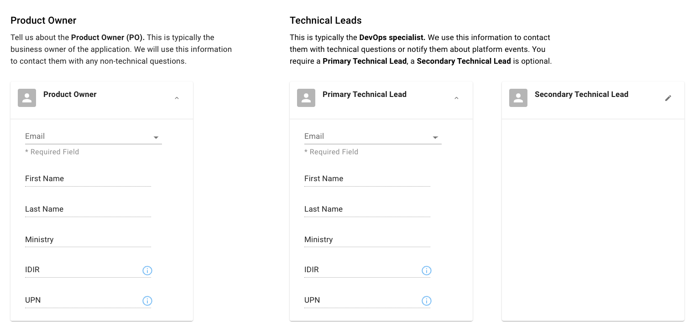
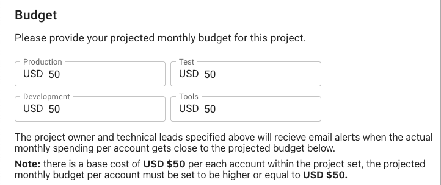

# Provision a new Project Set

Last updated: **{{ git_revision_date_localized }}**

On the Public cloud platform, different teams organize their work in isolated **Project Sets**. Before working in the cloud platform, the **Product Owner** of the respective team must submit a Project Set provisioning request for your team, through the [Product Registry](https://registry.developer.gov.bc.ca/login).

---

## What is a Project Set?

A project set consists of up to four distinct environments for development (`dev`), testing (`test`), production (`prod`), and tooling (`tools`). This isolates and protects each stage of the deployment lifecycle.

- The **`dev`** account is for developers to experiment and test features
- The **`test`** account mirrors production and is used for quality assurance testing
- The **`prod`** account is the live environment accessed by end users
- The **`tools`** account contains shared resources like CI/CD pipelines, container registries, and automation tools

## Prerequisites

New requests must be reviewed and approved by the Public cloud platform team. The same rule applies for teams that already have projects on the platform and require additional Project Sets.

To do that you must meet the prerequisites for provisioning a Project Set outlined in our [onboarding documentation](https://digital.gov.bc.ca/technology/cloud/public/onboard/).

## Request a Project Set

1. Login to the [Product Registry](https://registry.developer.gov.bc.ca/login)

  You'll need to provide the following information:

  - A descriptive product name (no acronyms)
  - Contact details and IDIR accounts for the Product Owner and up to 2 Technical Leads
  - An estimate for the product's projected monthly spend on cloud services
    - For estimating AWS monthly costs, please use the [AWS Cost Calculator](https://calculator.aws/#/)
    - For estimating Azure monthly costs, please use the [Azure Pricing Calculator](https://azure.microsoft.com/en-ca/pricing/calculator/)
  - An Account code for billing purposes
    - Refer to the [Memorandum of Understanding (MoU)](https://digital.gov.bc.ca/technology/cloud/public/onboard/#mou) for more information
    
  For **new product teams** requesting a Project Set in a Public cloud Landing Zone, complete the following 2 steps before submitting the provisioning request:

  - Sign a Memorandum of Understanding (MoU) with the OCIO
  - Book an onboarding session with the Public Cloud team
    - This can be done through the [Jira Support Portal](https://citz-do.atlassian.net/servicedesk/customer/portal/3)
  <!-- TODO: Update the "book onboarding session" with a link to the Support Portal request type, and/or MS Teams integration (when available) -->

2. Navigate to the top menu called **Public cloud Products**.

  

3. On the top right side of the screen click on the **Create +** button to create a Project Set.

  

4. Enter the **name** and **description** of your project.

  - Project names should be descriptive. Avoid the use acronyms. This may be used in the future to identify your project in the platform.

  

5. Enter your **ministry** and desired **service provider**.

  

6. Enter the **Product Owner** and **Technical Lead(s)** details per each required field.

  - The Product Owner and Technical Lead(s) will be granted access to the accounts/subscriptions in the Project Set via the Admin/Owner role.

  

7. Enter your **billing number**.

  - This number should be reflected on the team's signed Memorandum of Understanding (MoU), and is related to the Expense Authority funding the project.

  

8. Enter your **estimated budgets**.

  - Budgets are a tool for the team to receive email billing alerts, so it's important that they are accurate. However they can be updated later.
  - You will receive a budget alert when your monthly spend has reached 50%, 80%, and 100% of your estimated monthly budget. This tool is intended to allow ministry teams to quickly react and control cost surges within the accounts.
  - For help estimating your budget please see the [costs and billing](https://digital.gov.bc.ca/technology/cloud/public/intro/#costs) section of our introductory documentation.

  

## Accessing your Project Set

### AWS

Once the AWS accounts have been provisioned, the Product Owner and Technical Lead(s) will be able to see them all in the [Login Application](https://login.nimbus.cloud.gov.bc.ca/) and they will have Admin access into the accounts.

Other team members can be added to the Project Set by the Product Owner or Technical Lead(s) via the [AWS User Management](../aws/LZA/design-build-deploy/user-management.md) feature in the Product Registry.

### Azure

Once the Azure subscriptions have been provisioned, the Product Owner and Technical Lead(s) will be able to see them all in the [Azure Portal](https://portal.azure.com/) and they will have a restricted Owner role on the subscriptions.

Other team members can be added to the Project Set by the Product Owner or Technical Lead(s) through the designated Entra ID security groups. For more information on how to do this, see [Azure User Management](../azure/design-build-deploy/user-management.md).

---

## Related pages

- [Platform Project Registry](https://registry.developer.gov.bc.ca/login)
- [Onboard your team to Public cloud hosting](https://digital.gov.bc.ca/technology/cloud/public/onboard/)
- [AWS Landing Zone Overview](../aws/LZA/get-started-with-lza/aws-landing-zone-accelerator-overview.md)
- [Azure Landing Zone Overview](../azure/get-started-with-azure/bc-govs-azure-landing-zone-overview.md)
