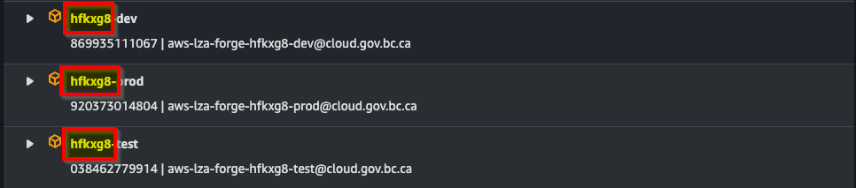
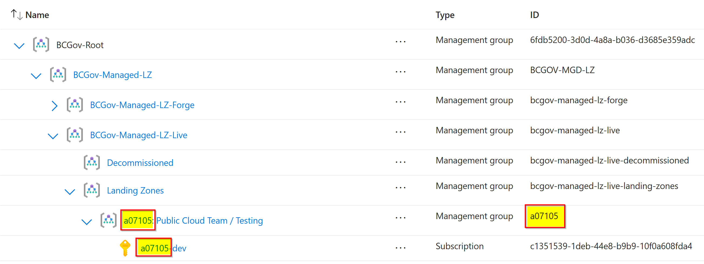

# Public Cloud Support

Last updated: **{{ git_revision_date_localized }}**

## Project Set license plate

When requesting support from the Public Cloud team, please provide the 6-character alphanumeric Project Set **license plate**. This is a unique identifier for your Project Set that helps us provide support more efficiently.

### AWS

To find the license plate for an AWS Project Set, follow these steps:

1. Log in to the [AWS Management Console](https://aws.amazon.com/console/).
2. The alphanumeric code in the **Account** column is the license plate for your Project Set.

### Azure

To find the license plate for an Azure Project Set, follow these steps:

1. Log in to the [Azure Portal](https://portal.azure.com/).
2. Search for **Management Groups**.
3. Expand **BCGov-Managed-LZ** > **BCGov-Managed-LZ-Live** > **Landing Zones** and locate your Project Set's Management Group.
4. The alphanumeric code in the **Name** column (for the Management Group, or Subscription) is the license plate for your Project Set.

  - If your Management Group or Subscription name has been changed, the Management Group ID field will contain the original license plate.

## Support options

There are multiple ways to get support for the Public Cloud Platform, including:

- [Jira Service Management (JSM)](https://citz-do.atlassian.net/servicedesk/customer/portal/3) (preferred method)
- [Rocket.Chat](https://chat.developer.gov.bc.ca/)

## Cloud vendor support

Each cloud vendor provides support for their services. Here are the support options for each vendor:

- [AWS Support](../aws/support/enterprise-support.md)
- [Azure Support](../azure/support/enterprise-support.md)
