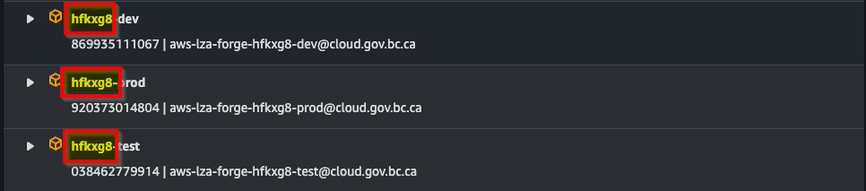
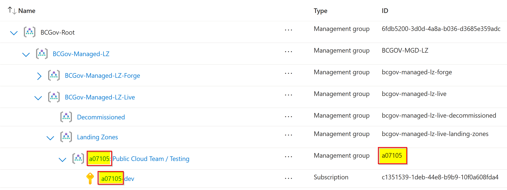

# Public cloud Support

Last updated: **{{ git_revision_date_localized }}**

## Project Set license plate

When requesting support from the Public cloud team, please provide the 6-character alphanumeric Project Set **license plate**. This is a unique identifier for your Project Set that helps us provide support more efficiently.

### AWS

To find the license plate for an AWS Project Set, follow these steps:

1. Log in to the [AWS Management Console](https://aws.amazon.com/console/).
2. The alphanumeric code in the **Account** column is the license plate for your Project Set.

### Azure

To find the license plate for an Azure Project Set, follow these steps:

1. Log in to the [Azure Portal](https://portal.azure.com/).
2. Search for **Management Groups**.
3. Expand **BCGov-Managed-LZ** > **BCGov-Managed-LZ-Live** > **Landing Zones** and locate your Project Set's Management Group.
4. The alphanumeric code in the **Name** column (for the Management Group, or Subscription) is the license plate for your Project Set.

  - If your Management Group or Subscription name has been changed, the Management Group ID field will contain the original license plate.

## Support options

There are multiple ways to get support for the Public cloud Platform, including:

- [Jira Service Management (JSM)](https://citz-do.atlassian.net/servicedesk/customer/portal/3) (preferred method)
- [Microsoft Teams - Developer Community Channels](https://teams.microsoft.com/l/team/19%3A6bffce0ac7aa47a1ba9f6d9a7e898db9%40thread.tacv2/conversations?groupId=a80418da-c27b-406e-89ab-7695b61924d8&tenantId=6fdb5200-3d0d-4a8a-b036-d3685e359adc)
  - Channel: [CloudAWS-howto](https://teams.microsoft.com/l/channel/19%3A2d3e0e06b31f493c8648a771c655fa2c%40thread.tacv2/CloudAWS-howto?groupId=a80418da-c27b-406e-89ab-7695b61924d8&tenantId=6fdb5200-3d0d-4a8a-b036-d3685e359adc)
  - Channel: [CloudAzure-howto](https://teams.microsoft.com/l/channel/19%3A91ae163c886c43e8b3537ab64ee15544%40thread.tacv2/CloudAzure-howto?groupId=a80418da-c27b-406e-89ab-7695b61924d8&tenantId=6fdb5200-3d0d-4a8a-b036-d3685e359adc)

## Cloud vendor support

Each cloud vendor provides support for their services. Here are the support options for each vendor:

- [AWS Support](../aws/LZA/support/enterprise-support.md)
- [Azure Support](../azure/support/enterprise-support.md)
